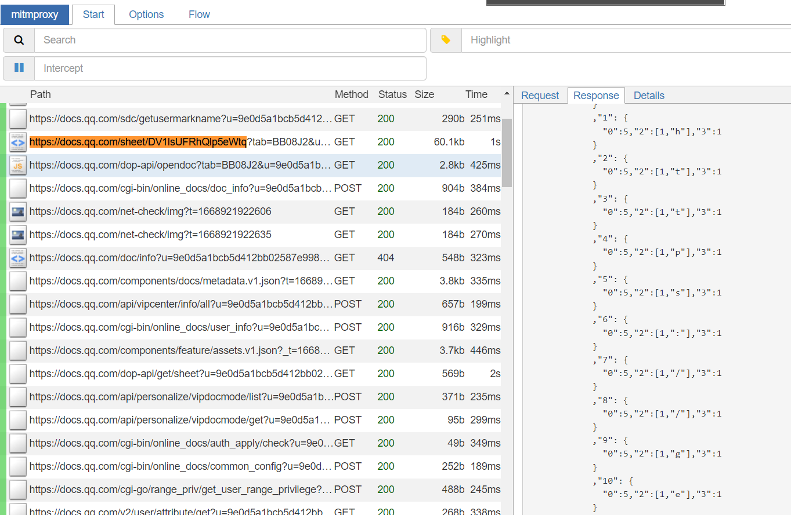
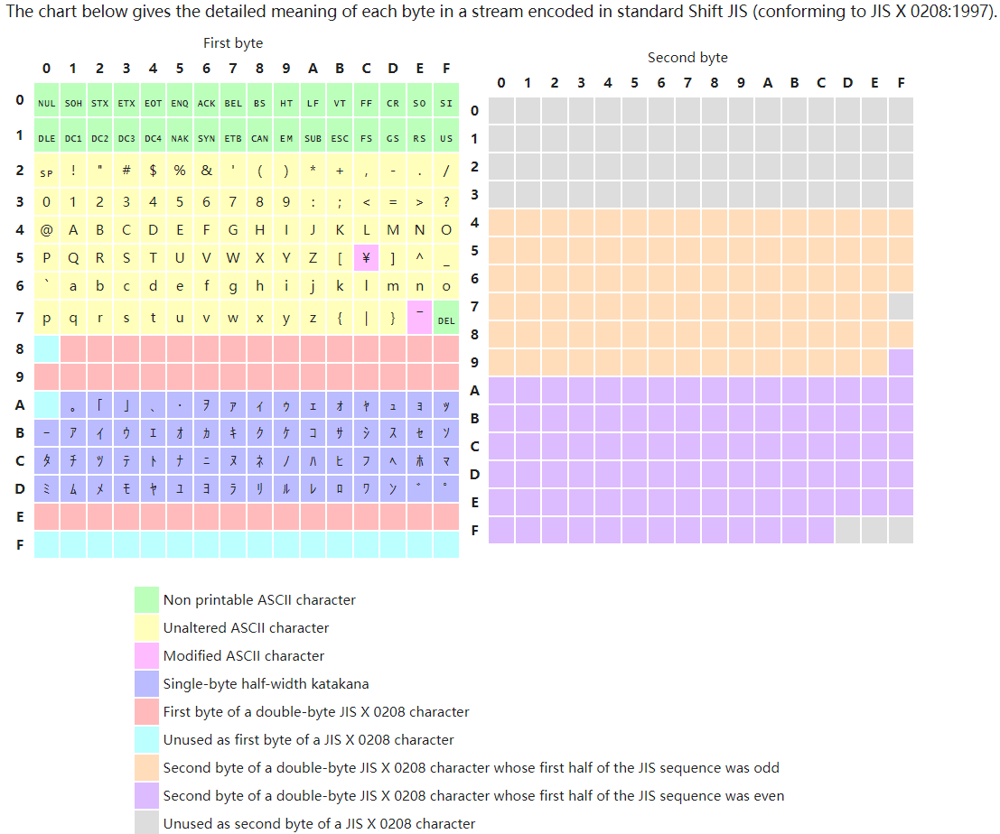

# PKU GeekGame#2 个人Writeup
Ribom，总分2547，校内排名19

<!-- truncate -->
## 2022-11-28 更新
看了放出来的官方Writeup，发现有部分地方有根本性的理解错误。但毕竟原文是还原了一个当时思考的状态，所以把补充的内容都写在这里。

### 小北问答-MAC地址
之前不知道Wifi Positioning System，原来Mac地址还有这样的作用，涨知识了！

### omnibox题
原来我没注意到，xssbot把scheme去掉丢进omnibox之后，是把原来的整个字符串拿去搜索的！我一直以为丢了就后面也丢了，所以一直写些` http:\\`这样的东西去绕过那个去除，实际根本不用绕！那个去scheme反而是友军！一个点的ip比较tricky这一点我已经通过源码发现了，真的残念。这个故事告诉我们读源码要仔细，不行就跑一跑。

当然js半问也是我见识短了，原来可以反引号转义（ascii值）出括号等号来，所以不用那个文档替换特性也能做。

### nodejs
确实是个人知识储备不足了，但是flag2其实也不要啥特别nb的绕过，只要知道`unescape`可以把url encode的字符解码就行了。这题真正难点在第三问nodejs沙箱。

## 19. 签到
跟去年签到神似的一道题，也是从一个PDF文件里读出<s>乱码</s>WingDing字体的字符。不同的是，这次字符并没有从页面溢出，并且从`Adobe Acrobat`中会提示文件加密无法复制。但是我用另外一个开源软件`SumatraPDF`在复制这个字符的时候没有遇到任何的问题，看来这个加密只是一个设置上的参数，数据本身并没有被加密。

复制出来的字符是

`fa{ecm_badGeGmV! lgWloeAor@ekae2}`

，很明显是两栏的栅栏密码，用[现成的工具](https://www.qqxiuzi.cn/bianma/zhalanmima.php)可以直接解出flag

## 1. 小北问答·极速版
挺喜欢这个随机题库+可即时验证正确答案的设计的，显著降低难度，建议下一届保留<s>，虽然感觉下一届大家都知道里面的trick了</s>

### 题库

> Q: 每个 Android 软件都有唯一的包名。北京大学课外锻炼使用的最新版 PKU Runner 软件的包名是什么？

我是直接从安装包里把答案扒出来的。众所周知apk格式的安装包可以改成zip之后解压。解压之后有一个`AndroidManifest.xml`，一看就是元文件，但是意外的是个二进制，所以用`010 Editor`打开，发现里面有大量的2字节的Unicode字符，里面找可以找到package字段，可以看到后面跟了一串域名反写的东西`cn.edu.pku.pkurunner`，刚好java的包名经常使用这样的格式。所以这就是答案了。

> Q: 支持 WebP 图片格式的最早 Firefox 版本是多少？

打开必应搜索，输入`firefox webp`，第四条记录标题就是[Firefox 65即将添加对WebP格式图片的支持 附开启方法](https://www.cnbeta.com/articles/tech/784937.htm
)，虽然链接打不开，但是标题就告诉我们答案是`65`。

> Q: 北京大学某实验室曾开发了一个叫 gStore 的数据库软件。最早描述该软件的论文的 DOI 编号是 多少？

搜了一下gStore，首先搜到一篇知乎文章，标题是《gStore官网全新改版上线》，里面找到gStore官网[gStore.cn](https://gStore.cn)。官网的【开发者资源】标签下有个【论文&专利】，把最早的一篇（2011年），题为《gStore: Answering SPARQL Queries Via Subgraph Matching》的文章拿去搜索，最后在researchgate里找到了这篇文章的DOI编号

> Q: 视频 bilibili.com/video/BV1EV411s7vu 也可以通过 bilibili.com/video/av_____ 访问。下划 线内应填什么数字？

B站AV号转BV号的事件我有所耳闻，当时其实就有过这种转换工具出来，所以直接找一个用就行了，我用的是这个：[https://tools.jixiaob.cn/bv2av/](https://tools.jixiaob.cn/bv2av/)。顺便这个视频竟然是新宝岛啊。<s>总好过Never gonna give you up🎵</s>。

> Q: 访问网址 “http://ctf.世界一流大学.com” 时，向该主机发送的 HTTP 请求中 Host 请求头的值 是什么？

主办方破费了啊，为了这个题专门买了个域名w

所以F12之后访问这个域名，看302跳转之前的记录就可以了，答案是`ctf.xn--4gqwbu44czhc7w9a66k.com`。不过说起来这个host居然和地址栏输入的不一样，不知道是怎么做到的，可能和DNS有关？<s>下一届会出dns相关的web题吗</s>

> Q: 在第一届 PKU GeekGame 比赛的题目《电子游戏概论》中，通过第 n 级关卡需要多少金钱？

这个题目开始出现随机<s>肉鸽</s>要素了
回答很简单，因为上一届题目有存档，所以看一下这个题后台和关卡生成相关的[源码](https://github.com/PKU-GeekGame/geekgame-1st/blob/master/src/pygame/game/server/libtreasure.py)，有一句`GOAL_OF_LEVEL = lambda level: 300+int(level**1.5)*100 `，从名字看应该是每关金币的生成函数。试一下发现确实是。

> Q: 我有一个朋友在美国，他无线路由器的 MAC 地址是 d2:94:35:21:42:43。请问他所在地的邮编是 多少？

这个题我没做出来，并且我怀疑不可解。

MAC地址是链路层的地址，是网卡设备的唯一标识。据我查到的信息，MAC地址前三个字节表示网卡生产商的信息，后三个字节是由网卡商自行分配，原则上网卡生产商也不知道这个网卡会被装到哪个设备上或者部署在哪里。另外，我还查到第一个字节的倒数第二位标识了网卡的mac地址是全局的本地的，这个mac地址是本地的，也就是说除非同一个网络的设备可以通过arp获得mac地址，其他设备是拿不到的。最后，我还尝试查了mac地址相关的日志和数据库，没有查到，期待下有没有其他人找到了这样的数据库。

As last resort，我们还可以遍历可能的邮编。美国的邮编是5位数，好像有0开头，我们就假设有100000个可能，终端的限制是每30秒三次，因此最多需要1000000秒也就是11.6天，所以还是有一定的概率在比赛结束前遍历出来的……当然肯定不会这么做就是了。

当然二阶段拿到住址查邮编是很简单的，这里不再赘述了。

> Q: 猜质数（两个数之间）

这个题给出的范围<s>好像</s>都是9位数，间隔在1000+。trick在于，多次测试后发现范围内的质数是不唯一的，一般都是8个。所以这个是原则上只有概率答对的题。遍历范围内质数可以用`sympy`库的`isprime`函数。

### 回答
正如二阶段提示所说，题库有8个题随机抽7个，其中有一个不会做，一个是纯概率，那么我们只需要大量尝试，当题库刚好没有MAC地址题，且猜质数猜对了就能获得flag，按二阶段提示是1/72概率。所以我用pwntools写了段[python脚本](xiaobei/run_xiaobei.py)，每十秒连接一次服务器答题，然后挂上nohup去睡大觉，第二天早上起来就能在输出日志里找到flag了。<s>睡大觉也能拿到flag，美滋滋</s>

根据flag的文本，看来MAC题就是做不出来，所以这是官方解法？

## 4. 编原译理习题课

这个题一阶段只做出flag12，二阶段补上了flag3

最先做出来的是flag2，因为g++并不是发现一个编译错误就退出编译的，所以有个非常简单的方法就是引入一个巨大的二进制文件，然后g++的报错日志里会包含二进制文件的所有内容。因为注意到题目用apt安装了python环境，所以我用的是`#include "/usr/bin/python3"`

flag1也不难，需要知道g++编译的时候，会把程序里出现的常量字符串打包进程序里，所以用类似`char A[9000000] = "123123123";`声明一个巨大的常量字符串就可以了。值得注意的是这个字符串的初始化值不一定要真的有8M那么大，但不能是空字符串。

flag3我一开始陷入了个巨大的误区，就是觉得要构造一个巨复杂的表达式让g++解析的时候内存不足而报段错误，所以拿各种宏套了半天没成果<s>以及测试发现好像宏是不可以嵌套的</s>。后来（周三）我其实想到了或许可以去找找别人报的bug，也找到了GNU bug tracker，但是可能是搜的方法不对<s>以及连续熬夜人也不太清醒</s>，硬是没找到相关的代码。第二阶段之后<s>睡了一觉起来</s>重新搜gnu bug tracker，这次只看c++, seg关键词并且按时间排序，终于找到了一个2022.4.18的[会报SegFault的BUG](https://gcc.gnu.org/bugzilla/show_bug.cgi?id=105300)（虽然最近回复是11.11），并且代码只有81Bytes：
```c++
void operator""_x(const char *, unsigned long);
static_assert(false, "foo"_x);
```
本地测试后果然报了SegFault，果断提交，拿到flag3

## 15. Flag Checker
这题给了个jar包，解压后发现只有一个GeekGame.class的类文件，根据题面找找JAVA8可用的反编译工具（我用的是Luyten），可以直接拿到反编译后的[代码](flag_checker/GeekGame.java)，确实如二阶段提示所说反编译质量很高，可读性很强。

源码里的一连串Unicode字符实在是很吸睛，所以我先从这里开始。看后面的处理是逐字符和`\u00ef`异或之后放进了一个scriptEngine里运行。用python模拟了这个过程，输出了一段JS代码。稍微查了一下确认了scriptEngine里跑的确实Javascript<s>毕竟Java+scriptEngine==Javascript+Engine</s>

接下来分析JS代码，因为代码不长，prettify后做些简单的变量替换可以很容易地理清逻辑。这是一个名为`checkflag2`的函数，函数体里包含了一个数组`a`，flag的第`i`位字符等于`checkflag2`函数本体的第`a[i]`个字符（【函数的第?个字符】这个写法有点tricky，我在浏览器F12里跑了一下发现是针对最原始的那个字符串的），所以可以跑个模拟程序把flag跑出来，发现是flag2。

最后分析剩余部分，发现在`actionPerformed`回调函数里有判断flag1的代码。flag1的内容在base64编码后，经过rot13函数处理要等于一个字符串。从rot13这个名字猜测是凯撒密码的一个著名变种：所有字母平移13位的密码。从源码来看，字母确实是这样处理的，数字则是平移5位，最终结果也没有+/=特殊字符。写一个模拟把flag跑出来即可。

另外`actionPerformed`结尾的判断，似乎根据按下的按钮是不是flag2，可能会触发一个叫checkflag3的JS函数，莫非一开始这个题是有flag3的，因为考点重复了所以删掉了？

[相关处理代码](flag_checker/solve_flag.py)

## 3. 智慧检测器
一开始看到这么长的源码根本看不下去，随便玩了玩也没什么思路，所以就暂时放置了。直到后来不死心再试试的时候发现了一个特性：如果输入两步，其中第二步是不合法的，那么虽然会提示不合法但是仍然会穿到墙里（最开始发现是用的最边界的墙，所以特别显眼）。

在本地用VSCode debug了源程序，处理指令的核心逻辑可以写成这样的伪代码，其中核心特性来自`CurPos = NewPos` (源码422行)：
```python
NewPos = list(CurPos)
_move(newPos) 
if _is_valid(newPos): # break if fail
    CurPos = NewPos
else:
    break
MoveCount += 1
```
Python基础小知识：list是传引用的，所以对list赋值之后，修改新的变量里的元素会影响原来的元素。如果要建立一个不受影响的list需要用构造函数, 切片或deepcopy建立一个新的拷贝。这个特性相当反直觉，以至于我每次用到数组拷贝的时候都会下意识地注意一下。<s>但说起来这句同一个函数上面（385行）就有个正常的`NewPos = list(CurPos)`，很难不认为是故意的</s>

所以当第一次指令合法时，`CurPos`的引用被传入了`NewPos`，那么下一轮循环即使是非法指令，因为在前面对`NewPos`赋值时已经改变了`CurPos`，这里即使break出来也不会回退这个操作，于是就穿墙了。除此以外，因为这个break也顺便跳过了步数的计数器，所以穿墙这一次移动是免费的，相当于2倍的移动力。

有这个特性存在，第一问很简单，直接往头顶上穿，就会因为数组越界报IndexError。第二问则需要一点设计，因为地图有80层，连续穿79次墙后只剩余20步，而地图是55x55的，即使考虑穿墙也最多只有40格的移动力，不一定能到达终点。在看源码注释的时候，我注意到起点和终点的位置并不是纯随机的，而是高概率分布在地图的两侧，因此前面的80步穿墙，我们的第一步要尽可能地向地图的对侧移动，这样在80步后我们有相当概率在终点的40步以内。

因为解法是概率性的，所以写了一个辅助脚本来帮助我做重复操作。具体来说就是在原来终端基础上写了个宏，连续进行n次向上的穿墙操作。有想过要不要把平面的走迷宫也写成算法的，但是想了想好麻烦，感觉处理不好贪心把自己贪死的情况，最终还是决定手操这部分，代码成型之后应该只roll了10次左右。

顺便一提，如果穿墙穿进了一个周围都被墙围住的位置，会报EOF错误。似乎如果一上来就穿79层触发概率很高，但是穿78层再手穿一层就有很大概率能穿上去，没有大样本测过也不知道是运气不好还是特性。总之这个题的flag文本精准地描述了这个游戏给我带来的印象。

[辅助脚本](maze/maze_ai.py)

## 21. 企鹅文档
> 第一次进题目环境看了一眼域名：这真的是腾讯文档？别又是出题组搞的专属环境<s>钓鱼网站</s>吧。
>
> 拿完flag之后看了一眼域名：这真的是腾讯文档？这权限控制真就控制了个寂寞啊？

大开眼界了。这个题告诉我们前端做权限控制是防君子不防小人的，不要用这个功能来处理敏感数据。

### 前半部分

第一问给了腾讯文档的链接，是个在线表格，我即使登录也只有只读权限，并且文档的主体部分（一个http链接，每行一个字符）是不可见的，当然也不能复制等等。开F12就可以看到与服务器的请求记录，我们特别关注的是涉及表格内容的条目，很容易发现有个opendoc请求，响应是个json，包含了title的【通过以下链接访问题目机密flag】的字符，以及下面很多行（包括被隐藏的行）的内容。然而仔细看会注意到这个请求是不完整的，只到60行，并且很容易看到请求里的两个参数`startrow`和`endrow`是控制返回的行数的，所以改成72重新发送请求即可拿到那个URL的完整内容。

> 当然我第一遍并不是这么做的，因为在做这个题的时候，F12有点问题，是之前开了筛选没关掉（UI太乱了也没发现），所以怎么也抓不到数据的包。最后我是拿出了`mitmproxy`这个中间人攻击软件，为了让这个软件抓到包还要删除浏览器对这个网站的HSTS缓存，最后终于是抓到包了，并且用这个软件的好处是可以在浏览器的请求发出之前修改数据包的内容，所以改参数非常简单。做完之后我才反应过来不对，F12没道理抓不到包，然后才发现我之前的配置错误，重新抓了一遍发现能抓到。绕了一大圈回到原点了属于是。
> 

> 顺便一提，我确实从没注意过原来有个放大镜可以直接搜索，谢谢主办方（

### 后半部分
打开链接后，是一个har包，这其实就是F12的抓包记录，直接打开后是json格式，但是特别大。同时给了一张图，提示flag是用腾讯表格的背景颜色画的一个字符画。

这题一开始我陷入了一个误区，就是以为这个流量包是整个flag的编辑过程，所以自己开了个腾讯文档抓包，看我改变单元格颜色时能抓到什么包，能否导出位置信息。但是后来发现，改变单元格时确实会伴随即时的数据包，但没找到格的位置的信息，并且还有很多数据包并不伴随任何编辑动作，所以这条路不通了。

后来忽然意识到画这么个flag应该是挺花时间的，所以会不会这并不是画flag的过程，而是只是打开了一个包含flag的文件？这时我才注意到提示的那张截图的waterflow包含了大量同时的请求，并且发生在整个流量包的早期，但是flag已经加载完成了，验证了这个假设。

那么接下来要做的事情就很简单了，前半部分已经知道文件的内容会包含在opendoc请求的响应中，搜索包含Below is your flag的json，把整个json复制出来。可以注意到和Below is your flag字符串的同一层，有一些很可疑的块，这些块的序号是不连续的，于是猜测这个编号对应了标黑块的位置。注意到表格是11列，首先猜测这个编号是不是先列后行的标号，可以拿前两行黑色块的位置检查一下，果然如此，于是直接按每行11个字符print出来，就得到flag了。

```python
with open('kAiQcWHobsBzRJEs_next/flag_opendoc.json', 'r', encoding='utf-8') as fp:
    full_res = json.load(fp)

flag_content = full_res['data']['initialAttributedText']['text'][0][3][0]['c'][1]
del full_res

# 11 grid/line, last pos in 2453
for iL in range(2453//11):
    line = ''.join(['X' if str(iL*11 + i) in flag_content.keys() else ' ' for i in range(11)])
    print(line)
# flag{WeAreNotSponsoredByTencent}
```

## 6. 给钱不要！（flag2）
今年XSS题比去年简单了一些，但还是比隔壁hackergame2022那个题难。<s>正则门神之一。</s>

这题的关键在于找出`location.href`地址跳转和`omnibox`对URL的判定有何不同点。显然前者范围必须包含后者，因为如果地址跳转都无法做到的URL自然也不应该被自动补全为URL。但是这两者的差集可能会很小，毕竟是同一个开发组的代码，甚至很多判定函数是共用的。

刚开始看了看omnibox前端源码，结果发现果然类型判断在后端里。我首先开始试的是javascript协议，我在大量尝试之后发现：

- 大小写绕过无效，都会识别。js有个很经典的特性是用俄文字母的i和p可以被js转成英文字母，但这一套对omnibox和location.href都无效。
- 包含`^=.();`这几个符号后会识别为URL，否则是UNKNOWN，所以适当的绕过可能可以用来做第二问。（这个和我后来找到的[Chrome源码](https://source.chromium.org/chromium/chromium/src/+/main:components/omnibox/browser/autocomplete_input.cc;l=464?q=autocomplete_input&ss=chromium%2Fchromium%2Fsrc)里说的内容基本一样，也是转大小写后一个正则把这几个字符过滤掉。

如果用javascript做第二问，我们应该要进行一个类似`document.title=document.body.children[2]`的操作。然后我开始分析绕过：

- `.`：可以用中括号和引号绕过，`document.title === document['title']`
- `;`：不是很关键，即使需要也可以用`,`代替，不是大问题
- `()=`：这两个就非常棘手了。我们需要的其实是一个赋值操作，如果不能用赋值号，就只能是函数调用，但也不能用括号。js确实存在一些[奇技淫巧](https://mp.weixin.qq.com/s/0x9pW8FJq2EZ8DoUq-V-bQ)，可以用call,valueOf等函数，实现不带括号调用函数，但是一般情况下是不能带参数的（只有非常特殊的情况下，比如`eval`等函数，可以带参数），同时赋值操作涉及两个对象，用函数调用处理至少需要使用一个参数。

然后我就卡住了，直到偶然翻到了这个[博客](https://www.cnblogs.com/ayuuuuuu/p/13362571.html)，原来当javascript协议最后一个语句是字符串时，会替换当前文档的内容，相当于`document=s`，这下最后一块拼图也凑齐了。URL最后的后缀用注释处理掉就可以了，不是很关键。我的payload是：
```javascript
javascript:'<title>'+document['body']['children'][2]['innerText']+'</title>'//
```

---

接下来的第一问，要求解析出来是QUERY，并且标题是指定格式。因为javascript按源码的说法只能是UNKNOWN，所以这题必须要用`location.href`跳转到某个外部URL。尽管标题要求包含`%`，但URL不需要，可以用js或者302跳转实现。开头的去协议也可以用加空格或者用`http:\\`绕过，但这些对omnibox是无效的。所以最关键的问题在于，如果让omnibox检测不出IP地址。

然后我开始找Chrome源码，看了包括`autocomplete_input.cc`, `url_canon_ip.cc`, `gurl.cc`,` url_constants.cc`, `url_fixer.cc`, `url_util.cc`等源码，最后完全没有思路。我中间尝试过纯数字，十六进制，八进制，少用一些点，加空格，加`@`，加冒号，各种各样的方法，都不能让omnibox是query的前提下能成功跳转。另外值得注意的是放进omnibox的字符串不包括最后的扩展名，所以还会出现一种情况就是不加扩展名会识别为Url，但加了扩展名就不是的情况，刚好反过来了。

所以寄了，感觉是有不会的知识点，准备看其他人的writeup了。

## 7. 私有笔记（二阶段flag1）

这个题是信息搜集题。wiki的内容是CVE漏洞，下面几个链接是CVE数据库，MediaWiki内部BUG讨论站，很明显提示我们要找记录在数据库的已有的漏洞。

作为新手，漏洞的信息收集是我的弱项，虽然我用MediaWiki关键词确实搜到了300+条记录，但是找出并判断和本题有关并不容易……根据题目提示，这个Wiki应该是某个2020年发布的版本，然后我看到release note在2020年有一个1.35的LTS版本，想当然地就认为这个漏洞应该来自1.35版本，然后把2020年发生在1.35版本的漏洞都看了一遍……没有相关的。

后来我找了个mediawiki的docker，自己建了个站，发现可在web端访问到一些比较重要的说明文件（比如HISTORY, RELEASE-NOTES-1.35），可以获得版本信息，缩小搜索范围，于是发现网站版本是1.34，于是又看了一遍……没有想要的。

结果二阶段提示出来我才发现我搞错了几个很重要的事情：

- 一个BUG爆出来不一定是当年，可能是几年之后
- CVE数据库上说某某版本之前，也可能包括前面的小版本号，比如说1.35前，那1.34也有可能存在这个BUG

最后根据提示的时间范围我终于锁定了相关的CVE漏洞[CVE-2021-45038](https://cve.mitre.org/cgi-bin/cvename.cgi?name=CVE-2021-45038)，即用action=rollback的返回日志把Flag所在页面的内容勾出来。并且[相关的讨论](https://phabricator.wikimedia.org/T297574)也包含了利用方法。

我的payload：`https://prob07-krt9a2bq.geekgame.pku.edu.cn/index.php?title=%E9%A6%96%E9%A1%B5&action=rollback&from={{:Flag}}`

第二问根据提示是`<score>`标签的BUG，搜了一下，应该是Lilypond解析时可以带postscript代码进去RCE，不过没有找到直接的利用代码，毕竟二阶段<sub67>-67%</sub67>了也没什么兴趣深挖了，就先这样了。

## 8. 企业级理解（二阶段flag1~3）
本届比赛最不甘心的一道题了，原来我跟企业级理解就差一个斜杠，结果喜提<sub67>-67%</sub67>……实际上二阶段我把三个flag全部解出只用了2个多小时，而且就我个人感觉后两个flag都不用提示……

说回题目，一上来给了登录界面和源码。源码第一页是项目的docker配置，可以看到运行了三个服务，只暴露了一个端口，这种配置我自己也用过，暴露端口那个高概率就是一个反向代理（Apache, Nginx一类，考虑到java应用感觉Apache概率很高，但不太清楚spring会不会有自己的反向代理）。第二页是一些权限配置，包括了一部分路由表的访问权限，允许所有HTTP方法，允许一些字符的转义等等。

绕过登录的关键在于路由表，`/admin`, `/admin/query`, `/admin/source_bak`这几个路由是`hasAnyRole`的，而注意到`permitAll`里面居然有一个`/**`，即匹配任意多的目录。很要命的一点是，这个路由并不是一个前缀匹配，而是全文匹配，因此`/admin`能匹配到，`/admin/`就不行了。但是后端解析的时候，这两个又指向的同一个地址，因此这么简单的方法，就实现了绕过。

> 吐个槽：我自己用过Apache，实际上我是知道斜杠这个东西是有trick的，因为我曾在配置文件里写过`ProxyPass /xxx/`这样的东西，结果匹配不到`/xxx`这个URL。但因为Apache是前缀匹配，即`/xxx`是可以匹配到`/xxx/`的，我先验地以为这里也不会出现这个问题，这可能导致我被误导了。之前没把这个问题和安全问题联系起来，这下我切实地认识到了。
> 
> 另外还有特别气的一点是，我在一阶段搜集资料的时候其实看到了[这篇博客](https://juejin.cn/post/6926710424142348302)，完全讲的就是斜杠的事情，但我仍然没有把这个和本题联系起来……后台应该能看到吧，我一直搁那打sql注入，连个水花都打出来……

既然这样就能绕过那就简单了，可以把路由表三个要求权限的URL都加上斜杠访问一下。访问`/admin/query/`后发现文本框里出现了一个json，type字段是PKU。访问`/admin/source_bak/`之后是一段Java源码，等会再分析。很容易发现第一个选项框里有三个选项，而`/admin/query/`返回的内容让我们联想到带上参数会不会能查到后两者对应的内容，于是带上`/admin/query/?type=PKU_GeekGame`果然在返回的json中拿到了flag1。（正常是应该F12看一下点那个按钮是什么功能，会发现是提交表单，但是我做的时候跳过了这一步，凭直觉就猜到了）

接下来开始分析`/admin/source_bak`返回的java源码，发现是`/admin/<query>`的路由（顺便这个路由绕过登录连斜杠都不用加了，原因同上）。这个路由会匹配一个query字段，会进行URL转义，加上默认type，然后post一个请求到后台8079端口，把查询到的字符串放进返回json的value字段。经过一些试验会发现，绝大多数的字符串都在访问`http://localhost:8079/<query>`的时候报404错误，这是因为baseURL被设置为localhost的8079服务。我并不清楚这个post是怎么运作的，但我假设我输入一个完整的URL，他就会去请求那个完整的URL（就像XSS那个题的`location.href`一样）。这里有个URL转义的问题，我的浏览器会帮我进行一次转义，然后发到服务器后台80端口，他又会帮我进行一次转义。那么也就是说，如果我想要`http://`，我需要让80端口的字符串是`http%3a%2f%2f`，那么我实际发送的字符串应该是`http%253a%252f%252f`。这样实际上就是让这个80端口的服务器变成了我的前向代理。为了方便理解，后文所有payload都是这样处理之前的。

访问bonus服务所在的`http://localhost:8080`，发现返回的字符串是`Endpoints:/bonus/source_bak`。首先直接想到的，当然是直接访问`http://localhost:8080/bonus/source_bak`，发现返回了flag2，type对应的是Bonus。

但是实际上根据文件名，这应该是一个源码备份，所以还得再找。根据我个人的Apache配置经验，这个bonus高概率是80端口反向代理把不开放的端口上的服务代理到子URL下的一种方式，所以真正需要访问的地址是`http://localhost:8080/source_bak`，这样如果反向代理正常运作，就可以在`localhost:80/bonus/source_bak`访问到这个文件了。<s>当然这里并没有配置这个代理</s>。<s>实际过程并没有这么顺，我还是稍微想了一下的</s>


接下来第三问，看源码，关键词捕获：`CommonsText`和`apache`。`log4j2`的漏洞大家都有所耳闻吧，我在赛前就猜大概会考一个这样的Web题（虽然那个漏洞利用起来貌似要自己搭服务器，所以当时其实猜测会出成xss题），稍微搜过一下，当时就看到了CommonsText的这个非常类似的所谓`Text2shell`漏洞，当然只是留了个印象，结果看提示真的考的这个（没有提示的话，通过看到apache这个与众不同的包名，Java和log4j2相关知识，靠搜索引擎应该<s>大概也许可能</s>能搜到这个RCE吧，毕竟太有名了）

那么接下来就是看`StringSubstitutor`的[官方文档](https://commons.apache.org/proper/commons-text/javadocs/api-release/org/apache/commons/text/StringSubstitutor.html)了。一看发现这东西真不得了啊，`${}`里面可以放的东西包罗万象，script，java执行代码，url访问远程资源，file访问本地资源，真是要啥有啥<s>建议再加一个shell关键词，直接一步到位</s>，他甚至允许嵌套，还贴心地为你准备了`base64Decoder`，生怕你被腐竹的waf规则给拦住，太感人了。

当然我们还是先研究怎么把这个攻击打通。研究源码，发现当`queryBean`对应的URL参数的`type`是`CommonsText`时，会进入目标分支，然后把`value`的值用`StringSubstitutor`处理后返回。因为这个`queryBean`是直接从上一级的URL参数传进来的，所以这个参数是不用两次转义的，直接做一次转义挂在最后就行。试的时候注意控制变量，一个一个特性往里加，首先挂`?type=CommonsText`看看返回的type是不是从`Bonus`变为`CommonsText`，然后加上`&value=123`，然后用一个不在waf里的无害的`${date:yyyy}`测试这个模板替换的可用性，然后尝试嵌套一个`${${base64Decoder:c2NyaXB0OmphdmFzY3JpcHQ6MyArIDQ=}}`（载荷是`script:javascript:3 + 4`）看能不能正常运作。这些测试都做完了就可以开始打了。我的原始载荷是`file:UTF-8:/root/flag3.txt`，`value`值是`${${base64Decoder:ZmlsZTpVVEYtODovcm9vdC9mbGFnMy50eHQ=}}`，URL转码后加在后面，就把flag3打出来了。

总之评价一下这个题就是，几乎所有的考点全都精准命中了我的技能树，思路完全没有卡壳，除了那个`/`，<s>甚至这斜杠某种程度也是，只是我忘了，反正就是退一步越想越气</s>。当然这个题是出的非常好的，一想到有个比这个还离谱的漏洞曾广泛存在于各种服务器<s>比如Minecraft服务器</s>里，真是让人感觉背后一凉啊。

从flag2开始试验用到的完整URL都放在[这里](enterprise/bypass.txt)了。

## 9. 这也能卷（flag1）

我发现主办方好喜欢拿`Node.JS`当Web压轴题啊（

这题第一问很简单，分析前端源码`main.js`可以发现最后一句当`localStorage.getItem('i_am_premium_user') === 'true'`的时候会`import`一个文件进来，那么我们直接`localStorage.setItem('i_am_premium_user','true')`，刷新一下页面就拿到会员权限了，发生的变化是计算器选项多了`NodeJS`和`Browser`。

然后我点了一下右上角很显眼的那个Premium，然后发生了一个鬼故事：我的F12开始不停地给我弹断点，断点对应的文件是一个非常奇怪的js文件，里面所有变量的名字都是下划线加一个十六进制数……然后我感觉有点怕，就把F12关了，结果flag打印出来了……

后来稍微查了一下发现这是一个挺流行的混淆+反调试代码（随便找了个介绍的[博客](https://blog.csdn.net/lacoucou/article/details/105443797)），虽然很有趣，但是这个题的我们拿flag并不需要打断点调试。

后两问的难点在于，有个很难搞的正则表达式<s>本届正则门神之二</s>，只允许数字，小写字母，加减乘除百分号，小括号，逗号，空格，以及两边都被数字包围的点。其中两边被数字包围的点就导致这个点没办法用来取对象的子元素（中括号也被ban了），没有等号也无法赋值，大写字母也没有导致很多常用函数(`valueOf, toString, Object.set...`)也用不了……看来肯定是有知识盲区了。期待一下其他大神精彩的绕过吧。

## 10. 简单题

多亏这个题今年Binary没有被零封了，这样赛前的`bomblab`和`attacklab`就没有白做了，真是太好了（

这个题核心在于我们输入的函数<s>或许叫shellcode更合适</s>是运行在mmap分配的堆内存上的，这也就意味着代码段是可写的。正因如此，我们可以配合`rip`寄存器，在前面的代码段覆写后面的opcode，理论上可以执行任意命令。自然，用`mov`指令实现这种操作是非常方便的。

举个例子，比如用来加减法的最常用的`lea`操作符，如果只是把opcode从lea换成mov，操作的寄存器和内存不变，那么只会修改前两个字节，并且整个汇编指令的长度不会发生变化，所以可以轻易用`mov word ptr [rip], 0x8d48`诸如此类的代码来覆写。

那么类似`call`这样比较短的指令怎么办呢？我的方法是把操作数填成`0x90909090`，这样后面没有用到的指令就变成了`nop`空指令，不会影响后续程序运行。当然如果是连续短指令，比如`pop rbp; leave; ret`，可以塞到一个替换指令里，节省一点空间。

之后就是安排流程了，按IDA反编译出的函数列表，我们可以依次调用`fopen, fread, puts`三个函数，就能打印出flag。文件名等字符串参数可以自己分配一些栈内存来进行存储，然后直接写成操作数mov进去。最后，我们还需要找到这三个函数的地址。因为程序开了PIE，所以我们需要一个已知的代码段地址，而栈中的返回地址刚好可以用来做这件事。

本地调试成功后就可以提交到服务器了，一次成功。这里是[汇编](simple/payload.s)和[用作汇编器的pwntools代码](simple/gen_asm.py)。

顺便一提，刚做这个题的时候思路还没想清楚，以为只有`lea`这种长度一样的指令才能做替换，所以开头rbp压栈部分写的比较混沌，后面就正常了。以及不知道这题用c写代码，在gcc编译成的汇编代码基础上改会不会工作量小一点。当然我实在受不了AT&T语法，还是直接手写汇编比较省事了。

## TTOWRSS（二阶段flag）
> 这个题我在周五晚上写Writeup的时候，想着把没做出来的题也写写自己的思路吧，结果写着写着就把这题思路给捋顺了，然后秒了，这才发现我离一阶段拿下这个题真的就只差一点点……

首先这个程序在我的电脑上跑不起来，一跑就SegFault，非常奇怪，但说不定是题目特性，要我自己patch一下才能跑，也没敢问<s>现在感觉好亏</s>。

gdb断点调试里我发现了他会报SIGTRAP，这个恰好就是gdb处理断点用的信号，对应的是errflags寄存器的第8位，也就是TrapFlag，并且在IDA里也看到了`sigaction`函数调用，对应的刚好是信号5（SIGTRAP）。稍微查查就能知道这是一个经典的反调试设计，程序自己抛出异常，具体到这个题是这样的代码：
```asm
pushfq
xor     dword ptr [rsp+0B0h+var_B0], 100h
popfq
```
即先把errflag压栈，和第8位异或之后再放回去，之后再往下走一步就触发单步异常了。

sigaction对应的回调函数也是这个程序的完整函数里最复杂的，应该是本题关键。这个函数只用到了第三个参数的偏移168（0xa8）字节后的一个值，根据manual对应了一个ucontext指针，指向一个异常发生前的上下文。manual上是这么写的
```c
typedef struct ucontext_t {
    struct ucontext_t *uc_link;
    sigset_t          uc_sigmask;
    stack_t           uc_stack;
    mcontext_t        uc_mcontext;
    ...
} ucontext_t;
```
然后我本地编了一个程序，用gdb测量了一下这几个变量的长度，发现`uc_mcontext`的偏移是0x28字节。所以我去翻看了glibc的源码。查到其第一个字段`gregs`其实是寄存器的值，并且似乎看到了[一系列寄存器的宏定义](https://elixir.bootlin.com/glibc/glibc-2.36/source/sysdeps/unix/sysv/linux/x86/sys/reg.h#L35)：
```c
# define R15	0
# define R14	1
# define R13	2
# define R12	3
...
# define RIP	16
# define CS	    17
# define EFLAGS	18
# define RSP	19
```
那么根据这个表，168字节偏移后的寄存器编号应该是`(0xa8 - 0x28)/8=16`，即RIP寄存器。


然后我们讨论这个回调函数究竟对`RIP`寄存器做了什么。根据IDA反编译结果，首先它会判断`RIP`寄存器的值是否在`0x1098`和`0x1445`之间，这两个值刚好处于代码段的两端。然后，程序会检查数据段数组`0x40e0`偏移`RIP-0x1098`那一位（反编译代码有shr 3和and 7的操作，刚好对应`a/8`和`a%8`）然后开始向前追溯，直到遇到第二个是1的比特位，然后把这一位相对`0x40e0`偏移的位数还给`RIP`寄存器。也就是说，这段代码建立了一个`0x40e0`数组和`RIP`寄存器的一个线性双射，并且代码段某些特别的位置被这个数组标注了，并且每次运行时会往前推两个标注。如果足够敏锐，应该能猜到这些1对应的偏移值很可能会刚好对应代码段每条指令的起始地址，而1之间的间隔代表了每条代码的长度。在这种情况下，已知`RIP`寄存器保存的是下一条指令，那么回溯两条指令，就会指向上一条指令。注意此时`TF`是一直打开的，也就是程序在代码段每跑一步，都会进入单步异常，被回调函数捕获并改变`RIP`。所以这整套系统的作用就是让汇编代码倒着执行！虽然到这一步是纯猜的，但如果真能做到的话，我觉得那太酷了，至少肯定是值得去进行验证的。

如果猜测得再大胆一点，我们可以认为这个程序得逆行行为会一直持续到`main`函数的上方——这里也是IDA分析时很蹊跷的一个地方，首先`main`函数并不完整，和`start`函数接在一起，同时`main`上方有`PASSWORD, %250s, Good Job!`等一看就明显是判断密码的字符串，但是它们的顺序很乱，完全看不出意义。但是如果真的把程序倒过来执行，就会发现这是一个非常正常的流程：首先`printf_chk`询问PASSWORD，`scanf`读取输入，然后调用函数`0x13c5`，最后根据`al`寄存器是否为0跳转到`Good Job`或者`Invalid Password`选项。跳转的函数`0x13c5`（也是倒着的）很明显就是判断flag的函数，逻辑也很简单，涉及到三个数组`r8=dword 0x4020, r10=word 0x2040, r9=0x20a0`，里面的内容包括一些ASCII字符。程序会循环比较输入字符串的每一位和用这些数组生成的某个字符，具体来说有效汇编代码是（正序）：
```asm
movsxd  rsi, dword ptr [r8+rcx*4]
mov     r11d, [r8+rcx*4]
movsx   edx, byte ptr [r9+rsi]
xor     edx, r11d
movzx   edx, word ptr [r10+rdx*2]
and     edx, 7Fh
cmp     eax, edx
```
也就是，实际和输入字符串比较的字符是`r10[r9[r8[rcx]] ^ r8[rcx]] & 0x7f`，我们只需要把相关的数组从IDA里复制出来，然后在python里模拟这段代码，就可以得到flag了。

当然这里还有一个细节问题，就是如果完全逆行的话，会遇到几个`jmp`指令，会完全打乱之前分析的指令流。但是说到底【逆行】这个事情只是我个人的猜测而已，真正进行控制流操作的是那个和代码段一一对应的数组，只要那几个jmp指令被赋了0，就很容易地跳过这个指令了。总之呢，这个题的整个解题过程可谓是连蒙带猜。另外尽管flag找到了，这个程序还是一次都没有在我电脑上以预期的方式运行过一次，所以我真的很想知道，这个段错误究竟是不是出题人预期的，还是只是我们环境不兼容造成的错误……

[代码](ttowrss/revert.py)其实没啥参考价值，主要是前面的分析过程

> 这个题我非常不甘心的一点是，其实二阶段提示的前两条我在一阶段就已经认识到了，但是好像是因为`uc_mcontext`的偏移地址算错了，我一直以为那个回调函数操作的是`R14`寄存器……现在想来，代码段地址和某个寄存器的值一一对应本身就不是一件平凡的事情，很难不让人去想【如果它在操作`RIP`寄存器会发生什么】，而只要往这个方向想了，基本上就没有做不出来的可能。感觉做RE还是需要很独特的思维方式的，因为信息缺失，用平时解决问题三段论逻辑一步一步推肯定会遇到困难，这时候得反过来想，靠经验和灵感，猜测预期的功能是什么，然后再想办法验证。

## 16. 381654729

这个非常好的性质其实就是，这个数从左到右的前n位组成的十进制数可以被n整除。这个题里，变成了16进制，答案这个数和代码里的常量异或之后可以得到flag的ascii值。

这个题我首先用了点场外知识，就是flag的格式必然是`'flag{'=0x666c61677b`开头。此外注意到那个常数大端的前几个字节刚刚好是`0x666c616774`，前9个hex都相同，异或出来为0，因此这个awesome number是从16进制的第10位开始的，总长度位39位。为了让这个数在n=16时能被16整除，左数第16n位必须为零。同时我们还知道最后一个ascii值`'}'=0x7d`。总结一下我们得到的限制，`a[1]=0xf, a[16]=0x0, a[32]=0x0, a[38]=4, a[39]=0x2`

之后稍微遍历一下就可以得到结果了。这个题很明显前n-1位满足性质是前n位满足性质的子问题，所以可以每次只考虑一步，从左到右依次遍历。事实上之前分析的已知的那几位完全没有派上用场，因为即使完全不利用这个剪枝也花不了多少时间，并且最后只解出了三个满足要求的非零解。（如果考虑第一位的话，甚至只剩下一个），异或之后求解出flag。

## 18. 乱码还原（flag1）

> 个人体验最差的一题，当然没有任何说这个题出的不好的意思，只是做这个题的时候刚好是周三凌晨，精神状态非常不正常，写个深搜愣是写不出来，VSCode的Jupyter也老是崩溃，整个人都整麻了，本来想着做完后时间可能还够做另外一个密码题，结果整到天亮了还没修完BUG。最后实在受不了了，第一问遍历出来一共就`2*2*5=20`种组合，我踏马写三重循环一个一个试！总算是把flag1交了。当然flag2我也没时间去这么搞了。

总之呢这个题第一问可以不需要AES-CBC相关的知识，而是需要一些UTF-8和Shift_JIS的知识。UTF-8比较简单，因为题目给的佛语字库全部是三字节，并且按照UTF-8的标准，三字节字最高十六进制位必须是`0xe`，并且恰巧字库里所有的字的第二三位最高位都不是`0xe`。这样，`0xe?`就变成了一个天然的分隔符，我们可以直接把乱码字节按`0xe?`分行对齐，少于3个字节则必有字节丢失。刚好三个字节则丢失概率很低。

然后是Shift_JIS编码，我在[Wikipedia](https://en.wikipedia.org/wiki/Shift_JIS)上找到了这张图：



Shift_JIS的字符分为单字节和双字节两种。第一张表格黄色、粉色和绿色区域是ascii字符区，有部分字符出现替换现象，但我们只关心编码的长度和可用性，不管。蓝色区域定义了一些半角的假名，也是一个字节。红色区域则为双字节的第一字节可以使用的区域，青色区域为不可使用的区域（同一篇wiki里说微软的日语操作系统在用户定义区`0xfa-0xfc`也填入了一些双字节字符，但反正我本地环境是没有的）。第二字节则比较简单，带色区域均为可使用的区域，颜色只是和他们在Shift_JIS中的编码位置有关。

然后我们分析解码字节丢失的行为：只有两种情况，第一种是不合法的单字节，第二种是不合法的双字节。对于后一种情况，当第一字节合法而第二字节不合法时，会抛弃第一字节，把第二字节作为第一字节，重新判断是否为单字节/不合法第一字节。这样或许可以推导一些有用的二级结论来帮助我们剪枝，比如我们只需要遍历一下佛语字符集，就会发现所有出现的字节都包含在第二字节合法区域中。也就是说双字节第一字节丢失的情况是不存在的，我们只需要考虑`0x80`,`0xa0`,`0xf0-0xff`几种情况就行了吧。

如果这么想的话，就错了。

原因是这张表其实只展示了**可能合法**的第二字节，但并不是**一定合法**：换句话说Shift_JIS标准的制定者其实并没有把这个表填满，可以存在第二字节相同，换一个首字节，就不合法的情况，这也导致我第一版代码总是跑不出结果，因为剪枝的时候把答案也给剪掉了。不过其实这种思考方式也不是完全没用的，比如分隔符`0xe?`字节是绝对不可能丢失的字节，为什么呢？因为我们已经知道`0xe?`只会出现在佛语字符集的第一字节，那么我们遍历一下所有佛语字符的前两个字节，看能否转换为合法的Shift_JIS字符即可验证。这样至少避免了最坏的情况，就是`0xe?`分隔符丢失的情况。

之后就可以做了，首先把可能影响判断的`佛曰：`去掉，然后按一行三个字符那样分组。如果这一行是三字节，那么需要断言到这一行位置所有的日语字符解码得到的结果和`flag1.enc`一样。并且当前字符确实在字库里。如果一行是两个字节，那么最好从佛语字符集出发遍历可能的结果。因为丢失的不是第二字节就是第三字节，有两个字节限制结果数量应该不多。然后每次出现多个选项时，就应当把当前变量打包之后，压进一个栈里。当断言出现错误时，说明当前选项有误，就从栈弹出这个上一次选择分支的地方，换下一个选择。最终到最后一个字节，`flag1.enc`总共出现了三个分支共20种结果，直接遍历即可得到flag。

我其实感觉flag2用这个方法也可以做，不过看起来好像有些更复杂的情况，比如一行丢两个字节的（这是可能的，尽管`0xe?`开头的双字节字符不会丢失，但如果`0xe?`被转码成了双字节的第二字节，那么就可能把下一个字节丢了。）这种情况应该不仅要保证在佛语字库内，还要去掉二三字节能转出合法字符的情况，理论上也不会剩很多情况。当然flag2密文实在是太长了，可能需要别的剪枝策略，比如考虑BYTEMARK不能连续出现，从IV和Key出发检查每个块是否能够解码结果是否正确，等等。

> 其实现在脑子清醒之后，发现这些东西都不难做，甚至可能在原来基础上并不需要多写多少代码，可惜那个时候的我还是更需要睡眠吧。毕竟与佛论禅，还是要以一种佛系的心态才行。

代码在[这里](fo/decode_fo_1.ipynb)，我决定完全不改以传达我当时的精神状态。实际上在跑出flag那个cell后面还有些更混沌的代码，也是脑子不清醒的产物。那个时候我试图去从日语字符出发，判断每个两个日语字符之间是否有可能插入一个单字节/双字节的不合法字符。当然那样做是一个更差的主意，搜索空间更大，算法复杂度更高，并且BUG更难修，最后当然是没有成功的。

## 18. 方程组（flag1~2）
首先分析代码，首先构造一个nxn矩阵P，第一行是前n个素数的平方根，每行相对上一行向右平移一位（最右边的会移回最左边），然后在给定的小数精度下与flag的ASCII值对应的向量相乘，把得到的结果按小数输出。

第一问很简单，因为没有动过输出变量，所以方程是适定的，直接拿去matlab求解。因为输出只留了五位小数，所以误差是很大的，但是没事，round一下就好了。事实上plot一下会发现误差最大在±0.3，四舍五入是不会有问题的。

第二问的问题在于截掉了后10个输出，也就意味着方程组变成欠定的了，但是在矩阵P的精度保留15位小数的情况下，出现第二组范围在可打印ASCII字符（32~127）范围内的整数解概率并不高。15位小数精度和double相当，所以我们仍然可以使用MATLAB来解方程。另外，我们仍然可以猜解的形式。比如解以`flag{`开头`}`结尾，这样剩下四个自由度。我们随机选取四个位置（比如`flag{`后面四个字符）进行猜测，并且为了缩小范围，我们可以假设这四个位置只存在数字，大小写字母和下划线。我本来担心算力不够，的想法是解出一个解就退出，所以还按英文字母在文本的出现频率精心设计了一个顺序（可以看我[代码](equation/flag2.m)，包括一些很有趣的顺序调换，<s>其中包含了我对GeekGame命题组写flag文本时出现的常见pattern的一些理解</s>），结果意外地发现挂上`parfor`之后在我自己电脑上即使全部遍历一遍也只需要10秒不到，即使加上大写字母也就不到1分钟，所以干脆全部遍历了。然后为了筛选合适结果，我把解向量所有元素和其round值差的平方和作为loss函数，这个函数对一般的非整数解会很大（我这里是10^4左右），但是对整数解这个值只有10^-13左右，所以很容易就能筛出一个整数解，确实是个看起来有意义的字符串，然后提交……

什么？答案错误？flag未匹配？

我当时觉得很不可思议，就把这个值放进prob.py跑了跑，发现确实和输出结果不一样诶，怎么回事呢？明明loss函数很低啊。于是我换了一组遍历的位置（`}`的前面四个字符），结果跑出来一个完全不一样的结果……当然这个是正确答案了。

```matlab
% flag{y0u_`re^a^fonc_gudrreq} fake flag?
% flag{y0u_are_a_good_guesser} real one!
```

当然现在我也没想明白是怎么回事，因为我第一组是拿前四个字母跑出来的，可以看出来和第二个flag结果一模一样，这个就挺诡异的，不知道是怎么做到的。

第三问没有相关知识，不会。虽然确实有想过类似的问题，但也确实第一次知道这种数学结构叫格。

## 总结

去年GeekGame我拿了31名（ID是Lysithea），今年终于踏进奖池了，爽到。不过今年赛前其实有刷了点题，比如GeekGame第0届和hackergame2022，所以我一直是以保三争二的心态来打这个比赛的，这个名次意料之中吧。

今年发现自己一个很大弱点在于信息收集，特别是别人公开的漏洞合集、大型开源项目源代码阅读上，往往提不出有效信息，这方面还得再修炼。然后志在主攻Web的我，对于Javascript的各种奇技淫巧还是要多学习一个，说不定自己搭网站的时候就会用到？

然后就是，**熬夜真的会让人智商下降**。

毕业还早，还可以再玩两年，明年再见啦