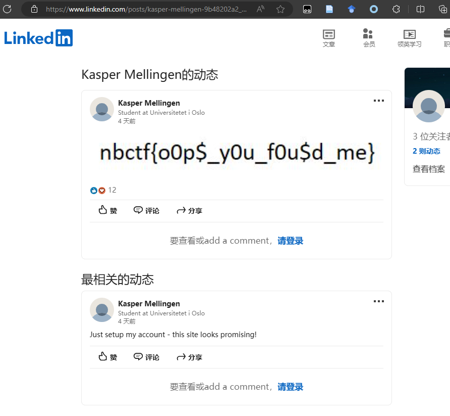
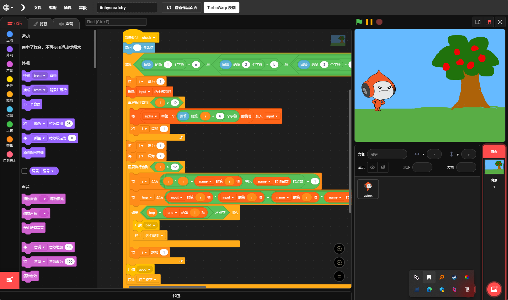

# 2023.12.2 周末CTF练习（TUCTF & Newport Blakes CTF）
Lysithea

周末打了CTFtime看到的的两个国外CTF（TU是高校的，NB好像是……高中社团的？）。TUCTF显得比较草台班子（服务器网巨差就不说了，甚至出现了pwn-welcome题因为movaps导致0 clear / xss题共享环境导致选手互相条件竞争），NBCTF就专业很多，但是部分题目考点集中且偏，难度不低。

不打算所有题都写WP，只挑有趣的写。

<!-- truncate -->
## TUCTF - keyboard cipher (crypto)
密文base16一轮解码后得到这个：
```
r5yG Ji7y XdV r5yG DrGv 0oL xDwA gY5R ZsC gYjN ZsQ jIlM aWdX kOp 1wA KoP YgJn
```
根据标题提示，这些对应美式键盘上按键位置，三/四个按键框出一个位置。（如果是德式qzerty键盘，可怎么做呢？）

## TUCTF - PHP Practice (web)
PHP页面，可以访问并加载一个页面，有外网，也能走`file://`, `php://`等协议。可以读取`/proc/self/environ`环境变量（结果好像包含了整个比赛所有题目的IP端口，您完全不做隔离是吗），也能读到`display.php`源码。核心在于如果加载资源不是图片（`getimagesize`），会经过htmlspecialchars做escape，所以没办法拼凑木马做RCE（如果RCE了怕是能直接给比赛后台干掉，我充分相信）。

正解是file协议读取`.htaccess`，可以直接发现隐藏的flag文件。虽然http访问会被.htaccess限制，但file协议似乎不管这个

-------------------

> 剩下都是NBCTF的，不标注了
> Web比较简单有趣，pwn前两个还比较正常后面全是ARM pwn完全不会。rev比较正常地很难（wasm rev / rust rev是给人看的吗.jpg）。osint因为不想在linkedin注册所以不想做。crypto后面都是RSA仙人。misc/algo好多神秘oi题。总体评价为难度曲线极其陡峭的比赛。

## web/Inspector Gadget
网站爬取信息收集。flag被拆成四个部分藏在不同位置
- 主页图片的alt属性有一部分
- 主页js有个getflag函数，跳转到一个隐藏txt
- 某个子链接里面有一部分
- robots.txt里有一部分（差点错过这个）

## web/walter's crystal shop
nodejs+sqli，还给了完整源码，就非常无脑了。
```js
db.all(`SELECT * FROM crystals WHERE name LIKE '%${name}%'`, (err, rows) => { ...
```
`LIKE`查询时用`%'`闭合字符串还是有点容易忽视的。

## web/secret tunnel
也是个有外网的文件包含，不过是flask，而且只能显示前0x20个字符（flag比这个短）。给了源码，环境有两个服务器，flag在内网1337端口的另一个网站上，但是前端网站做了些过滤，过滤了明文`flag`，`x`，`127`，不能包含超过两个`.`。并且因为用的requests库，不能用file协议。

```python
@app.route("/fetchdata", methods=["POST"])
def fetchdata():
    url = request.form["url"]

    if "127" in url:
        return Response("No loopback for you!", mimetype="text/plain")
    if url.count('.') > 2:
        return Response("Only 2 dots allowed!", mimetype="text/plain")
    if "x" in url:
        return Response("I don't like twitter >:(" , mimetype="text/plain") 
    if "flag" in url:
        return Response("It's not gonna be that easy :)", mimetype="text/plain")

    try:
        res = requests.get(url)
    except Exception as e:
        return Response(str(e), mimetype="text/plain")

    return Response(res.text[:32], mimetype="text/plain")
```

最后直接用URL编码绕过黑名单，`http://localhost:1337/%66lag`

## web/Galleria
看起来有文件上传接口（只能是图片），但因为是flask很难插马。前端渲染调用了一个加载图片的api，`?file=`，会把后面图片名称拼接在`uploads`后面，然后用`send_file`传输文件。这里是会过一个WAF的，会用`pathlib`分割，neutralize掉`..`,`.`。

```python
@app.route('/gallery')
def gallery():
    if request.args.get('file'):
        filename = os.path.join('uploads', request.args.get('file'))
        # check_file_path is to neutralize ".." and "." with pathlib
        if not check_file_path(filename):
            return redirect(url_for('gallery'))
        return send_file(filename)
```     

这个题用了一个非常申必的[特性](https://blog.csdn.net/qq_36078992/article/details/122070641)：`os.path.join`函数，当第二个参数为绝对路径时，会忽略第一个参数，然后就路径穿越了？？？？

当然一般保险做法是`send_from_directory`传输静态文件，这是最后一重保险，这里也没有。

所以直接访问`/gallery?file=/tmp/flag.txt`就拿flag了。os.path.join，很神奇吧。

## crypto/Caesar Salads
签到凯撒
## crypto/32+32=64
给了两个文件，都是套娃`|base64 -d`就完了
## crypto/Rivest Shamir forgot Adleman
类似RSA，但是作者故意不小心把幂次`**`给写成异或`^`了，结果就是`(e^c)%n`一步出（变成对称加密了）

## crypto/SBG-ABW's Insanity (未完成)
从这个题开始crypto难度变得丧心病狂。

这个题前半部分是两组RSA加密，共享质因数p，但是给了m, e=11, c1, c2，没给n1, n2。因为`m**e`可以算，所以可以得到`k1 p q1`和`k2 p q2`，求GCD可以得到p，进而得到k1q1。

后半部分用q1的sha256作为AES-ECB的key，所以已知k1q1必须算出q1，相当于一个大整数分解，其中一个质因数很大（1096bit）。在[factordb.com](https://factordb.com)可以得到其中比较小的几个因数，但是最后似乎还差一个大约是`2**69`这么大的一个质因数分不出来（也可能是两个），爆破、yafu等工具也搞不定。AES我不认为可以简单绕过，鉴定为寄。

那个巨大的数是：`1994841907166253555595565977017478085887329084880725018747951325992115875705370218202322214630728223048172383718977090965296009531272776521845483566167033031269338016789693088543541790629051269003822184012599810842070807948798980555276831576563670836568984652871999874061392371091033327265557380785506760057331398908817521964436164725366935857973626563`

## misc/do you hear that?
简单图片隐写，显然尾部藏了数据，是个wav。在audacity里发现波形很规则，在adobe audition里看频谱发现是文字的flag。

## misc/not accepted (未完成)
怎么有人在CTF比赛里塞OI题啊真下头

Case 4无论如何都Time exceed，全leak要200次，算了，咱不卷这个了

#### 赛后补充
看了一个[视频Writeup](https://www.youtube.com/watch?v=ibNhCi2Zw0g)。原来这个题的flag只需要给第一个题提交错误答案然后看Check Log啊？？？甚至他已经给我1/3了我都没去看。这么看下来就算第二题AC了应该也是给hint吧，逆天。

## misc/Myjail (未完成)
丧心病狂的python沙箱逃逸，包含AST沙箱、audithook和builtins过滤，可用的东西很少，并且限制exec一行4096字符（疑似是TCP单次包文上限）

AST虽然丧心病狂但是已知规则是能绕的，但hook触发条件完全不明，看起来完全无法在python内打开文件，启动子进程等。所以以后有机会研究吧。谷歌关键词：pyjail

## osint/persona (赛后完成)
喜闻乐见开盒题，只给了一个用户ID：in2win9945
- twitter上有号，有分享某个打字网站monkeytype的高分记录
- 在monkeytype上能搜到此人[主页](https://monkeytype.com/profile/in2win9945)，主页上有指向blogspot的博客
- 在其profile能看到国籍(norway)，能看到另一个名为Kaspermellingencs的[blogspot博客](https://kaspermellingencs.blogspot.com/2023/11/job-hunting.html#comments)，有三篇文章，最近一篇说他为了找工作在Linkedin建立了自己的主页
- 然后线索断了，因为谷歌没搜出这个人的Linkedin主页

赛后补充：
- Google太拉了，bing国际版直接出当事人linkedin动态。另外我居然没想到Mellingen是姓，Linkedin主页可以直接按姓名查人的。
- 2023.12.5: web of archive 能查到那个被删了的图片，但那天我就是打不开，我以为是没有爬取记录，吐了，可能是选项问题，得从主页进。顺便不要迷信谷歌，搜集信息也考虑bing和duckduckgo



## pwn-ribbit
简单粗暴的`gets`栈溢出，目标要用ROP链实现指定参数调用`win`函数，程序绝大部分静态编译。第二个参数是个char[]需要和两个不同的字符串进行比较，但strcpy似乎不能用（未知原因），所以我是用`gets`解决第二个参数`strcmp`两处比较的。似乎也可以不管win函数直接`ret2syscall`

## pwn-heapnotes
2.31堆题，增删改查都有，而且基本没什么限制可以随意引用删除后的note，随意UAF。申请的chunk大小只能是0x50大小，并且note不能越界写。

因为2.31还没有引入tcache xor检查，所以只要UAF把tcache指针指向任意位置即可无代价任意读写。首先把tcache bin的0xa0对应的count填满为7，然后把一个已分配的0x50 trunk修改大小成为0xa0（extend到2倍大小），然后free掉就进入unsorted bin，泄露main_arena进而得到libc基址，之后修改`__malloc_hook`到目标`win`函数即可。

[exp](./pwn-heapnotes/exp.py)

## pwn-ret2thumb （未完成）
从这里开始全是ARM了，尝试了一下第一题但是没跑通。

ARM ROP可以参考些网上的资料，gadget不太一样，类似于`pop {fp, pc}`这样的命令可以pop 多个寄存器，而pop进pc实际就是ret指令。调用约定也不太一样，一般用r0-r3传前几个参数，用r0返回。似乎所有arm指令都是4个字节，但是似乎ARM可以跳转到奇数指令，就会进入所谓thumb指令集，地址表示方法似乎也会发生变化，非常神奇。

这几个pwn似乎有[WP](https://blog.csdn.net/weixin_46483787/article/details/134752187)出来了，可以看

- 补充：看这个比赛整体难度，这个题里面是有shellcode的，搜strings能搜出`/bin/sh`，只是Ghidra没有反编译，只需要跳转就行了。不过为了系统学习还是用ROP打比较好

> 逆向题做出多少取决于你想多大程度折磨自己

## rev/crisscross
每个字节的块加密，然后根据奇偶会把连续两个字节放到目前已知的第一个/最后一个。块内是两重的表加密，其中一个表只有20个元素所以不确定是否一定可逆？不过flag这组给的是有唯一解的。

## rev/itchyscratchy
第一次接触Scratch 3竟是在CTF逆向题里，真不愧是游戏化编程代表作啊，感觉比NS上的Game Builder Garage都要好玩。

Turbowarp网站可以在线查看编辑sb3代码。其实也是非常简单的输入密码型逆向，逻辑不长且非常可视化/易学（小孩子都能看懂！）。常量池在左侧搜索对应变量点一下就能看到了。注意数组寻址是1开始的。



[rev](./rev-itchyscratchy/pseudo.py)

## rev/shifty-sands
迷宫逆向题，这个题的trick在于没有回显，并且迷宫内部分标为S的沙子是随回合移动的（4回合为一周期），限制了最大步数（0x32步）。flag到服务器上，nc进去玩通关就给flag，但本地和远程程序一样且没有随机要素。

我的玩法是用pwnlib连一个gdb，每个回合打上断点，输出当前坐标和地图，这样本地玩的时候就知道进度是否推进了，然后因为迷宫相当模块化，分段随便试一试固定组合通过各个难点，连起来就好了。

虽然框架没设计好，所以好像输出的位置并非是实际位置，但能用了。[rev](./rev-sands/rev_sands.py)

## rev/two-step
名为two-step实为nine-step，超级集邮碎片砍一刀套娃逆向题，纯纯折磨，但我还是做出来了我真闲啊。

密码逆向三种思路都试了一遍，结果还是最简单的方法最有效：

1. 直接逆向反编译程序逻辑
2. Z3约束求解、angr符号执行（浪费不少时间还始终没调通）
3. patch源程序、gdb动态调试

这个题的框架核心在于函数`0x401d0f`
```cpp
char * FUN_00401d0f_getsplit(char *param_1)

{
  char *pcVar1;
  long lVar2;
  basic_ostream *this;
  char *local_20;
  long local_10;
  
  lVar2 = DAT_00404310_swi_a;
  DAT_00404310_swi_a = DAT_00404310_swi_a + 1;
  local_10 = (long)SHORT_ARRAY_00404090[lVar2];
  pcVar1 = param_1;
  while( true ) {
    local_20 = pcVar1;
    if (local_10 == 0) {
      return local_20;
    }
    pcVar1 = local_20 + 1;
    if ((*pcVar1 == '}') || (*pcVar1 == '\0')) break;
    if (*pcVar1 == '_') {
      local_10 = local_10 + -1;
      pcVar1 = local_20 + 2;
    }
  }
  this = std::operator<<((basic_ostream *)std::cout,"Aww shucks!");
  std::basic_ostream<>::operator<<((basic_ostream<> *)this,std::endl<>);
                    /* WARNING: Subroutine does not return */
  exit(1);
}
```
这个函数核心功能是按`_`分段，并且根据一个全局变量`DAT_404310`的值加一个short array决定这一次调用要的是哪一段。每次进入这个函数这个值都会加一。真正checkflag的函数分散在`0x401296`, `0x4016c1`两个函数，互相递归调用，用`switch(DAT_404310)`决定进入的分支。

在逐个分支逆向之前，我还进行了patch，具体来说就是把输入错误的提示换成输出`DAT_404310`，这样我能知道前面几轮是正确的。之后本来打算直接基于这个变量做侧信道，后来绝大多数分支都是4个字符以上，遍历时间太久，还是算了（但其实即使是每个分支内部，也基本上是流加密，可能是weak to timing attack的）。某一个分支只有2个字符，是可以用这个方法爆出来的。

然后每个分支内部我还尝试用z3/angr求解，但是angr怎么也跑不通，似乎是常量传不进去。z3弄了半天不懂语法，似乎z3要xor常数还挺麻烦的，以后有空再学吧。

因而大多数分支我是手动求解的，没有特别复杂的加密，基本都是逐字节流加密，繁琐无趣。列一下几个有意思的：

- 3和4两个分支是一起出的，即乘以0x80相加合并为一个变量，3里没有判断，只在4里有。
- 分支6就是那个2个字节的，我直接（伪）侧信道爆破了
- 分支7是和一个double比较，ghidra可以直接看转换成`char[]`是什么

```cpp
case 7:
    pdVar4 = (double *)FUN_00401d0f_getsplit(param_1);
    DAT_00404308 = *pdVar4;
    if ((DAT_00404308 == 3.325947034342098e+151) &&
        (cVar1 = FUN_00401296_checkbase(param_1), cVar1 != '\0')) {
        uVar5 = 1;
    }
```

- 分支8比较有趣，对于每个字节和一个表异或后放到栈上，然后直接`call rax`执行shellcode（逆到这里我才checksec了一下发现还真是不带NX有RWX的，惊了）。因为只能控制shellcode一个字节，所以最好的让程序不报错的方法就是直接`ret`返回，所以这6次调用的`shellcode`需要是`c3`。这一轮逆出来碎片是`return`，还挺有创意的不得不说

```cpp
case 8:
    lVar3 = FUN_00401d0f_getsplit(param_1);
    for (local_a8 = 0; local_a8 < 6; local_a8 = local_a8 + 1) {
        local_12 = CONCAT11(local_12._1_1_,(byte)local_88[local_a8] ^ *(byte *)(local_a8 + lVar3));
        (*(code *)&local_12)();
    }
    uVar4 = 1;
```