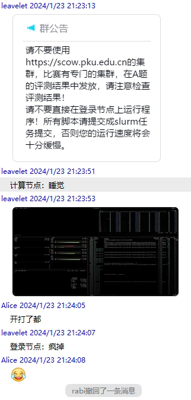
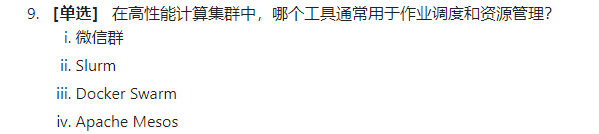
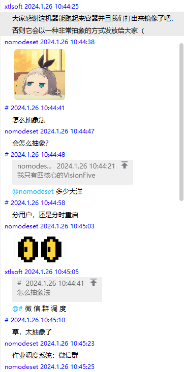
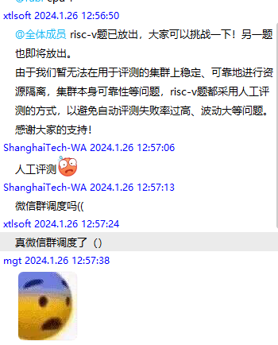
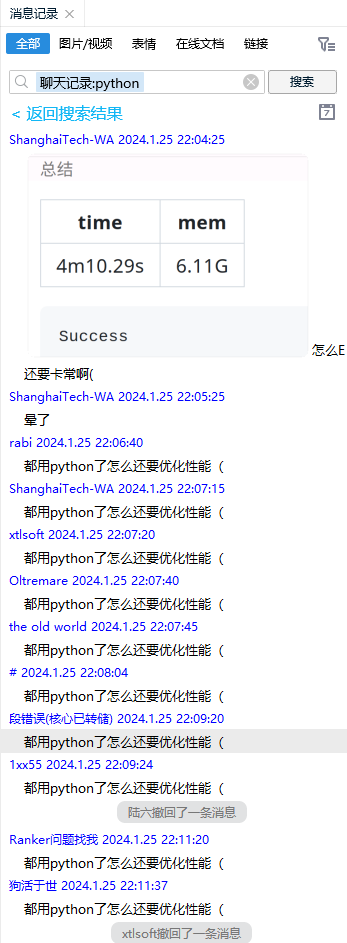
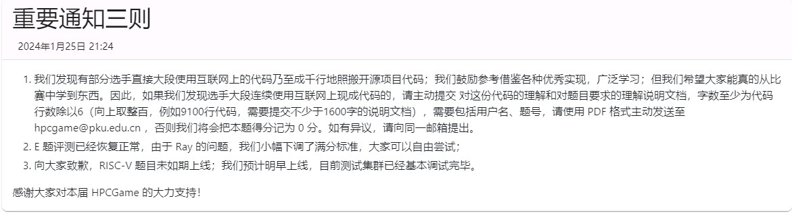

# HPCGAME-01 第一届北京大学高性能计算 个人Writeup
Ribom 657

[比赛主站](https://hpcgame.pku.edu.cn)，[官方题解](https://github.com/lcpu-club/hpcgame_1st_problems)

H题有些有思路但没做完的优化点，差半个小时，痛失30名。

<!-- truncate -->
## A 签到
教程题之一，算是这套OJ系统的教程，直接提交就拿分，然后在提交结果里拿到登录集群的账号和密码。

（其实账号和密码我在网站上找了半天，差点就在群里问了……还好最后是找到了）

## B 流量席卷土豆
教程题之一，主要是熟悉Slurm作业系统的使用。

题目要求是以4个节点，每个节点4个进程运行一个tshark指令（从流量包提取SSH流量），然后合并为一个完整的包，解码出其中的信息（解码程序已经给出）。最后还要获取给出JOBID

```bash
srun -pC064M0256G -N4 -n16 --ntasks-per-node=4 bash -c 'tshark -r /lustre/shared_data/potato_kingdom_univ_trad_cluster/pcaps/${SLURM_PROCID}.pcap -Y ssh -w ${SLURM_PROCID}.ssh.pcap'
```
这里有一个坑点是，如果没有加`-n`（最大进程数）参数，就会OOM（爆内存），原因可能是分配的核心数少了，所以可用内存就少了。--ntasks-per-node不控制申请的总核数，只控制每个node跑几个进程。很显然我第一次做这个题的时候不知道这一点，所以一直OOM了，所以当时我的方法是……手动串行地重新跑那些被OOM kill掉地部分进程，之后就能进行后面部分了，提交答案时交那个被OOM kill掉没有执行完的JOBID（因为评测系统似乎检查不到这个任务到底有没有是正确完成返回结果）。当然经过ray题配环境的鞭打之后，我自己偷偷地把正确的命令在集群上执行了一遍，没有OOM。

做这个题的时候应该是我第一次用集群，很显然我也犯了每个用过超算的人应该都犯过的错误：在登录节点上跑任务。中间被kill了很多次我还以为是集群网络不稳定，原来是管理员看内存占用手动kill的，笑死。




## C 简单的编译
教程题之一，学习编写Makefile和CMakeLists.txt编译omp, MPI和CUDA代码。

Makefile编译很接近shell直接运行命令的编译方式，我自己一直用的也是这个。只需要注意omp是gcc编译器自带特性，需要`-fopenmp`开启，而`openmpi`/`cuda`是第三方库，分别用`mpicxx`和`nvcc`进行编译。
CMake则是构建器，会根据各种条件生成一个可以直接运行的Makefile，定制化程度更高。这个我就不太熟悉了，基本上是求助Claude帮我写的，相关记录：[https://poe.com/s/E8NgzHkkzvXHZHlacPXb](https://poe.com/s/E8NgzHkkzvXHZHlacPXb)，然后把路径改改，无关的设置删一删就好了。

## D 小北问答 Classic
教程题之一，典中典之小北问答。这个题大部分我都是先问AI再自己搜索验证的，相关记录可以看：[https://poe.com/s/aISTnOzUdsxzDIhawRTR](https://poe.com/s/aISTnOzUdsxzDIhawRTR)，大多数都没什么说法，就略去不讲了。

### D-10. 矩阵乘法分块作用
正解是提升缓存命中。我之前以为是通信延迟，但事实上矩阵乘法运算时，各个线程之间根本不会做数据通信，而是在一个固定的共享内存里一起算。分块可以提升数据局部性，即短时间内一直在用固定的一小段数据，只要CPU把这一小段数据存在高速缓存（L2甚至L1）里，就可以极大提升性能。

这一点在后面H题会深刻地体会到……

### D-9. 微 信 群 调 度
> 

> 然后RISC-V题机器终于到了之后，比赛群里
>
> 
> 

## E 齐心协力（python-ray框架-pipeline）
这个题要计算一个类似神经网络的前向传播：共四级网络，输入向量是(200,40000)的float32，一共要计算100个这样的输入向量。每一级权重都是(40000,40000)的float32矩阵。每一级网络，向量和权重矩阵相乘后再进行ReLU激活（负值取0），所以输出向量也是(200, 40000)。一共要处理100个这样的向量，输入输出文件夹有高速文件系统，权重文件夹没有（因而权重最多只能读取一次）。分配4个节点，每个节点4核16G内存，而一个权重就6G（题干说12G可能是按double算的），不可能把所有矩阵都存在一个节点上（其实放2个好像也是放得下的，不过总之还是有开销，最好还是每个节点读一个）

> 等下，该不会ray题线上环境里的weight都是double，需要手动astype吧？

这个题的并行思路是pipeline，即四个节点各自负责一步（矩阵乘+ReLU），处理好后传给下一个节点，除了最开始和最后有空窗期，中间部分四个节点会同时执行计算量相当的任务。完全串行需要400步，而pipeline并行只需要103步，可以获得四倍性能提升。

ray是一个新兴的并行计算框架，好像做AI的用的多一点，主要卖点是包含了面向对象设计（Actor和Task抽象，分别对应远程的class和func），可以保存状态。本身编程思路很像async异步编程，函数（包括Actor的方法）直接调用`.remote()`只能返回一个Future对象，只有`ray.get()`之后才能返回具体的值，因而需要延迟取值，直到真正需要用的时候再取值。

对于每个Actor，都会有一个自己的Worker，相当于一个独立的Python进程，内部变量不和其他Actor共享，当然可以拿到其他Actor的句柄以进行Actor到Actor的远程调用。Actor的内部方法被多次调用remote时，是按照调用顺序串行的，如此解决Actor内属性的同步问题（当然单线程总之会损失性能）。Future可以直接当作参数调用下一级的remote函数，会在上一级结果返回后参与下一级运算，相当于实现了多个步骤的计算。

Actor可以被分配资源（placement group），Actor和node是独立的概念，一个Actor不一定运行在一个node上。ray框架内维护了一个跨节点的Object Store分布式存储，可以主动把计算结果`ray.put`到这个分布式存储中，而请求不在自己node上的数据时，就会远程下载数据内容，会带来不必要的通信开销（所以我理解这个题`ray.put`函数是陷阱，不能用）。最后，众所周知Python是有GIL的，所以即使每个Actor分配了多个CPU也是串行执行Python代码；但是当进入numpy底层的C++代码时，会释放GIL，这时可以利用被分配的多核性能。

回到这个题，我自己的思路是，分配4个包含4CPU的Actor（记得用PlacementGroup让每个Actor只处在一个节点上），Actor内部包含一个`last_node`属性，构造一个链表，在具体执行计算任务的`pipeline`方法中，远程调用上一级的`pipeline`。

另外这个题我花了半天时间进行了一次负优化，就是我意识到4个4CPU Actor的CPU占用只有400%（即只用了4个核），此时我对`numpy内部会释放GIL`这件事实产生了怀疑，于是我尝试手动把输入向量拆成四份喂给4个1CPU的Actor（即最后总共维护16个Actor），惊喜地发现CPU利用率掉到了100%……最后，我在文档里发现一个特性，就是如果在建立Actor时设置一个`max_concurrency=4`的设置（即开启Actor内多线程），可以极大增大CPU利用率，难道说不加这个设置时即使是`num_cpus=4`也是单线程跑numpy，还是说IO和计算互相阻塞了？搞不太懂。最后我是92分，可能还是有优化点，比如可能每个节点分出一个核专门做IO，可能还会更快一点？不知道要怎么profiling。

> 

然后，不得不吐槽一下这个题的环境……主办方也觉得ray和现有超算体系不怎么兼容。首先ray集群启动就很麻烦，同个节点上多个ray互相干扰会出现端口冲突/临时文件夹冲突/CPU-内存冲突等等，主办方一开始给了一套脚本，但是也不能用，最后索性给了一套半手动的shell命令，大家开tmux自己敲命令（那时已经是倒数第三天了？），但是即使是这套命令也有坑（比如要多开终端，但是每个终端都要`module load python/hpcgame`，不然会导致ray输出一大堆东西后直接退出，但因为确实有ray相关地输出也不会想到是module没加载，很不直观。我后来索性直接把这句话写`.bashrc`里了）。

> 主办方发在比赛群的ray启动指南：
```
我的运行方法：
salloc -p C064M0256G -N4 --ntasks-per-node=8 -n32 --no-shell 获取一个 JobID
（最后记得 scancel JobID）
然后 srun --jobid JobID hostname，获取四个节点的 hostname，记住其中第一个，作为 Head Node
接着 srun --jobid JobID -w HeadNode的hostname bash -c "hostname -I | awk '{print \$2}'" 获得头节点 IP
然后生成一个随机端口号和 /tmp/h_rayU_ 开头的随机目录名，记为 $PORT 和 $TMP_DIR
接着 srun --jobid JobID -N1 -n4 -w 头节点hostname --exact bash -c "if [ \$SLURM_PROCID -eq 0 ];
 then ray start --head --node-ip-address IP地址 --port $PORT --num-cpus 4 
 --include-dashboard=false --temp-dir $TMP_DIR --block --min-worker-port $PORT加一 --max-worker-port $PORT加100; fi"
这个终端不要关，新开一个终端运行 srun -w 剩下的节点用逗号分割 --cores-per-socket=4 --sockets-per-node=1 ray start --address 头节点IP:$PORT --num-cpus 4 --block
这个终端不要关，最后再开一个终端运行RAY_CLUSTER_ADDRESS=ip:端口 srun -w 头节点Hostname -n1 --exact python3 main.py
```

同时，这个题要求的计算资源大（4节点16核，16G内存几乎用一半），计算时间长，在练习集群上非常容易互相干扰（主要体现为光读个权重就OOM，浪费大把调试时间），评测更是要排大队（为了减少干扰评测机已经串行了，一次只测一个），最后一天甚至要排几个小时。最后我就干脆放弃用练习节点调试了，直接换成了我们组的单节点服务器，用`ray.init(num_cpus=16)`代替繁琐的多节点启动过程……自己的服务器好处在于我可以看ray dashboard，可以详细看到运行过程中CPU占用情况。

这波啊，这波是ray的反向广告了（开玩笑的，其实学下来发现ray还是挺好用的，虽然没那么直观。虽然有点PTSD，但我自己的工作要跑并行计算任务可能也会考虑ray）

最后，这个题背景介绍有些很明显的neta：
> 遥远的开爱大陆盛产毒药，这些毒药威力并不高，只是会让人痛苦不堪，乖乖地给开爱国王交上赎金获取解药。开爱国王富得流油，但人们对此苦不堪言。
>
> 你和宿舍小伙伴们是拉玛大陆骑士学院的优秀学员，致力于推翻开爱国王对解药的垄断，于是踏上了寻找解药方法的路程。路上你们遇到了善良的开爱国公主，她告诉你们，每一种毒药都有40000种可能的原料，构成药物空间的一个40000维32位浮点向量。而对应的解药就是将这个向量进行变幻得到的另一种配方。

开爱很明显是OpenAI，拉玛应该是LLaMA，一个开源的LLM大模型。可以想象这种pipeline调度很适合这种生成式AI。

## F 高性能数据校验 （OpenMPI, MPI-IO）
这个题给出了一种可并行的数据校验算法，并要求在node=2,core-per-node=4的机器上对单个大文件计算校验和。框架为OpenMPI。

算法本身是对文件进行1M大小的分块（最后一个块用0对齐），每个块的校验和是这个块内容+上一个块的校验和的SHA512值，即`this_checksum = SHA512(chunk + last_checksum)`（第一个块的上一个块为空块的SHA512值）

结合实例代码，不难发现通过`EVP_DigestUpdate`函数，chunk部分和上一个块校验和部分是可以分开的，因此下一个块不需要等待上一个块校验和，可以先算完chunk部分，再等待上一个块的校验和。在此基础上，我们可以给出一种循环pipeline：序号为rank的进程，计算`(chunk_id % 8)==rank`的校验和，从`(rank - 1)%8`处获得上一个块的校验和，再把计算完成的结果发给`(rank + 1)%8`。

接下来我们需要解决IO问题，也是这个题最大的性能瓶颈。输入文件很大，尽管用了高速并行文件系统，每个进程进行`seek+read`的过程还是很慢。而我们注意到每个文件的读取有非常规则的pattern，每8M数据只获取1M。这样的需求在并行计算中如此常见，以至于MPI为此开发出一套MPI-IO的接口，特别是`MPI_File_set_view`使得文件读取对每个进程都是连续的，而不需要seek。MPI IO资料比较少，我主要参考了[这个课件](https://wgropp.cs.illinois.edu/courses/cs598-s16/lectures/lecture32.pdf)

```cpp
MPI_Aint lb, extent;
MPI_Datatype etype, filetype, contig;
MPI_Offset disp;
MPI_Type_contiguous(BLOCK_SIZE, MPI_UINT8_T, &contig);
extent = nprocs * BLOCK_SIZE;
MPI_Type_create_resized(contig, lb, extent, &filetype);
MPI_Type_commit(&filetype);
disp = rank * BLOCK_SIZE;
etype = MPI_UINT8_T;
MPI_File_set_view(fh, disp, etype, filetype, "native", info);
```

注意文件读取时用`MPI_File_read_all`反而会慢，如果仔细分析pipeline过程会发现不太可能做到所有进程都同时读取。

最终拿到98%，可能还有些细小的优化点，我就没再管了。

## H 矩阵乘法（openmp, GeMM, Cache Miss）
一般矩阵乘法（GeMM）太经典了，做的人很多，我一开始不太敢做但是最后半天为了冲分不得不紧急写了一个半小时，拿了26%。直接搜索【矩阵乘法 并行 优化】就能得到很多博客讨论这个问题（[这个](https://renzibei.com/2021/06/30/optimize-gemm/), [这个](https://zhuanlan.zhihu.com/p/371893547)），我这里简单罗列一下优化点
- ijk求和次序，保证B矩阵最内循环按行连续，不过这个题的求和次序已经是优化过的
- omp多线程：最外循环显然可以直接无成本`#pragma omp parallel for num_threads(8)`
- AVX512：Intel的向量化SIMD指令，可以同时算8个double，可以参考[官方文档](https://www.intel.com/content/www/us/en/docs/intrinsics-guide/index.html#avx512techs=AVX512F&text=madd_pd&ig_expand=4091,3087)。最内层连续的情况下，只要把循环递进改成`k+=8`就可以很容易用avx512指令了。指令集有个乘加的`fmadd`指令，可以让每个循环只需要一次运算。群友说最优秀的AVX512要手写汇编，不过对我这种newbee来说除非抄OpenBLAS之类的代码，不然肯定打不过编译器；甚至就算不写AVX512，只要写的合理，编译器会自动给你优化成AVX512。

```c++
// 核心代码长成这样
*(__m512d *)(&c[i * n3 + k]) = _mm512_fmadd_pd(ra, *(__m512d *)(&b[j * n3 + k]), *(__m512d *)(&c[i * n3 + k]));
```

> 说到抄代码，真的有人抄代码
> 

- 分块：好的分块可以提高访存局部性（再cue一下小北问答），我目前就用的最简单的那种（知乎里介绍的），但是最后vtune profiling下来还是L3缓存为主，所以还是分块分大了？或者需要内存重排？
- 内存重排：简单说就是A矩阵访问是按列的，最好加一个缓冲区重排成按行的再进行运算，这个似乎也能增大缓存命中率？可能输出矩阵也要重排？我没完全理解这部分。
> 赛后改了代码，对每个BLOCK循环时，先把A矩阵的这个BLOCK复制到一段连续的内存里，再进ijk循环可以提升性能。如果同时减小BLOCK_SIZE到8或者16，对8192x8192我可以从30s优化到19s，L1 bound能到49.2%……
- 循环展开：循环展开的意思是把本来是循环的部分写成多个重复语句，如此提升性能


总之，因为vtune说我的程序只用了L3缓存，所以下一步优化空间可能是提升缓存命中的问题了。感觉再进一步深入要看论文了。

另外，我发现没人讨论strassen算法这种低O算法，可能是overhead大也很难用上硬件优势？所以我最终也就没考虑。

## I logistic方程（openmp, avx512）
这个题要求我们进行一个n维double数组logistic迭代：`x=rx(1-x)`，r值和迭代次数itx固定，数组大小n是1024整数倍。注意因为logistic迭代本身的混沌特性，我们不能改变运算顺序。

某种程度上优化点被矩阵乘法题包含了，因为这个题是先放出来的，所以我也是根据这个题学习的avx512指令集的使用，但是最后只拿到76%的分数，这是一个坎。

赛后学习了群里的姿势，把最外层n的循环分出8次来给最内层（相当于每个itx内部处理64个double，或者8个AVX512），然后就能用上L1缓存，（有概率）速度加倍。我？？？

> 不过群友那个做法本身总缓存利用就不高，存在false sharing可能性，等等标答吧

最后：手写线程池调度不如`#pragma omp parallel for`让他自己来。


## L 洪水困兽（openmp, PIC particle2grid）
这个题属于个送分题。题目给了一个图形学流体仿真的PIC算法的一部分，即从粒子速度插值到格点速度。算法本身非常精巧，关于特别是关于速度的不同分量会插值到不同的格点位置，但是这些代码全部都给出了不用自己写，我们需要做的只是把这个程序并行化，使用openmp多线程，提供64个核心。

题干中说明，直接`#pragma omp parallel for`会出现写入冲突问题，这是因为本题中的所有数据都存在`std::vector`中，而对这个复杂数据结构的访问不是原子的。

> 举个例子，如果两个线程都要对某个位置元素做+=操作，这个位置原本是a，两个线程的另一个操作数是b和c，那么假如第二个线程取值时第一个线程还没把a+b覆写回去，那么第二个线程就会取到a，最终就会把a+c覆写回去，而不是串行时a+b+c的结果

解决方案很简单，就是在写回vector时加上`#pragma omp atomic`。注意这个编译指令对后面一句的格式有要求，不是所有地方都能加的。

## 总体感想
- 第一次用超算集群（听说还是未名二号的一部分），SCOW平台基础设施意外地挺好，可以直接在网页上用jupyter, VSCode和X11桌面，特别是VSCode，同为Chromium在浏览器上兼容性意外的好，除了插件不好装以外使用体验和本地几乎无异。
- 缓存！缓存！缓存！写局部性代码，分块处理太重要了，分块大小也要自己调试出来。这个比赛里算法`<<`操作系统+硬件优化
- 有时候拍脑袋想的优化写半天真的不如相信编译器/底层库。
- ray……挺好的。
- 其实我来比赛之前从没写过C++（C是写过的），这比赛除了E题以外全是写C++，还都是新版本C++。但事实上E题的python反而成了写代码体验最差的一道题，吐了。
- 这个比赛其实有个CUDA题（3D生命游戏），一个图形学光线追踪渲染题（光的游戏），属于想碰一碰但是一看难度就很高的题目，听说OJ后面还开放，如果有时间了我也想试一试。