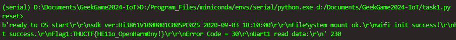

# GeekGame 2024 IoT线下赛 个人Writeup
Lysithea

[TOC]

第一次玩硬件赛，甚至几乎也是第一次玩板子（树莓派不算）。在我看来比起安全更像是Puzzle Solving/开发板使用指南。发给的物料都是烧写好的板子，我们全程不需要写固件烧进去，只需要根据串口输出对板子操作就行（ESP32题有源码）

<!-- truncate -->
## 配环境

硬件比赛配好环境就赢了大半了，估计经常玩硬件的朋友可以直接跳过这一步。

给的物料其实很充足，包括两款板子的驱动，串口调试软件（+逻辑分析仪）。从物料出发，最正确的调试方法就是装好驱动之后，用CoolTerm看COM输出（需要在设置里调好波特率和COM口）。在此之前，我还尝试了用`pyserial`手动读取COM数据，但因为是底层阻塞IO，非常坐牢，而且可能漏掉很多信息。

## BearPi 小熊派

### 分支1
#### 1. Hello Open Harmony
这个题是唯一用pyserial做出来的。装好驱动之后：
```py
import serial

with serial.Serial('COM4', baudrate=115200) as ser:
    input('reset> ')
    cont = ser.read_all()
    print(cont, len(cont))
```
连上板子之后，记录COM端口号，先运行py程序，然后按下板子重置键，再在py终端里回车一下，然后屏幕上输出了字符。听起来就比较窒息。



然而如果是CoolTerm，只要连上板子设好波特率就能直出结果。果然还得用工具。

#### 2. 故障的UART API传输Flag / 其他信道

这个其他信道就是指那个LED灯了，其实是个摩斯电码。为了方便提取信息，我先用手机固定机位录屏，从按下reset一直录到串口弹出Task4为止。然后用python opencv2 + PIL 把视频每一帧提取出来，根据某个固定截取范围内蓝色通道最大值，判断这一帧灯是不是亮着的。


```py
def dump_video_morse():
    VIDEO = '/mnt/d/Huawei Share/OneHop/VID_20241117_150129.mp4'

    videoCapture = cv2.VideoCapture(VIDEO)

    frame_rate = 5

    res_light = []
    LIGHT_THRES = 200

    for iframe in range(100000):

        end_flag = False
        for _ in range(frame_rate):
            success, frame = videoCapture.read()
            if not success:
                end_flag = True
                break
        
        if end_flag:
            break
        

        frame_b = frame[350:400,450:550,2]
        max_bit = np.max(frame_b[:])
        im = Image.fromarray(frame_b)

        print(iframe, max_bit)
        res_light += [max_bit > LIGHT_THRES]


    bin_of_light = ''.join(['1' if b else '0' for b in res_light])

    with open('morse_bin.txt', 'w') as fp:
        fp.write(bin_of_light)


    print(bin_of_light)
```

之后我这里发现除了开头结尾有几次闪烁的时间不对以外，其他所有灯亮的时间都只会在一短一长两个固定时长范围内，符合摩斯电码特征。

但是唯一的问题是，摩斯电码的字母分隔符被舍弃了，因此我们要自己爆出来。

这个题题干指明了flag字符只能由一部分字母符号组成，并且看起来是有意义的英文单词leet（后来提示直接指明了morse code, led light）。但问题在于字母表里没有d，而flag对这个d的处理居然是给直接扔掉了，给我的震撼程度不亚于新穷铁道上下行。


> `THUCTF{M0RSE_C0E_&_LE_L1GHT}`


似乎还有一种解法是修好UART，不过我就没尝试了

#### 4. ADC端口低电平
在4分半摩斯电码播完之后，进入下个环节，需要让ADC端口检测到小于1V的低电压。板子上ADC是GPIO13

我一开始尝试直接把13接地，没成功。后来在提示下阅读了给的材料，发现了一个控制adc的demo，里面提到我要按下F1按钮之后ADC电压会降低。于是试了一下就成功了。我知道ADC是模数转换，但是这个原理不懂，可能得把固件dump出来才能明白。


(flag3也在里面了)

### 分支2
#### 3. 进入条件
进入分支2的条件是GPIO11接低电平（接地），会直接弹flag

#### 5. 碰一碰钓鱼
进入分支2后，板子NFC功能会开启。拿出我的<s>遥遥领先的</s>华为Nova12Ultra，把贴在板子背面，结果……没反应！

为什么呢？明明COM输出确实表明NFC是开的了啊？原来是我的手机带了个塑料的保护壳，结果NFC就识别不到了，我必须得把手机壳摘下来才能碰一碰成功！看来熊哥的NFC识别范围不太行啊。

然后会跳转一个网站。接下来我又展示了我的惊世操作：华为碰一碰跳转链接之前会先弹一个确认推送，但是考虑到这个是个勒索网站我就没点进去，而是从推送的内容把跳转链接复制出来，到电脑浏览器上去访问了。结果我不知道的是，这个确认推送上的链接隐藏了端口号，原本的服务是开在3000端口上的！最尴尬的是，80端口居然也是能上的，是Apache的默认确认页！这就导致在后面的爆破环节，我就对着80端口的Apache爆了半天，自然是什么也没有（我顺便还看了这个域名的其他端口，随便试了几个，22是OpenSSH， 21是vsftpd，似乎没有匿名登录之类的）

后面似乎就要爆flag路径了，总之flag是在`/THUCTF/FLAG5`。后面的提示已经细到连字母都告诉了只是确认一下大小写（结果还是全大写）。总之确实不喜欢这种什么也没有的纯爆破，不知道用其他方法能不能跳过爆破这一步。

```py
import requests
from itertools import product

HOST = 'http://www.charginginquire.online:3000'

dir1_part = [f"{c.upper()}{c.lower()}" for c in 'thuctf']
dir2_part = ['fF','1lL','aA','gG', '5sS']

flag_part = dir1_part + ['/'] + dir2_part


iter_dir = (''.join(cg) for cg in product(*flag_part))

for dir1 in iter_dir:
    url = f"{HOST}/{dir1}"
    # print(url)

    resp = requests.get(url, allow_redirects=False)
    print(resp.status_code, url, resp.text)
    if resp.status_code != 404:
        print(resp.text)
        break
```


### 6. 信号分析题
似乎是给了一个板子输出波形，要求分析flag，用不到板子。没做。

## ESP32

> 首先这部分固件和[两年前清华办的比赛](https://xuanxuanblingbling.github.io/iot/2022/08/30/esp32/)几乎没多大区别<s>甚至flag都长得一样</s>。更尴尬的是我在参赛前一天调研IoT比赛到底比什么的时候就看到这篇WP了，今天题目发下来我直接绷不住了。所以虽然我有意识的没有对着答案做题，但有些东西确实看一眼就和没看天差地别了。

ESP的题有源码可以看。可以看出板子的逻辑。另外这里都是每个序列条件达成之后才会开启下一个任务，然而重置之后又需要把前面任务再做一遍。

### 硬件
#### 1. 在GPIO18构造1W个上升沿
板子的TX似乎会不停地传数据出来，把GPIO18接上去就好了。Task 1前面还有个Task X是需要GPIO三次读取到高电平，给出的是一个废弃的flag，其实这一条线就顺便都完成了。


#### 2. 在另一个串口寻找第二个flag
这部分可以看源码：
```c
#define ECHO_TEST_TXD  (GPIO_NUM_4)
#define ECHO_TEST_RXD  (GPIO_NUM_5)
#define ECHO_TEST_RTS  (UART_PIN_NO_CHANGE)
#define ECHO_TEST_CTS  (UART_PIN_NO_CHANGE)
...
void hardware_uart_setup(){
    uart_config_t uart_config = {
        .baud_rate = 115200,
        .data_bits = UART_DATA_8_BITS,
        .parity    = UART_PARITY_DISABLE,
        .stop_bits = UART_STOP_BITS_1,
        .flow_ctrl = UART_HW_FLOWCTRL_DISABLE,
        .source_clk = UART_SCLK_APB,
    };
    uart_driver_install(UART_NUM_1, 1024 * 2, 0, 0, NULL, 0);
    uart_param_config(UART_NUM_1, &uart_config);
    uart_set_pin(UART_NUM_1, ECHO_TEST_TXD, ECHO_TEST_RXD, ECHO_TEST_RTS, ECHO_TEST_CTS);
}
...
void hardware_task3(){
    printf("[+] hardware task II : find the third flag in another UART\n");
    while (1) {
        uart_write_bytes(UART_NUM_1, hardware_flag_3, strlen(hardware_flag_3));
        vTaskDelay(1000 / portTICK_RATE_MS);
    }
}
```
所以第二个UART串口是GPIO4和5，原则上把这两个口加上地线接到发的USB_TTL转接线的针脚上就好，但我不小心加了个3.3V的电源（有空着的针我能忍住不插吗？）结果接上电脑之后确实三个灯都亮了，但是一摸，**我超烫烫烫**，赶紧给拔下来了。冷却之后再插上，就识别不到设备了，估计烧了（三块多一个说是）

所以最后需要用逻辑分析仪，需要接TX，GND和CLK三个接口。分析软件是saleae Logic 2，使用比较简单，接上线之后直接抓包就行，默认设置就好（其实波特率/空比特等设置在代码里都有）。我在现场抓包的时候好像报错之后动了某个参数（采集频率之类的，我给降低了），结果就什么信号都抓不到。

如果已经完成前两个任务，这里每隔1s能抓到一小串低电平信号。点Add Analyzer之后，输入好比特率（这里比特率=波特率），就可以分析出结果了，然后可以到输出终端里把flag复制出来


### 蓝牙
#### 1. 修改蓝牙名称并设置为可发现
还是在COM日志里找，会有提示你要把蓝牙ID设置为什么。这个字符是随机生成的。发现之后COM日志就会弹flag，并进入下一阶段


#### 2. flag在空中
这个之前预习功课的时候就已经知道了，这个flag会在广播报文里（COM日志也说了会在ADV报文中），因此不需要和板子蓝牙配对（也就是Wireshark似乎抓不了）。我最终是用的nRF Connect，看一下Scanner里面的设备，里面会有信息是flag的ASCII编码


#### 3. 分析GATT业务
还是nRF Connect里连接设备之后，可以看到有几个业务，可以上传或下传数据包。我们看源码可以分析出来，我们需要在其中一个服务上传flag2字符串，之后在另一个服务的下载中就能拿到这次的flag。


### 隐藏
这个flag是写在固件里的，导出固件即可。之前在VSCode里配置了esp-idf开发环境，于是在VSCode里新建项目并打开后，开启一个IDF终端，输入`python -m esptool --baud 115200  read_flash 0x10000 0x310000 dump.bin`就把固件导出了，然后strings一下就出来了。


> 没错这个命令我确实是抄的题解。主要还是我这边环境配的似乎确有问题，直接`esptool.py`居然默认是用nodejs打开的，太幽默了，在找原因的过程中不可避免地又回去看了包括那篇题解在内的很多资料，还重装了一次esp-idf环境，所以其实还算是做了不少工作的。


## 感想

- 首先是非常好比赛，建议以后经常搞（虽然我马上毕业了）
- 确实是一次非常生动的开发板入门教程/武器库展示，带碰一碰能跟鸿蒙联动的华为板子还是挺有趣的。
- 从CTF角度来讲，感觉猜的成分有点重，特别是爆路径和不带分隔符摩斯电码属于不太有趣的猜，和IoT主题关联也不强。
- ESP32题目复用程度有点太高了，好在这比赛是娱乐赛<s>成绩没什么用</s>。能理解出新的硬件题目的困难性，不过网上搜题解直接出flag确实不太好吧（
- 玩下来感觉硬件入门门槛确实高，配工具，配环境，如果是面向零基础的，光是这些东西就已经难/麻烦得不行了；但其实真正比较核心的东西，包括板子里各种设计各种架构什么的，其实还完全没有入门，也感觉和真正的嵌入式安全方面有些距离（不过这个可能确实完全超出零基础比赛能接受的范围）
- 不知道有没有加入固件编程方向的题目的可行性……
- 然后算是个请愿环节？或许有朝一日能见到这些出成题目？软路由、红外遥控、机器人、RFID……